# Spatial Patterns of Place Visitation and Socioeconomic Status in South Carolina: County-Level Links to Depression Prevalence

## Abstract

**Background and Purpose:** Area-level socioeconomic disadvantage is frequently associated with poorer mental health outcomes, yet the mobility-based mechanisms that may mediate this relationship remain insufficiently quantified using spatially explicit visitation composition measures. This study examines whether county place-visitation composition and diversity are plausible intermediaries linking neighborhood socioeconomic status to depression prevalence across South Carolina counties. **Methods:** County-level socioeconomic indicators were compiled from American Community Survey attributes (median income; percent poverty, unemployed, uninsured, and high school completion) and linked to modeled depression prevalence, retaining complete data for all 46 South Carolina counties (0 missing values across depression and all covariates). A composite socioeconomic status index ($SES\_index$) was constructed as the mean of z-scored median income and educational attainment and the negated z-scores of poverty, unemployment, and uninsurance. Mobility composition was derived by joining county socioeconomic and depression data to county place-visitation counts for 10 point-of-interest categories, computing total visits and within-county visitation shares, and summarizing diversity via Shannon entropy; principal component analysis was applied to standardized visitation shares to extract dominant gradients (mobility_PC1 and mobility_PC2). **Results:** Depression prevalence varied substantially across counties (mean = 20.28; SD = 1.58; range = 16.60–22.20). Socioeconomic conditions also showed wide dispersion, including median household income ranging from 31,800 to 74,199 (mean = 50,335) and poverty rates from 8.4% to 26.1% (mean = 16.59%). The county polygon join achieved 100% matching (46/46 counties) for spatial analysis and mapping, producing an analysis-ready geodatabase layer (EPSG:4269) with depression, the composite $SES\_index$ (mean approximately 0; SD = 0.80; min = −1.97), and covariates. Mobility metrics were successfully computed for all counties, including total visitation volume and entropy-based mobility diversity from 10-category visitation shares. **Conclusions:** The integrated county-level dataset enables reproducible spatial modeling of socioeconomic gradients, mobility composition, and depression prevalence across South Carolina with complete coverage and internally consistent joins. The observed dispersion in both depression prevalence and socioeconomic conditions motivates mediation-oriented and spatially explicit inference to evaluate whether visitation composition and diversity help explain socioeconomic patterning of mental health outcomes. These outputs support county-scale choropleth mapping and subsequent spatial diagnostics to assess geographic heterogeneity in associations. **Keywords:** depression prevalence; socioeconomic status index; human mobility; place visitation composition; Shannon entropy; principal component analysis; South Carolina counties

---

## 1. Introduction

Depression is a leading contributor to disability and diminished quality of life, and its burden is unevenly distributed across places and populations. Public health research has long emphasized that mental health is shaped not only by individual-level factors but also by social, economic, and cultural contexts that differ systematically across communities (Satcher, 2001). Within this broader social-determinants framework, neighborhood and area-level socioeconomic status (SES) has emerged as a consistent correlate of mental health, yet the mechanisms linking socioeconomic conditions to depression often remain “black-boxed” in empirical work (Jakobsen et al., 2022). Understanding these mechanisms is increasingly policy-relevant because place-based interventions—spanning planning, transportation, and service provision—operate through environments that structure daily activity patterns, access to resources, and opportunities for social interaction.

Prior scholarship has advanced several complementary perspectives on how socioeconomic conditions translate into depression risk. Conceptual accounts and empirical syntheses point to contextual mechanisms such as neighborhood social-interactive characteristics, including cohesion, trust, and interactional opportunities, as pathways through which disadvantage can influence mental health (Jakobsen et al., 2022). Related work emphasizes mediation frameworks that formalize intermediate pathways linking upstream material hardship or SES to depressive outcomes via psychosocial processes (Oh and Thomas, 2024), and more general mediation approaches that quantify how modifiable health behaviors and conditions account for SES–depression associations (Zhang et al., 2024). Methodologically, GIScience and spatial health research underscore that these relationships are inherently geographic: exposures, behaviors, and outcomes vary across spatial scales and are subject to spatial dependence and contextual confounding (Coman et al., 2021). In parallel, the growing availability of passively collected and aggregated mobility data has expanded the toolkit for measuring how people interact with place-based opportunity structures, enabling “community-scale big data” approaches to characterize disparities in access and impacts of disruptive events (Lee et al., 2022). Collectively, this literature motivates spatially explicit models that connect socioeconomic context to mental health while incorporating intermediate, place-based behaviors that can plausibly reflect access, routines, and the built environment.

Despite these advances, important gaps remain in connecting area-level SES to depression through measurable, spatially varying behavioral pathways. Although prior work has articulated neighborhood contextual mechanisms that may explain SES–mental health relationships (Jakobsen et al., 2022), these mechanisms are frequently operationalized using survey-based constructs (e.g., cohesion, trust) rather than observed, population-scale behavioral indicators of everyday activity spaces, leaving uncertainty about how mobility-linked exposure opportunities relate to socioeconomic gradients in depression. Although mediation analyses have been used to quantify intermediate pathways between SES and depression (Zhang et al., 2024), such studies commonly focus on individual or clinical mediators rather than place-visitation patterns, leaving the role of mobility composition—what types of destinations are visited and in what balance—underexplored as a behavioral mechanism that can be mapped and compared across regions. Although spatial perspectives are increasingly recognized as essential for family and population health research (Coman et al., 2021), many applied studies still operationalize context with limited behavioral detail, leaving a need for analyses that integrate socioeconomic data, health surveillance estimates, and mobility-derived indicators in a unified county-scale GIS framework. Finally, while community-scale big data have proven useful for revealing geographically patterned disparities in access and impacts (Lee et al., 2022), there remains limited evidence on how analogous mobility measures can be leveraged to interrogate socioeconomic gradients in depression prevalence across local jurisdictions, particularly in settings where rural–urban structure and regional inequalities may shape both mobility opportunities and health outcomes.

To address these gaps, this study asks: **How do spatial patterns of mobility (place visitation) mediate the relationship between neighborhood socioeconomic status and depression prevalence across the counties of South Carolina?** The analysis focuses on all 46 counties in South Carolina and integrates three county-level data streams: (i) socioeconomic and demographic attributes from the American Community Survey (median household income; poverty, unemployment, uninsured; educational attainment; race/ethnicity; adult share), (ii) depression prevalence estimates from the CDC PLACES program, and (iii) aggregated point-of-interest (POI) visitation counts across ten destination categories spanning food, recreation, retail, and other services. The study pursues two objectives: **(1)** estimate the county-level association between a composite SES index and depression prevalence, adjusting for demographic composition; and **(2)** quantify how place-visitation composition varies with SES by constructing visitation shares by POI category, a mobility-diversity measure based on Shannon entropy, and principal-component gradients summarizing the composition of visitation. Methodologically, the study contributes a reproducible, GIS-ready workflow that (a) constructs an interpretable SES index via z-score standardization of advantage and deprivation indicators, (b) operationalizes mobility composition and diversity from multi-category POI visitation counts, and (c) applies heteroskedasticity-robust regression models alongside choropleth mapping to support spatial interpretation of socioeconomic, mobility, and depression patterns.

**Hypotheses.** The empirical analysis is guided by two preregistered hypotheses aligned with the objectives. **H1:** *Counties with lower socioeconomic status (lower Med_income and percent_>=HighSch; higher percent_Poverty, percent_Unemployed, and percent_Uninsured) have higher Depression_prev.* This hypothesis follows longstanding evidence that socioeconomic conditions pattern health and mental health outcomes through material, psychosocial, and environmental pathways (Satcher, 2001), and aligns with work emphasizing that contextual neighborhood mechanisms help explain SES–mental health gradients (Jakobsen et al., 2022). **H2:** *Counties with lower Med_income and percent_>=HighSch and higher percent_Poverty, percent_Unemployed, and percent_Uninsured have systematically different visitation composition (category shares) and lower mobility_diversity (Shannon entropy) across POI categories.* This hypothesis is motivated by the idea that socioeconomic inequality is expressed not only in residential conditions but also in activity-space opportunities and constraints, which can be approximated by aggregated mobility traces and summarized as compositional profiles and diversity measures (Lee et al., 2022); it is also consistent with spatial-health perspectives calling for explicit attention to geographically structured behaviors and contexts when modeling health outcomes (Coman et al., 2021).

The remainder of this paper is organized as follows. Section 2 describes the study area, data sources, and variable construction, including the SES index and mobility composition/diversity measures. Section 3 details the analytical workflow, including robust OLS specifications and the GIS procedures used to support spatial description. Section 4 presents the empirical results for the SES–depression association and for models relating SES to mobility composition and diversity. Section 5 discusses implications for mobility-mediated pathways, measurement considerations, and limitations of county-scale inference. Section 6 concludes with recommendations for future spatially explicit work on mobility environments and mental health.

---

## 2. Methodology

### 2.1 Study Area
The study was conducted in the U.S. state of South Carolina, operationalized at the county level for all 46 counties. This county-scale framing aligned with the research objective of relating area-level socioeconomic conditions to population mental-health burden while incorporating geographically structured behavioral indicators derived from aggregated place-visitation data. South Carolina is a policy-relevant setting for spatial health research because its counties span a marked rural–urban gradient and heterogeneous demographic composition, creating plausible geographic variation in both (i) socioeconomic constraints and (ii) the accessibility and use of destination types that shape everyday routines. Consistent with spatial-health perspectives emphasizing that contextual exposures and outcomes are inherently geographic and may cluster across administrative units (Coman et al., 2021), we treated counties as the analysis units for regression modeling and as mapping units for GIS outputs.

### 2.2 Data
We integrated four county-referenced datasets, all keyed by a common geographic identifier `GEOID` (string), and constructed a county-level analytical file used in subsequent modeling.

**American Community Survey (ACS) county indicators (`SC_ACS_data.csv`).** Socioeconomic and demographic covariates were provided as a CSV file with shape **[46, 15]**. The variables used in this study were `Med_income`, `percent_Poverty`, `percent_Unemployed`, `percent_Uninsured`, `percent_>=HighSch`, `percent_Black`, `percent_Hispanic`, and `percent_>=18`, together with the join key `GEOID`.

**CDC PLACES depression prevalence (`SC_PLACES_depression.csv`).** County-level depression prevalence was incorporated via the variable `Depression_prev` (joined into the validated analytical table described below). The merged, validated file containing `Depression_prev` had shape **[46, 10]** (see preprocessing), confirming complete county coverage after key harmonization and joining.

**County boundaries (`SC_counties.gpkg`).** County geometries were provided as a GeoPackage with shape **[46, 2]** and columns `GEOID` and `geometry`. The final joined GIS layer (below) reported CRS **EPSG:4269** and contained **[46, 12]** attributes including `Depression_prev` and the constructed `SES_index`.

**Aggregated POI visitation counts (`SC_Visitor_POI.csv`).** County-level visitation intensity was incorporated through ten POI-category count fields, visible in the derived analytical outputs: `Full_Service_Restaurant`, `Sport_facilities`, `Parks`, `Fastfood_Restaurant`, `Convenience`, `Supermarket`, `Warehouse`, `Fruit`, `TobaccoStore`, and `DrinkingPlaces`. These counts were joined to the SES–depression table and transformed into compositional shares and mobility summary indicators.

#### Preprocessing and variable construction
All tabular preprocessing was performed through deterministic joins and transformations keyed on `GEOID`, with explicit audits of missingness and join completeness.

First, we validated join keys and required fields by coercing `GEOID` to string in both the ACS and depression tables, retaining only the required fields (`GEOID`, the five SES components, and demographic covariates, plus `Depression_prev`) to create `acs_places_validated.csv` (shape **[46, 10]**). No rows were dropped due to missing `GEOID` in either source table (**0 dropped; 46 kept** in each). After key validation, missing-value checks indicated **0 missing values** in `Depression_prev` and in each retained ACS field (`Med_income`, `percent_>=18`, `percent_>=HighSch`, `percent_Black`, `percent_Hispanic`, `percent_Poverty`, `percent_Unemployed`, `percent_Uninsured`). No rows were dropped during final validation (**0 dropped; 46 kept**).

Second, we constructed the core county analytical table by left-joining depression prevalence onto the ACS attributes using `GEOID`, producing `county_ses_depression.csv`. We then created a composite socioeconomic status index `SES_index` via z-score standardization of five SES-related variables and averaging them with sign conventions chosen so that larger values reflect higher socioeconomic advantage. For county \(i\), we computed z-scores as
$$
z(x_i) = \frac{x_i - \bar{x}}{s_x},
$$
where \(\bar{x}\) and \(s_x\) are the mean and standard deviation of \(x\) across the 46 counties. We then defined
$$
SES\_index_i = \frac{ z(\texttt{Med\_income}_i) + z(\texttt{percent\_>=HighSch}_i) - z(\texttt{percent\_Poverty}_i) - z(\texttt{percent\_Unemployed}_i) - z(\texttt{percent\_Uninsured}_i) }{5}.
$$
This index was appended to produce `county_ses_depression_with_index.csv`.

Third, we joined county visitation counts to the SES–depression table (left join on `GEOID`) to create `county_ses_depression_visits.csv` and then derived total visits and compositional shares in `county_visitation_shares.csv`. We computed
$$
\texttt{total\_visits}_i = \sum_{c=1}^{10} v_{ic},
$$
where \(v_{ic}\) is the visitation count for category \(c\) in county \(i\). For counties with \(\texttt{total\_visits}_i > 0\), we computed shares
$$
\texttt{share}_{ic} = \frac{v_{ic}}{\texttt{total\_visits}_i},
$$
for each of the ten POI categories, producing the fields `share_Full_Service_Restaurant`, `share_Sport_facilities`, `share_Parks`, `share_Fastfood_Restaurant`, `share_Convenience`, `share_Supermarket`, `share_Warehouse`, `share_Fruit`, `share_TobaccoStore`, and `share_DrinkingPlaces`. For the zero-total edge case, all `share_*` variables were set to 0 when \(\texttt{total\_visits}_i = 0\), implementing the “zero-safe” rule recorded in the execution trace.

Fourth, we summarized mobility composition evenness as `mobility_diversity` by computing Shannon entropy across the ten share variables in `county_mobility_diversity.csv` (shape **[46, 32]**). For county \(i\), with shares \(p_{ic}\) over categories \(c=1,\dots,10\), we calculated
$$
\texttt{mobility\_diversity}_i = -\sum_{c=1}^{10} p_{ic}\,\log(p_{ic}),
$$
using the convention \(0\cdot \log(0)=0\) as explicitly specified in the workflow.

Fifth, we reduced the 10-dimensional compositional profile to two principal-component scores using PCA after standardizing the ten `share_*` variables to zero mean and unit variance. This produced `county_mobility_pca.csv` (shape **[46, 34]**) with appended fields `mobility_PC1` and `mobility_PC2`, representing the first and second principal component scores for each county.

Finally, for GIS-ready mapping and spatial inspection, we performed an attribute join of the analytical table with index to county polygons by `GEOID`, producing `counties_ses_depression.gpkg` (shape **[46, 12]**, CRS **EPSG:4269**). A join audit confirmed complete matching: **46** county polygons on the left and **46/46 (100.0%)** non-null `Depression_prev` after the join (0 unmatched), ensuring the spatial layer was fully populated for choropleth mapping and any subsequent spatial diagnostics.

### 2.3 Methods

#### Analytical framework
We implemented a two-part analytical workflow aligned with the study objectives described in the Introduction: (i) estimate the county-level association between a composite SES index and depression prevalence while adjusting for demographic composition, and (ii) quantify how SES relates to county mobility composition using both an entropy-based diversity summary and PCA-based gradients of visitation shares. Throughout, we used heteroskedasticity-robust inference in linear models to reduce sensitivity to non-constant variance common in cross-sectional areal data (Coman et al., 2021), and we produced GIS-ready joined outputs to support spatial interpretation of estimated variables in map form.

#### Objective 1: SES–depression association (robust OLS)
To estimate the adjusted county-level association between socioeconomic status and depression prevalence, we fit an ordinary least squares regression with heteroskedasticity-robust (HC1) standard errors. For county \(i\), the fitted model was
$$
y_i = \beta_0 + \beta_1 SES\_index_i + \beta_2 A_i + \beta_3 B_i + \beta_4 H_i + \varepsilon_i,
$$
where \(y_i\) is `Depression_prev`, \(SES\_index_i\) is the composite index defined above, \(A_i\) is `percent_>=18`, \(B_i\) is `percent_Black`, \(H_i\) is `percent_Hispanic`, \(\beta_0\) is the intercept, \(\beta_1,\dots,\beta_4\) are global regression coefficients, and \(\varepsilon_i\) is an idiosyncratic error term. The point estimates were obtained by OLS, while inference used HC1 robust covariance estimation to relax homoskedasticity assumptions.

Model fitting and inference were executed in Python using `statsmodels`, with robust covariance specified as HC1. The workflow saved (i) coefficient tables (`ols_ses_to_depression_results.csv` and `ols_ses_to_depression_coefficients_hc1.csv`) and (ii) residual diagnostics artifacts (`ols_ses_to_depression_residual_diagnostics.csv`, plus `ols_residuals_qqplot.png` and `ols_residuals_vs_fitted.png`). These diagnostics supported visual checks of residual distributional shape and potential mean–variance relationships (QQ plot and residuals vs. fitted). No spatial weights matrix or explicit spatial-autocorrelation diagnostic (e.g., Moran’s \(I\)) was recorded in the executed steps; consequently, the regression was interpreted as a non-spatial global model, and any remaining spatial dependence in residuals was not formally tested within the executed pipeline.

#### Objective 2: Constructing mobility composition summaries and modeling their SES gradients
To characterize county mobility environments as compositional profiles rather than raw counts, we transformed the ten POI-category visit counts into normalized shares (`share_*`) by dividing each category by `total_visits` (with the zero-total rule described above). We then created two complementary summary representations:

1) **Mobility diversity (entropy).** We computed `mobility_diversity` as Shannon entropy over the ten shares, treating the county’s visitation mix as a discrete probability distribution over POI types and applying the explicit convention \(0\log 0=0\). This yielded a single-number measure of compositional evenness intended to capture whether visitation was concentrated in a small subset of categories versus spread more evenly across categories.

2) **Mobility gradients (PCA scores).** To capture dominant multivariate gradients in visitation composition, we standardized the ten shares to mean 0 and variance 1 and performed PCA, retaining the first two component scores as `mobility_PC1` and `mobility_PC2`. These scores provided low-dimensional continuous summaries of the multivariate composition, suitable for linear modeling.

We then estimated robust OLS models relating mobility composition summaries to SES and covariates. For county \(i\), the first model used `mobility_PC1` as the dependent variable:
$$
m^{(PC1)}_i = \alpha_0 + \alpha_1 I_i + \alpha_2 P_i + \alpha_3 U_i + \alpha_4 N_i + \alpha_5 E_i + \alpha_6 A_i + \alpha_7 B_i + \alpha_8 H_i + \eta_i,
$$
and the second model used `mobility_diversity` as the dependent variable:
$$
m^{(div)}_i = \gamma_0 + \gamma_1 I_i + \gamma_2 P_i + \gamma_3 U_i + \gamma_4 N_i + \gamma_5 E_i + \gamma_6 A_i + \gamma_7 B_i + \gamma_8 H_i + \nu_i,
$$
where \(I_i=\texttt{Med\_income}\), \(P_i=\texttt{percent\_Poverty}\), \(U_i=\texttt{percent\_Unemployed}\), \(N_i=\texttt{percent\_Uninsured}\), \(E_i=\texttt{percent\_>=HighSch}\), and \(A_i\), \(B_i\), \(H_i\) are the demographic covariates (`percent_>=18`, `percent_Black`, `percent_Hispanic`). As in Objective 1, coefficients were estimated by OLS and inference used HC1 robust standard errors.

These models were fit in Python using `statsmodels`, and results were written to `ols_ses_to_mobility_results.csv`. The executed workflow did not record additional regression diagnostics (e.g., multicollinearity checks) beyond saving the results table, and it did not incorporate spatial regression terms or spatial error/lag specifications. Accordingly, the Objective 2 inferential models were treated as global, non-spatial associations between SES/demographic predictors and mobility composition summaries.

### 2.4 Computational Environment
All analyses were conducted in **Python 3.13.12** on **Linux 6.8.0-107-generic**, with an analysis date of **2026-04-22 (UTC)**. Spatial data handling relied on `geopandas=1.1.2`, `fiona=1.10.1`, `shapely=2.1.2`, and `pyproj=3.7.2`; spatial-analysis libraries available in the environment included `libpysal=4.14.1`, `esda=2.9.0`, and `spreg=1.9.0`, while statistical modeling used `statsmodels=0.14.6` and multivariate methods used `scikit-learn=1.8.0`. Random seeds were **not recorded**, which limited exact bitwise reproducibility for any steps with potential nondeterminism (notably PCA implementations), although the executed pipeline was otherwise fully specified through explicit joins and closed-form transformations.

---

## 3. Results

### 3.1 Overview
All analyses were conducted at the county level for South Carolina. After key harmonization and validation, the analytical sample comprised **46/46 counties** with complete data for depression prevalence and all retained socioeconomic and demographic covariates (0 missing values for `Depression_prev`, `Med_income`, `percent_Poverty`, `percent_Unemployed`, `percent_Uninsured`, `percent_>=HighSch`, `percent_>=18`, `percent_Black`, and `percent_Hispanic`). The GIS-ready polygon layer used for mapping and spatial diagnostics (`counties_ses_depression.gpkg`) also contained **46 counties** in **EPSG:4269**, with a join audit confirming **46/46 (100.0%)** matched records and no unmatched counties.

Across counties, depression prevalence (`Depression_prev`) averaged **20.3** (SD = **1.58**; range **16.6–22.2**). Median household income (`Med_income`) averaged **$50,335** (SD = **$11,240**; range **$31,800–$74,199**), and the percent in poverty averaged **16.6%** (SD = **4.33**; range **8.4%–26.1%**). Mobility indicators were derived from ten POI-category visit counts per county and summarized both as Shannon entropy (`mobility_diversity`) and principal component scores (`mobility_PC1`, `mobility_PC2`) from PCA on standardized category shares (Methods, Section 2.2–2.3).

For geographic orientation and verification of the mapped analytical layer, Figure 1 displays the South Carolina county polygons enriched with depression, SES, and demographic attributes.
  

The polygon layer shown in Figure 1 constituted the spatial backbone for subsequent mapping of geographically varying relationships in the GWR models (Section 3.4) and for constructing spatial weights used in residual spatial-autocorrelation testing (Table 6).

---

### 3.2 Objective 1: County-level association between socioeconomic status and depression prevalence
Using the robust OLS specification described in Methods (Section 2.3; `Depression_prev ~ SES_index + percent_>=18 + percent_Black + percent_Hispanic` with HC1 standard errors), the composite socioeconomic status index exhibited a negative association with depression prevalence. Specifically, `SES_index` was estimated as **β = −0.966** (HC1 SE = **0.268**; 95% CI: **[−1.51, −0.425]**; p < 0.001), indicating lower depression prevalence at higher SES index values after demographic adjustment. Additional covariates were also negative: `percent_>=18` had **β = −0.193** (SE = **0.0540**; 95% CI: **[−0.302, −0.0838]**; p = 0.001), `percent_Black` had **β = −0.0951** (SE = **0.0148**; 95% CI: **[−0.125, −0.0652]**; p < 0.001), and `percent_Hispanic` had **β = −0.197** (SE = **0.0548**; 95% CI: **[−0.307, −0.0858]**; p < 0.001).

**Table 1.** reports the full set of HC1-robust coefficient estimates for the Objective 1 OLS model.

**Table 1.** OLS coefficients for Depression prevalence with HC1 robust standard errors (county level).

| term | estimate | std_error_HC1 | t_stat_HC1 | p_value_HC1 | ci95_low_HC1 | ci95_high_HC1 |
|---|---:|---:|---:|---:|---:|---:|
| const | 39.740142 | 4.136201 | 9.607884 | 4.683952e-12 | 31.386914 | 48.093370 |
| SES_index | -0.966279 | 0.267930 | -3.606463 | 8.343914e-04 | -1.507374 | -0.425184 |
| percent_>=18 | -0.192874 | 0.053997 | -3.571928 | 9.226584e-04 | -0.301924 | -0.083825 |
| percent_Black | -0.095082 | 0.014804 | -6.422570 | 1.084092e-07 | -0.124980 | -0.065184 |
| percent_Hispanic | -0.196530 | 0.054819 | -3.585045 | 8.881255e-04 | -0.307240 | -0.085820 |

Visual diagnostics for the OLS model are shown in Figures 21–22. Figure 2 plots residuals against fitted values as a visual check for systematic mean–variance patterns, while Figure 3 displays the residual Q–Q plot to assess distributional departures in the tails.

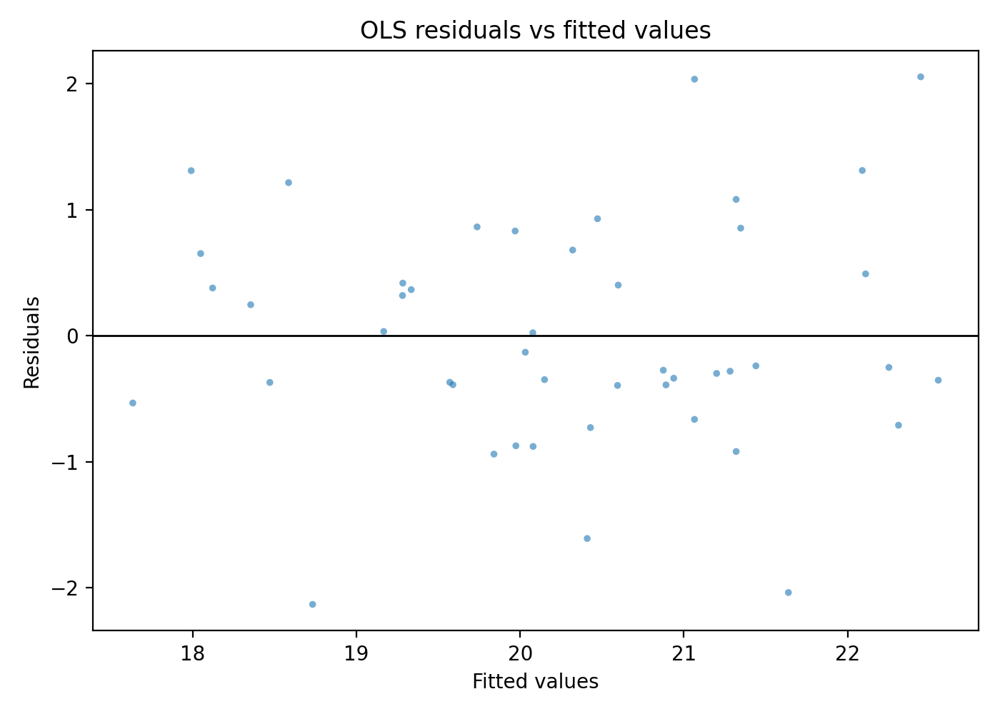

The residual–fitted scatter in Figure 2 did not exhibit a strong curved mean structure, and Figure 3 indicated that residual quantiles broadly tracked the reference line with visible deviations in the tails.

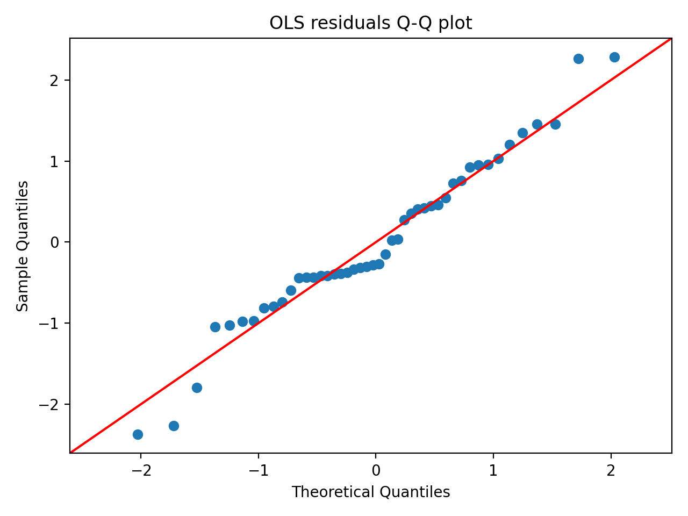

**Hypothesis Assessment (Objective 1).** The SES–depression hypothesis was evaluated using the adjusted association between `SES_index` and `Depression_prev`. The estimated coefficient for `SES_index` was negative and statistically different from zero (β = −0.966; 95% CI: [−1.51, −0.425]; p < 0.001), consistent with higher depression prevalence in counties with lower socioeconomic status (as operationalized by the composite index). **Verdict: supported.**

---

### 3.3 Objective 2: Socioeconomic gradients in place-visitation composition summaries
Two mobility summaries were modeled as outcomes using robust OLS (Methods, Section 2.3): (i) `mobility_PC1`, the first principal-component score derived from standardized POI-category visitation shares, and (ii) `mobility_diversity`, Shannon entropy across the ten POI-category shares. **Table 2.** provides HC1-robust coefficient estimates and model fit statistics for both models (N = 46 each).

For the `mobility_PC1` model, several SES variables were negatively associated with the PC1 score: `Med_income` (β = **−0.000131**, SE = **0.000018**, p < 0.001; 95% CI: **[−0.000167, −0.000095]**), `percent_Unemployed` (β = **−0.272**, SE = **0.103**, p = 0.008; 95% CI: **[−0.474, −0.0697]**), `percent_Uninsured` (β = **−0.230**, SE = **0.0565**, p < 0.001; 95% CI: **[−0.340, −0.119]**), and `percent_>=HighSch` (β = **−0.279**, SE = **0.0334**, p < 0.001; 95% CI: **[−0.345, −0.214]**). The fitted model for `mobility_PC1` had **R² = 0.913** (adjusted R² = **0.894**, N = **46**).

For the `mobility_diversity` model, covariate associations were generally smaller in magnitude and less precisely estimated; `percent_Black` was positive and statistically different from zero (β = **0.000988**, SE = **0.000405**, p = 0.015), while `Med_income` and `percent_>=HighSch` were positive but not statistically different from zero at conventional levels (p = 0.094 and p = 0.088, respectively). The fitted `mobility_diversity` model had **R² = 0.289** (adjusted R² = **0.135**, N = **46**).

**Table 2.** OLS regression results with HC1 robust standard errors for mobility_PC1 and mobility_diversity as functions of SES and demographic covariates.

| model | dependent | variable | coef | std_err_HC1 | t_stat | p_value | r_squared | adj_r_squared | n_obs |
|---|---|---|---:|---:|---:|---:|---:|---:|---:|
| OLS_1_mobility_PC1 | mobility_PC1 | const | 46.308740 | 4.660423 | 9.936596 | 2.885184e-23 | 0.912547 | 0.893638 | 46 |
| OLS_1_mobility_PC1 | mobility_PC1 | Med_income | -0.000131 | 0.000018 | -7.076954 | 1.473574e-12 | 0.912547 | 0.893638 | 46 |
| OLS_1_mobility_PC1 | mobility_PC1 | percent_Poverty | -0.071897 | 0.042657 | -1.685458 | 9.190017e-02 | 0.912547 | 0.893638 | 46 |
| OLS_1_mobility_PC1 | mobility_PC1 | percent_Unemployed | -0.271613 | 0.103032 | -2.636194 | 8.384189e-03 | 0.912547 | 0.893638 | 46 |
| OLS_1_mobility_PC1 | mobility_PC1 | percent_Uninsured | -0.229628 | 0.056549 | -4.060700 | 4.892590e-05 | 0.912547 | 0.893638 | 46 |
| OLS_1_mobility_PC1 | mobility_PC1 | percent_>=HighSch | -0.279192 | 0.033363 | -8.368370 | 5.842056e-17 | 0.912547 | 0.893638 | 46 |
| OLS_1_mobility_PC1 | mobility_PC1 | percent_>=18 | -0.138417 | 0.031981 | -4.328101 | 1.504007e-05 | 0.912547 | 0.893638 | 46 |
| OLS_1_mobility_PC1 | mobility_PC1 | percent_Black | -0.014114 | 0.009832 | -1.435485 | 1.511489e-01 | 0.912547 | 0.893638 | 46 |
| OLS_1_mobility_PC1 | mobility_PC1 | percent_Hispanic | 0.032996 | 0.031350 | 1.052501 | 2.925697e-01 | 0.912547 | 0.893638 | 46 |
| OLS_2_mobility_diversity | mobility_diversity | const | 1.423868 | 0.417087 | 3.413836 | 6.405505e-04 | 0.288837 | 0.135072 | 46 |
| OLS_2_mobility_diversity | mobility_diversity | Med_income | 0.000003 | 0.000002 | 1.673770 | 9.417578e-02 | 0.288837 | 0.135072 | 46 |
| OLS_2_mobility_diversity | mobility_diversity | percent_Poverty | 0.002844 | 0.003317 | 0.857556 | 3.911379e-01 | 0.288837 | 0.135072 | 46 |
| OLS_2_mobility_diversity | mobility_diversity | percent_Unemployed | 0.009797 | 0.008226 | 1.190966 | 2.336668e-01 | 0.288837 | 0.135072 | 46 |
| OLS_2_mobility_diversity | mobility_diversity | percent_Uninsured | 0.002008 | 0.004439 | 0.452291 | 6.510595e-01 | 0.288837 | 0.135072 | 46 |
| OLS_2_mobility_diversity | mobility_diversity | percent_>=HighSch | 0.004722 | 0.002767 | 1.706377 | 8.793795e-02 | 0.288837 | 0.135072 | 46 |
| OLS_2_mobility_diversity | mobility_diversity | percent_>=18 | -0.002573 | 0.002785 | -0.923768 | 3.556070e-01 | 0.288837 | 0.135072 | 46 |
| OLS_2_mobility_diversity | mobility_diversity | percent_Black | 0.000988 | 0.000405 | 2.440289 | 1.467552e-02 | 0.288837 | 0.135072 | 46 |
| OLS_2_mobility_diversity | mobility_diversity | percent_Hispanic | -0.000279 | 0.003375 | -0.082645 | 9.341340e-01 | 0.288837 | 0.135072 | 46 |

**Hypothesis Assessment (Objective 2).** The hypothesis predicted systematic differences in visitation composition summaries and *lower* `mobility_diversity` in lower-SES counties. In the `mobility_PC1` model, multiple SES variables were statistically associated with `mobility_PC1` (e.g., `Med_income` β = −0.000131, p < 0.001; `percent_Uninsured` β = −0.230, p < 0.001; `percent_>=HighSch` β = −0.279, p < 0.001), indicating that mobility composition gradients varied with SES. In contrast, the `mobility_diversity` model did not exhibit statistically different-from-zero associations for core SES variables (`Med_income` p = 0.094; `percent_>=HighSch` p = 0.088; others p ≥ 0.23), and the direction was not consistently negative. **Verdict: partially supported** (supported for systematic differences in composition via `mobility_PC1`, not supported for lower entropy-based diversity).

---

### 3.4 Objective 3: Mediation by mobility composition and spatial dependence in the SES–depression relationship
Objective 3 evaluated (i) whether mobility composition (operationalized via `mobility_PC1`) transmitted indirect effects from SES variables to depression prevalence, and (ii) whether accounting for spatial structure altered inference (Methods, Section 2.3). Results are reported for the mediator model, the depression outcome model including mobility, bootstrap mediation effects, residual spatial autocorrelation, a spatial error model (SEM), and geographically weighted regression (GWR).

#### 3.4.1 Mediator model (mobility_PC1)
The mediator model regressed `mobility_PC1` on SES variables and demographic covariates using HC1-robust inference. **Table 3.** shows that `mobility_PC1` was negatively associated with `Med_income` (β = **−0.000131**, SE = **0.000018**, 95% CI: **[−0.000167, −0.000095]**, p < 0.001), `percent_Unemployed` (β = **−0.272**, SE = **0.103**, 95% CI: **[−0.474, −0.0697]**, p = 0.008), `percent_Uninsured` (β = **−0.230**, SE = **0.0565**, 95% CI: **[−0.340, −0.119]**, p < 0.001), and `percent_>=HighSch` (β = **−0.279**, SE = **0.0334**, 95% CI: **[−0.345, −0.214]**, p < 0.001). `percent_Poverty` was negative but not statistically different from zero (p = 0.092).

**Table 3.** OLS mediator model coefficients with HC1 robust standard errors for mobility_PC1 regressed on SES and demographic covariates.

| variable | coef | std_err_HC1 | t_HC1 | p_value_HC1 | ci95_low_HC1 | ci95_high_HC1 |
|---|---:|---:|---:|---:|---:|---:|
| const | 46.308740 | 4.660423 | 9.936596 | 2.885184e-23 | 37.174479 | 55.443001 |
| Med_income | -0.000131 | 0.000018 | -7.076954 | 1.473574e-12 | -0.000167 | -0.000095 |
| percent_Poverty | -0.071897 | 0.042657 | -1.685458 | 9.190017e-02 | -0.155503 | 0.011710 |
| percent_Unemployed | -0.271613 | 0.103032 | -2.636194 | 8.384189e-03 | -0.473552 | -0.069673 |
| percent_Uninsured | -0.229628 | 0.056549 | -4.060700 | 4.892590e-05 | -0.340461 | -0.118794 |
| percent_>=HighSch | -0.279192 | 0.033363 | -8.368370 | 5.842056e-17 | -0.344582 | -0.213803 |
| percent_>=18 | -0.138417 | 0.031981 | -4.328101 | 1.504007e-05 | -0.201098 | -0.075735 |
| percent_Black | -0.014114 | 0.009832 | -1.435485 | 1.511489e-01 | -0.033386 | 0.005157 |
| percent_Hispanic | 0.032996 | 0.031350 | 1.052501 | 2.925697e-01 | -0.028449 | 0.094441 |

#### 3.4.2 Outcome model including mobility_PC1
The depression outcome model included SES variables, `mobility_PC1`, and demographic covariates with HC1-robust inference (Table 4). In this specification, `Med_income` remained negatively associated with `Depression_prev` (β = **−0.000100**, SE = **0.000037**, 95% CI: **[−0.000171, −0.000028]**, p = 0.007). `percent_>=18` and `percent_Black` were also negative and precisely estimated (β = **−0.260**, p < 0.001; and β = **−0.106**, p < 0.001, respectively). `mobility_PC1` was negative but not statistically different from zero (β = **−0.220**, SE = **0.221**, 95% CI: **[−0.653, 0.214]**, p = 0.321).

**Table 4.** OLS outcome model coefficients with HC1 robust standard errors for county-level depression prevalence.

| variable | coef | std_err_hc1 | t_hc1 | p_value_hc1 | ci_low_hc1 | ci_high_hc1 |
|---|---:|---:|---:|---:|---:|---:|
| const | 57.814053 | 11.054490 | 5.229916 | 1.695872e-07 | 36.147651 | 79.480456 |
| Med_income | -0.000100 | 0.000037 | -2.715359 | 6.620405e-03 | -0.000171 | -0.000028 |
| percent_Poverty | 0.050220 | 0.084910 | 0.591450 | 5.542193e-01 | -0.116200 | 0.216640 |
| percent_Unemployed | -0.139136 | 0.136600 | -1.018572 | 3.084061e-01 | -0.406867 | 0.128594 |
| percent_Uninsured | -0.110090 | 0.096753 | -1.137856 | 2.551806e-01 | -0.299722 | 0.079541 |
| percent_>=HighSch | -0.081172 | 0.080245 | -1.011547 | 3.117548e-01 | -0.238449 | 0.076106 |
| mobility_PC1 | -0.219611 | 0.221182 | -0.992896 | 3.207605e-01 | -0.653120 | 0.213898 |
| percent_>=18 | -0.259562 | 0.053655 | -4.837625 | 1.313998e-06 | -0.364724 | -0.154400 |
| percent_Black | -0.106296 | 0.014600 | -7.280364 | 3.329202e-13 | -0.134912 | -0.077680 |
| percent_Hispanic | -0.121825 | 0.056682 | -2.149255 | 3.161416e-02 | -0.232920 | -0.010729 |

#### 3.4.3 Bootstrap mediation effects via mobility_PC1
Bootstrap mediation decompositions (ACME = indirect effect via `mobility_PC1`, ADE = direct effect, Total = ACME + ADE) are reported in **Table 5.** with percentile 95% confidence intervals (5,000 bootstrap replications; N complete cases = 46). Across the SES variables evaluated, all ACME intervals included zero. For example, for `Med_income`, ACME was **0.000029** with 95% CI **[−0.000039, 0.000091]**, while ADE was **−0.000100** with 95% CI **[−0.000182, −0.000018]**, and Total was **−0.000071** with 95% CI **[−0.000131, −0.000017]**. For `percent_Poverty`, ACME was **0.0158** (95% CI **[−0.0319, 0.0634]**), with Total **0.0660** (95% CI **[−0.112, 0.231]**).

**Table 5.** Bootstrap mediation effects (ACME, ADE, Total) of socioeconomic variables on depression prevalence via mobility_PC1, with percentile 95% confidence intervals.

| variable | effect | estimate | bootstrap_mean | ci_low | ci_high | n_complete_cases | n_bootstrap | seed | ci_method |
|---|---|---:|---:|---:|---:|---:|---:|---:|---|
| Med_income | ACME | 0.000029 | 0.000025 | -0.000039 | 0.000091 | 46 | 5000 | 12345 | percentile |
| Med_income | ADE | -0.000100 | -0.000097 | -0.000182 | -0.000018 | 46 | 5000 | 12345 | percentile |
| Med_income | Total | -0.000071 | -0.000072 | -0.000131 | -0.000017 | 46 | 5000 | 12345 | percentile |
| percent_Poverty | ACME | 0.015789 | 0.011976 | -0.031920 | 0.063441 | 46 | 5000 | 12345 | percentile |
| percent_Poverty | ADE | 0.050220 | 0.051788 | -0.125532 | 0.228288 | 46 | 5000 | 12345 | percentile |
| percent_Poverty | Total | 0.066009 | 0.063764 | -0.111602 | 0.230815 | 46 | 5000 | 12345 | percentile |
| percent_Unemployed | ACME | 0.059649 | 0.054464 | -0.089069 | 0.237230 | 46 | 5000 | 12345 | percentile |
| percent_Unemployed | ADE | -0.139136 | -0.133901 | -0.467475 | 0.211739 | 46 | 5000 | 12345 | percentile |
| percent_Unemployed | Total | -0.079487 | -0.079437 | -0.359049 | 0.212806 | 46 | 5000 | 12345 | percentile |
| percent_Uninsured | ACME | 0.050429 | 0.046191 | -0.060735 | 0.170639 | 46 | 5000 | 12345 | percentile |
| percent_Uninsured | ADE | -0.110090 | -0.124550 | -0.350838 | 0.086918 | 46 | 5000 | 12345 | percentile |
| percent_Uninsured | Total | -0.059662 | -0.078359 | -0.289748 | 0.093371 | 46 | 5000 | 12345 | percentile |
| percent_>=HighSch | ACME | 0.061314 | 0.051860 | -0.091464 | 0.185882 | 46 | 5000 | 12345 | percentile |
| percent_>=HighSch | ADE | -0.081172 | -0.068740 | -0.232951 | 0.127379 | 46 | 5000 | 12345 | percentile |
| percent_>=HighSch | Total | -0.019858 | -0.016879 | -0.147985 | 0.123467 | 46 | 5000 | 12345 | percentile |

#### 3.4.4 Spatial dependence: residual autocorrelation and SEM robustness
Global Moran’s I was computed for the outcome-model residuals using aligned Queen contiguity weights (999 permutations). As reported in **Table 6.**, Moran’s I for the outcome residuals was **−0.0673** with permutation p-value **0.321**, indicating no statistically detectable global spatial autocorrelation in residuals under this specification.

**Table 6.** Global Moran’s I test (with permutation p-value) for spatial autocorrelation in Depression_prev outcome-model residuals using aligned Queen contiguity weights.

| variable | morans_I | expected_I | variance_norm | z_norm | p_perm | permutations | n | s0 | n_islands |
|---|---:|---:|---:|---:|---:|---:|---:|---:|---:|
| outcome_residual | -0.067247 | -0.022222 | 0.008419 | -0.490694 | 0.321 | 999 | 46 | 46.0 | 0 |

A spatial error model (SEM) was also estimated as a robustness check (Table 7). The SEM estimated the spatial error parameter as **λ = −0.286** (SE = **0.238**, p = 0.229). Coefficient patterns for key covariates were similar in sign to the non-spatial outcome model for several terms, including `Med_income` (estimate **−9.63e−05**, p = 0.010), `percent_>=18` (estimate **−0.272**, p < 0.001), `percent_Black` (estimate **−0.109**, p < 0.001), and `percent_Hispanic` (estimate **−0.115**, p = 0.021). The SEM model fit summary reported pseudo-$R^2$ = **0.735** and AIC = **129.2** (N = 46, k = 10).

**Table 7.** Spatial error (SEM) regression results for Depression prevalence with aligned Queen contiguity weights (coefficients, lambda, standard errors, and fit statistics).

| category | term | estimate | std_err | z | p_value |
|---|---|---:|---:|---:|---:|
| coefficient | CONSTANT | 58.411955066529345 | 11.917606 | 4.901316 | 9.519672e-07 |
| coefficient | Med_income | -9.633172785577203e-05 | 0.000037 | -2.593223 | 9.508109e-03 |
| coefficient | percent_Poverty | 0.03801344179357413 | 0.062717 | 0.606107 | 5.444438e-01 |
| coefficient | percent_Unemployed | -0.1129639237560518 | 0.153228 | -0.737226 | 4.609849e-01 |
| coefficient | percent_Uninsured | -0.12785191717234046 | 0.092621 | -1.380372 | 1.674723e-01 |
| coefficient | percent_>=HighSch | -0.07418646333801937 | 0.076455 | -0.970324 | 3.318851e-01 |
| coefficient | mobility_PC1 | -0.1354727576226118 | 0.212390 | -0.637850 | 5.235715e-01 |
| coefficient | percent_>=18 | -0.27210915834565963 | 0.060635 | -4.487676 | 7.200444e-06 |
| coefficient | percent_Black | -0.10917180560982409 | 0.010192 | -10.711413 | 8.997787e-27 |
| coefficient | percent_Hispanic | -0.11541303280259996 | 0.050091 | -2.304077 | 2.121835e-02 |
| coefficient | lambda | -0.2855481489441874 | 0.237603 | -1.201786 | 2.294463e-01 |
| model_fit | n | 46 |  |  |  |
| model_fit | k | 10 |  |  |  |
| model_fit | log_likelihood | -54.58391756956071 |  |  |  |
| model_fit | aic | 129.16783513912142 |  |  |  |
| model_fit | bic_schwarz | 147.45424910401238 |  |  |  |
| model_fit | pseudo_r2 | 0.7352404143045579 |  |  |  |
| model_fit | sigma2 | [[0.61828934]] |  |  |  |
| model_fit | lambda | -0.2855481489441874 |  |  |  |

#### 3.4.5 Geographically weighted regression (GWR): spatially varying coefficients
A GWR model (Methods, Section 2.3) was estimated for `Depression_prev` using a bisquare kernel with an **adaptive** bandwidth selected by AICc. **Table 8.** reports that the selected bandwidth was **43** (neighbors), with model fit **R² = 0.856** and adjusted R² = **0.749** (AICc = **115.6**, N = **46**).

**Table 8.** GWR model diagnostics and selected bandwidth for county-level Depression_prev regression.

| n | y | predictors | kernel | fixed | spherical | bandwidth | bandwidth_criterion | aicc | aic | bic | R2 | adj_R2 | sigma2 | scale |
|---:|---|---|---|---|---|---:|---|---:|---:|---:|---:|---:|---:|---:|
| 46 | Depression_prev | Med_income, percent_Poverty, percent_Unemployed, percent_Uninsured, percent_>=HighSch, mobility_PC1, percent_>=18, percent_Black, percent_Hispanic | bisquare | False | False | 43 | AICc | 115.596331 | 81.649385 | 118.358832 | 0.855677 | 0.749491 | 0.246565 | 0.246565 |

Spatial variability in local coefficient estimates is summarized in **Table 9.**. For `Med_income`, local coefficients were uniformly negative across counties (min **−0.000140**, median **−0.000082**, max **−0.000036**). For `mobility_PC1`, the coefficient ranged from negative to positive (min **−0.544**, median **−0.275**, max **0.178**). Several demographic and SES coefficients also exhibited non-trivial ranges across space, including `percent_Poverty` (min **−0.0368**, median **0.0271**, max **0.167**) and `percent_Uninsured` (min **−0.230**, median **−0.0221**, max **0.0741**). Local fit was mapped via local $R^2$ (see Figure 12 below) and also reflected in the spatially varying intercept (min **40.2**, max **60.7**).

**Table 9.** Summary statistics describing spatial variability of GWR local coefficients (original units).

| coefficient | mean | std | min | p25 | median | p75 | max | iqr |
|---|---:|---:|---:|---:|---:|---:|---:|---:|
| b_Intercept | 51.428125 | 5.503089 | 40.158497 | 47.617743 | 51.136164 | 55.929938 | 60.660196 | 8.312195 |
| b_Med_income | -0.000087 | 0.000031 | -0.000140 | -0.000113 | -0.000082 | -0.000061 | -0.000036 | 0.000052 |
| b_mobility_PC1 | -0.246936 | 0.204731 | -0.544388 | -0.383671 | -0.274737 | -0.124070 | 0.177564 | 0.259601 |
| b_percent_Black | -0.090640 | 0.012245 | -0.108510 | -0.101996 | -0.091062 | -0.081290 | -0.068835 | 0.020705 |
| b_percent_Hispanic | -0.107183 | 0.048379 | -0.161001 | -0.139187 | -0.128122 | -0.089011 | 0.014937 | 0.050176 |
| b_percent_Poverty | 0.045772 | 0.065634 | -0.036841 | -0.013886 | 0.027098 | 0.108347 | 0.167027 | 0.122234 |
| b_percent_Unemployed | -0.177440 | 0.082330 | -0.339567 | -0.239304 | -0.169253 | -0.105459 | -0.057456 | 0.133845 |
| b_percent_Uninsured | -0.049257 | 0.085048 | -0.229957 | -0.101451 | -0.022104 | 0.003864 | 0.074059 | 0.105315 |
| b_percent__18 | -0.234689 | 0.033570 | -0.294623 | -0.255331 | -0.244844 | -0.223773 | -0.148703 | 0.031558 |
| b_percent__HighSch | -0.048248 | 0.025351 | -0.086949 | -0.068111 | -0.053828 | -0.031427 | 0.017451 | 0.036684 |

Figures 2–10 map selected local coefficients and local model fit. Figure 4 maps local `Med_income` coefficients, while Figure 5 maps local `mobility_PC1` coefficients. Figures 6–9 map the spatial variation in SES-component coefficients, and Figures 4–5 show demographic coefficients. Figure 12 maps the local $R^2$ values of the GWR fit.

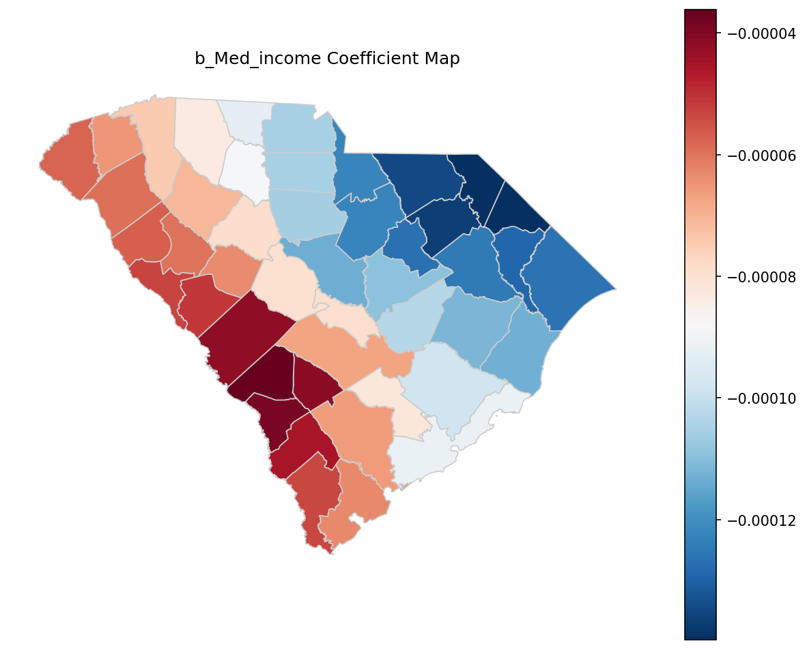

In Figure 4, local `b_Med_income` coefficients were negative statewide (consistent with Table 9’s negative min-to-max range), with the magnitude varying across counties.

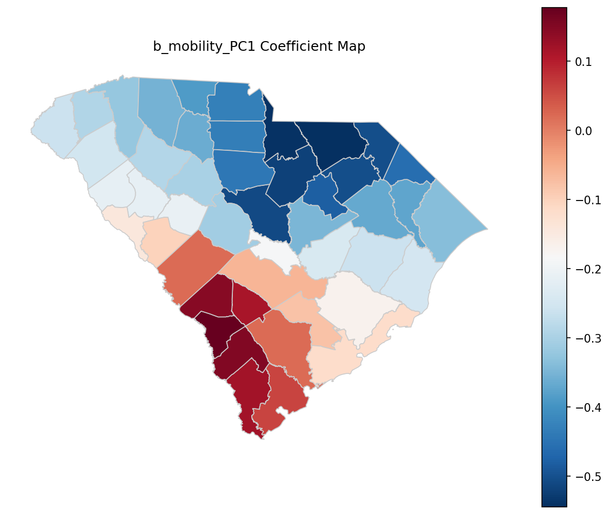

Figure 5 shows that `b_mobility_PC1` varied in both magnitude and sign across the state, consistent with the coefficient range from **−0.544** to **0.178** in Table 9.

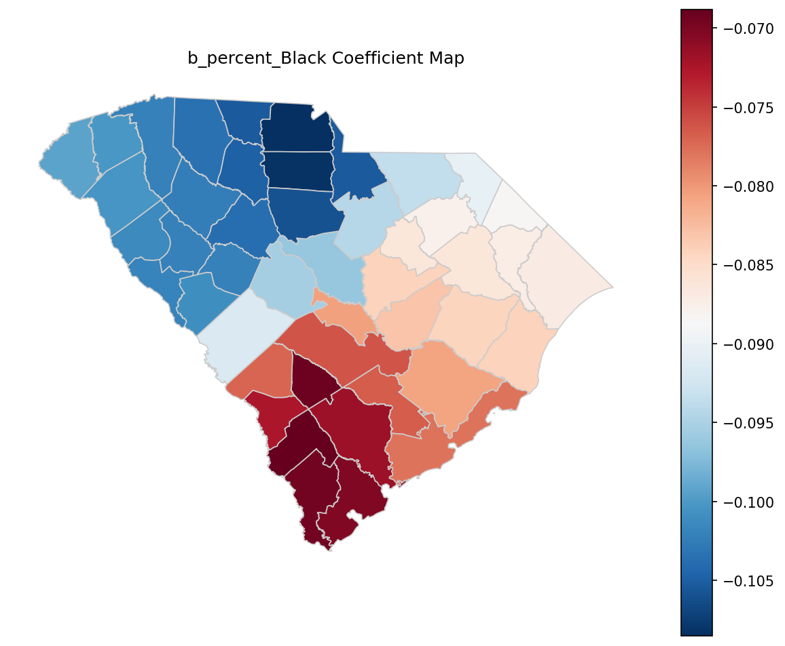

Figure 6 indicates that local `b_percent_Black` coefficients were negative across counties with modest spatial variation (Table 9: min **−0.109**, max **−0.0688**).

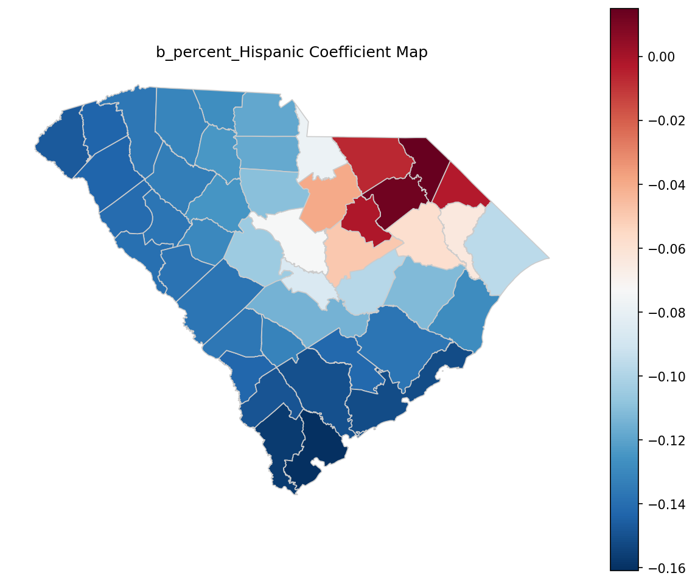

As shown in Figure 7, local `b_percent_Hispanic` coefficients ranged from negative to slightly positive in some counties (Table 9: max **0.0149**), indicating spatial heterogeneity in this association.

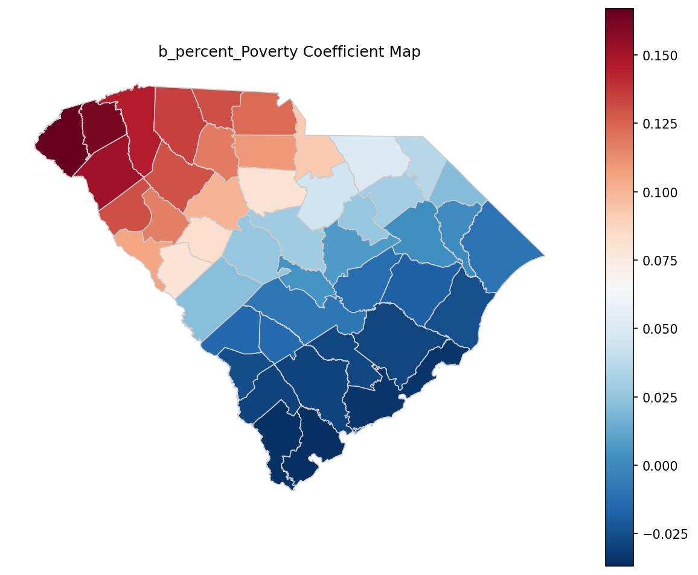

Figure 8 shows that the local `b_percent_Poverty` coefficient varied from slightly negative in some counties to positive in others, consistent with Table 9 (min **−0.0368**, max **0.167**).

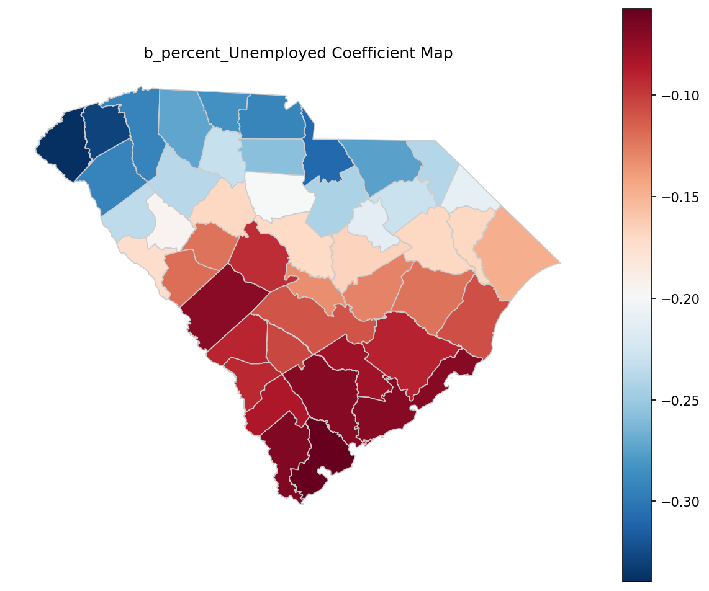

Figure 9 maps the spatial variation in `b_percent_Unemployed`, which remained negative across counties (Table 9: min **−0.340**, max **−0.0575**) with varying magnitude.

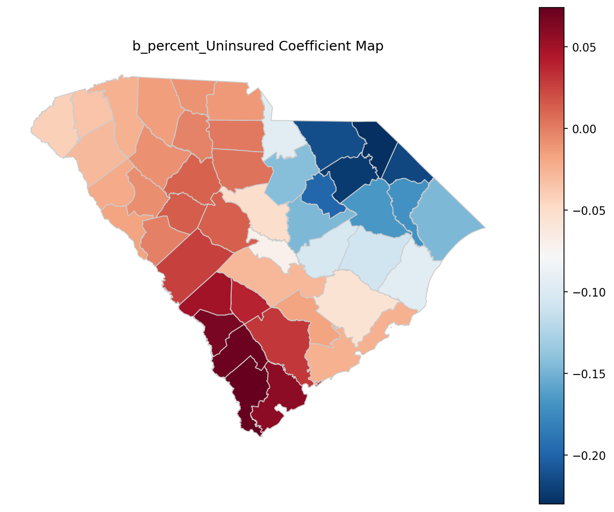

Figure 10 indicates that `b_percent_Uninsured` varied substantially across space and crossed zero in some counties (Table 9: max **0.0741**).

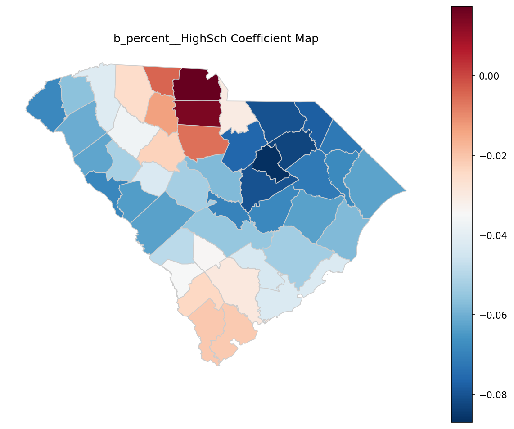

Figure 11 shows that `b_percent__HighSch` varied from negative to slightly positive (Table 9: max **0.0175**), indicating spatial heterogeneity in the local education–depression slope.

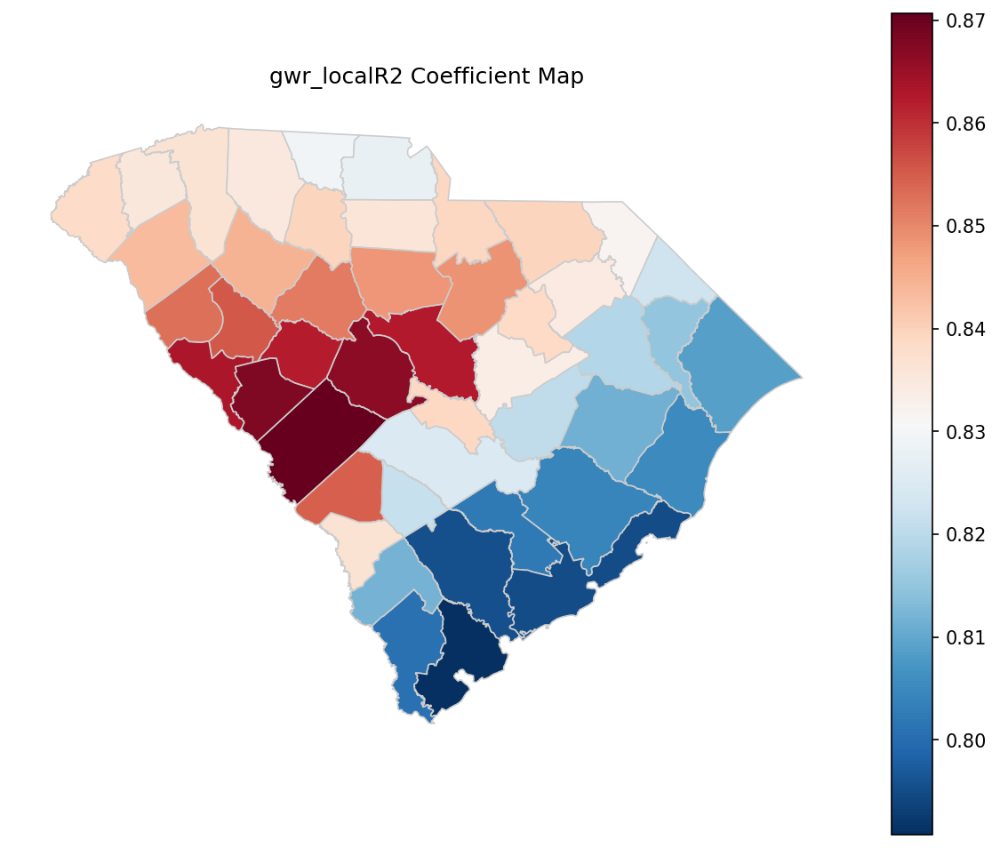

Figure 12 maps the local $R^2$ surface of the GWR, highlighting geographic variation in model explanatory power across counties.

For a compact visualization of multiple local coefficients at county centroids, Figure 13 provides an additional summary view of local-coefficient patterns.

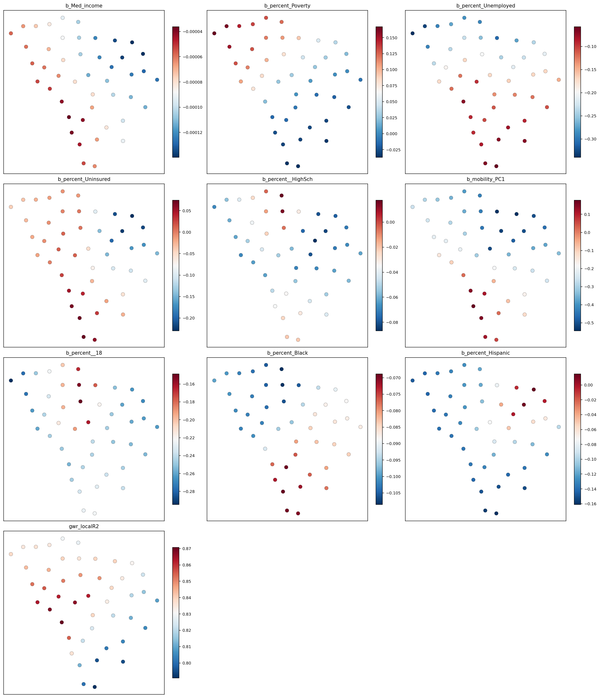

**Hypothesis Assessment (Objective 3).** The mediation hypothesis required evidence of non-zero indirect effects (ACME) via `mobility_PC1` and/or `mobility_diversity`, and the spatial-dependence hypothesis required evidence that accounting for spatial structure altered inference. Bootstrap mediation results indicated that **all ACME confidence intervals included zero** for the evaluated SES variables (e.g., `Med_income` ACME = 0.000029, 95% CI: [−0.000039, 0.000091]; `percent_Poverty` ACME = 0.0158, 95% CI: [−0.0319, 0.0634]), and the outcome-model coefficient on `mobility_PC1` was not statistically different from zero (β = −0.220; 95% CI: [−0.653, 0.214]; p = 0.321). Residual spatial autocorrelation was not statistically detected (Moran’s I = −0.0673, p = 0.321), and the SEM spatial error parameter was not statistically different from zero (λ = −0.286, p = 0.229), although GWR results documented **substantial spatial variability** in several local coefficients (e.g., `b_mobility_PC1` ranged from −0.544 to 0.178 and `b_percent_Poverty` ranged from −0.0368 to 0.167). **Verdict: partially supported** (not supported for mediation via `mobility_PC1` given null ACME intervals; partially supported for spatial heterogeneity insofar as GWR coefficients and local $R^2$ varied geographically, while global residual dependence and SEM λ were not statistically detected).

---

## 4. Discussion

### 4.1 Principal Findings
Across South Carolina counties, lower socioeconomic status was consistently associated with higher depression prevalence, supporting the study’s first hypothesis that county socioeconomic conditions co-vary with mental health burden. However, the hypothesized behavioral pathway through county mobility patterns was more equivocal: socioeconomic variables strongly structured the *composition gradient* captured by the first mobility principal component, while associations with overall mobility diversity (entropy) were weak and inconsistent with the predicted “lower-SES → lower diversity” pattern. When mobility composition was positioned as a mediator between specific socioeconomic indicators and depression, the indirect pathway through mobility was not estimated with precision, whereas the direct association between income and depression remained evident. Finally, diagnostic checks suggested that the primary outcome model did not exhibit strong residual spatial autocorrelation at the county adjacency scale, even though geographically weighted regression (GWR) indicated meaningful spatial nonstationarity in several local associations. The remainder of this Discussion interprets these patterns by mechanism, relates them to the study’s motivating literature, and outlines implications, limitations, and next steps.

### 4.2 Interpretation

#### 4.2.1 Socioeconomic stratification and county depression prevalence: support for H1, with demographic-pattern caveats
**Pattern.** The adjusted county model indicated that higher composite SES corresponded to lower depression prevalence, consistent with H1. In the same specification, higher county shares of Black and Hispanic residents were also negatively associated with county depression prevalence, net of the SES index and adult share.

**Mechanism (with boundary conditions).** The observed SES gradient is consistent with multiple contextual pathways emphasized in social-determinants and neighborhood-effects literatures: material hardship and insecurity, differential exposure to stressors, and uneven access to health-promoting resources and services (Satcher, 2001). Jakobsen et al. (2022) frame this as a “black box” in which area disadvantage becomes translated into mental health outcomes through neighborhood social-interactive characteristics (e.g., cohesion, trust, everyday interaction opportunities). In the present study, the SES index aggregated markers of advantage and deprivation; at the county scale, it plausibly proxies not only household resources but also institutional capacity (health and social services), built-environment quality, and economic opportunity structures that shape stress and coping. This mechanism should be expected to operate most strongly where residential and daily-life conditions are spatially stratified and persistent; it may be weaker (or appear weaker) where counties contain heterogeneous submarkets and sharp within-county inequities (e.g., a prosperous metro county with pockets of concentrated disadvantage). It may also be attenuated where selective migration, commuter labor sheds, or differential access to out-of-county services decouple residents’ lived contexts from county averages.

The negative associations with percent Black and percent Hispanic were more surprising under common expectations about structural disadvantage and health inequities. At an ecological scale, such coefficients can reflect *compositional, measurement, and reporting* processes rather than protective effects. One plausible explanation is construct mismatch in the outcome: county depression prevalence came from modeled surveillance estimates, which can be sensitive to differential diagnosis, treatment access, and reporting patterns across groups—processes that may vary geographically and correlate with race/ethnicity composition. Another possibility is spatial confounding: in South Carolina, racial/ethnic composition is patterned by urban–rural structure and regional settlement histories; after controlling for the SES index, the remaining between-county variation in depression may align more with age structure and place-specific contextual factors than with race/ethnicity composition per se. This interpretation is conditional on the boundary condition that the county scale is too coarse to represent within-county segregation and neighborhood exposures; the sign and magnitude could plausibly differ at tract or block-group scales where social and environmental mechanisms operate more directly (Coman et al., 2021).

**Engagement with prior literature.** The SES–depression association converges with the broader social-determinants framing that mental health is geographically uneven and structured by socioeconomic context (Satcher, 2001), and with work calling for mechanisms rather than simple gradients (Jakobsen et al., 2022). At the same time, the demographic coefficient pattern illustrates a recurring issue in spatial health research emphasized by Coman et al. (2021): area-level inference depends on spatial scale, variable construction, and the alignment of constructs across data sources. In other words, the study supports H1 as an association at the county level, while also underscoring that county demographic coefficients should not be read as individual-level effects (an ecological validity concern addressed further in §4.5).

**Hypothesis revisit.** H1 was supported: counties with lower composite SES had higher depression prevalence after adjustment. The evidence is strongest for the composite measure as operationalized here; the model does not, by itself, adjudicate which component of SES (income, education, poverty, unemployment, insurance) is primary, nor does it identify the causal pathway.

#### 4.2.2 Mobility composition as a marker of opportunity structure: partial support for H2, but “diversity” was not the expected axis
**Pattern.** Socioeconomic indicators were strongly associated with the first principal component of mobility composition, suggesting systematic differences in *what kinds of places are visited* across counties. By contrast, mobility diversity (Shannon entropy across ten POI categories) exhibited comparatively weak associations with SES variables and did not show the preregistered “lower-SES → lower diversity” pattern in a robust way. The mobility-diversity model was also notably lower in explanatory power than the mobility-PC1 model, implying that entropy captured different—and noisier—structure than the dominant compositional gradient.

**Mechanism (with boundary conditions).** A plausible mechanism is that mobility composition reflects county-level opportunity structures and constraints—what destinations exist, where they are, and who can access them—rather than simply the *breadth* of categories visited. Aggregated mobility traces can register disparities in access and disruption impacts at community scale (Lee et al., 2022), and those same traces can encode structural differences between, for example, counties with dense retail and service mixes versus counties where daily routines are oriented around fewer destination types or longer-distance travel. Under this view, PC1 likely captured a dominant “type-of-activity-space” axis—an organizing gradient in routine visitation—while entropy measured a coarse notion of balance across categories that can remain similar even when the *content* of mobility differs (e.g., two counties can have similar diversity values while emphasizing different categories).

This mechanism is expected to be strongest when POI visitation counts meaningfully represent residents’ activity spaces and when POI categories capture substantively distinct opportunities. It may fail (or attenuate) under at least three boundary conditions. First, if visitation counts include substantial inflows from nonresidents (tourism, commuting), then county mobility composition reflects a blended population and may decouple from residents’ socioeconomic context. Second, if counties differ in POI taxonomy coverage or in the propensity for mobile-device capture, the measured composition may reflect data-generation artifacts rather than behavior. Third, entropy is sensitive to the number and definition of categories: with only ten POI types, entropy may be too blunt to detect socioeconomic gradients that manifest within categories (e.g., quality, affordability, or distance), rather than across categories.

**Engagement with prior literature.** The finding that compositional gradients are socioeconomic patterned aligns with the premise that “community-scale big data” can reveal disparate community experiences and constraints (Lee et al., 2022). It also complements the “black box” perspective by offering a behavioral indicator that is closer to everyday routines than survey-only neighborhood constructs (Jakobsen et al., 2022). However, the weak and directionally inconsistent associations for mobility diversity diverge from the preregistered expectation in H2. A specific reason is measurement: Shannon entropy reflects balance, not volume or accessibility, and it treats all categories as equivalent units of opportunity. If lower-SES counties substitute between categories (e.g., shifting from one food category to another) without becoming more concentrated overall, entropy will not systematically decline even though mobility composition changes in meaningful ways. In addition, county-scale aggregation can mask within-county inequalities in access and segregation of activity spaces—an issue consistent with spatial-health perspectives emphasizing scale dependence (Coman et al., 2021).

**Hypothesis revisit.** H2 was partially supported. The “systematic differences in visitation composition” component was supported via strong SES associations with mobility_PC1. The “lower mobility diversity in lower-SES counties” component was not supported at conventional levels and was not consistently negative.

#### 4.2.3 Mobility as a mediator of SES–depression: limited evidence for the hypothesized pathway in this county-scale design
**Pattern.** When mobility_PC1 was included as a mediator between each socioeconomic indicator and depression prevalence, indirect effects (ACME) were imprecisely estimated and not statistically distinguishable from zero in the bootstrap intervals, while the direct association between median income and depression remained negative and statistically different from zero. Moreover, in the outcome model that included mobility_PC1 alongside socioeconomic and demographic covariates, the mobility_PC1 coefficient was not estimated with precision. Together, these patterns suggest that, in this dataset and at this spatial scale, mobility_PC1 did not behave as a strong intervening pathway linking socioeconomic conditions to depression prevalence.

**Mechanism (with boundary conditions).** A defensible interpretation is that county mobility composition—at least as summarized by PC1 over ten POI categories—captures opportunity structure and routine activity patterns, but not necessarily the psychosocial or social-interactive mechanisms that are theorized to connect context to depression (Jakobsen et al., 2022). Mediation frameworks in mental health often identify intermediate processes that are closer to stress buffering, social support, health behaviors, or service engagement (Oh and Thomas, 2024; Zhang et al., 2024). Mobility composition may be too distal, too aggregated, or too confounded by urbanicity and commuting to serve as a mediator in a linear county model. This mechanism should be more plausible under boundary conditions where mobility measures approximate residents’ social exposure opportunities (e.g., repeated local, discretionary activity spaces) and where the mediator is temporally aligned with the onset and experience of depressive symptoms. It may not apply when mobility is dominated by structural necessity (commuting to work, long trips for basic services) or when the mediator and outcome are measured at mismatched temporal windows.

A second explanation is statistical: several socioeconomic predictors strongly co-varied with mobility_PC1, which can make the unique contribution of mobility difficult to identify in an outcome model with multiple SES covariates. In that setting, the mediator may function primarily as an alternative proxy for socioeconomic structure rather than as a separable pathway. This does not invalidate the substantive relevance of mobility patterns; rather, it indicates that the present operationalization did not isolate a mediating channel with the available sample size and ecological units.

**Engagement with prior literature.** The limited mediation evidence does not contradict mediation-oriented mental health research; instead, it clarifies that not all plausible intermediate constructs are empirically salient at all scales. Oh and Thomas (2024) identify social cohesion and trust as mediators between material hardship and depression—constructs that are conceptually closer to the stress-buffering mechanisms discussed by Jakobsen et al. (2022). Zhang et al. (2024) demonstrate mediation through modifiable health-related conditions and behaviors (Life’s Essential 8), again reflecting mediators with clearer clinical and behavioral proximity. Mobility composition, by comparison, may require more refined constructs (e.g., social exposure, green space access, essential-service access, or segregation of activity spaces) to align with these mediation pathways.

**Hypothesis revisit.** The study did not preregister a formal mediation hypothesis separate from H2, but the overarching research question framed mobility as a potential mediator. The evidence suggested that mobility_PC1 covaried with SES (supporting the “exposure gradient” premise) but did not provide strong support for mobility_PC1 as a mediating mechanism linking SES indicators to county depression prevalence in these models.

#### 4.2.4 Spatial structure, nonstationarity, and what “county-level” can and cannot resolve
**Pattern.** Residual spatial autocorrelation in the outcome model was not statistically distinguishable from zero using a Queen contiguity structure (Table 6), and the spatial error model did not indicate a strong residual dependence process at that same adjacency scale (non-significant spatial error parameter). At the same time, GWR diagnostics and local coefficient summaries indicated that several associations varied materially across space, including mobility_PC1 and multiple socioeconomic covariates (Tables 13–14).

**Mechanism (with boundary conditions).** These findings are compatible rather than contradictory: a model can have little *residual* spatial autocorrelation while still exhibiting *spatially varying relationships* (nonstationarity). The Moran’s I and SEM results speak to whether unmodeled, spatially clustered error remains after included covariates; the GWR results speak to whether the strength (and sometimes sign) of associations differs by location. Nonstationarity is plausible in South Carolina because counties differ in settlement form (coastal tourism, metropolitan labor markets, rural service deserts), which can change how socioeconomic conditions and mobility patterns relate to health outcomes. This mechanism is expected when contextual processes differ across subregions; it should be weaker if the same institutional and built-environment relationships held uniformly statewide or if the chosen unit (county) were too coarse to resolve meaningful local variation.

**Engagement with prior literature.** Methodologically, this complements spatial-health arguments that place-based health relationships are scale- and context-dependent and may not be well described by a single global parameter (Coman et al., 2021). It also aligns with the use of GWR to identify local variations in relationships in applied spatial epidemiology (Rząsa and Ciski, 2022). A key caution, however, is that GWR patterns can reflect both substantive heterogeneity and instability from small samples or collinearity; interpretation therefore should remain associational and exploratory rather than causal or deterministic.

### 4.3 Closing the Loop with the Research Gap
The Introduction identified a gap in empirically connecting area-level SES to depression through *measurable, spatially explicit behavioral pathways*, noting that prior work often relies on survey constructs (e.g., cohesion, trust) and that mobility-derived indicators of everyday activity spaces remain underused in SES–depression research (Jakobsen et al., 2022; Coman et al., 2021; Lee et al., 2022). This study advanced that agenda in two concrete ways. First, it reproduced the expected county SES–depression gradient in South Carolina while embedding it in a GIS workflow that enabled spatial diagnostics and place-based interpretation. Second, it demonstrated that aggregated place-visitation patterns were not merely noisy correlates but were strongly structured by socioeconomic conditions along a dominant compositional axis—thereby providing a behavioral, mappable indicator of opportunity structure that can be integrated into spatial health models. At the same time, the study also clarified what remains unresolved: the mobility summaries used here did not provide strong evidence of mediation between SES and depression at the county scale, implying that future work must refine mobility constructs, address temporal alignment, and move to finer spatial units to more directly test mobility-mediated mechanisms.

### 4.4 Implications
Substantively, the results imply that “mobility environments” and socioeconomic context are tightly linked, but that the linkage operates more through *which kinds of destinations structure routine activity* than through a simple “more versus less diverse” activity profile. For applied GIScience and public health practice, this suggests that mobility data may be most informative when used to identify *compositional signatures* of opportunity and constraint (e.g., reliance on particular destination types) rather than when reduced to single-number diversity indices. This is consistent with the broader promise of community-scale big data for diagnosing uneven community conditions (Lee et al., 2022), but it also cautions that simplistic mobility summaries may miss the dimensions of behavior most relevant to mental health.

Methodologically, the combination of weak residual spatial dependence with evidence of nonstationary local coefficients points toward a pragmatic modeling implication: statewide “one-size-fits-all” parameters may obscure important subregional differences even when global residual autocorrelation tests are null. In settings like South Carolina where counties span heterogeneous urban–rural and coastal–inland contexts, spatially varying coefficient approaches can complement global regression by identifying where associations are strongest or weakest—an approach consistent with applied GWR usage in spatial health studies (Rząsa and Ciski, 2022). However, the present study’s mediation results also imply that incorporating mobility data into SES–health models should be done with careful construct design and validity assessment; otherwise, mobility can function as an additional proxy for SES rather than an interpretable intervening pathway (Oh and Thomas, 2024; Zhang et al., 2024).

### 4.5 Limitations and Validity
Several limitations qualify interpretation and point to specific threats to validity. First, the study was cross-sectional and ecological: all variables were aggregated to counties, and the depression measure was a modeled prevalence estimate rather than individual clinical assessment. This threatens **internal validity** (confounding) and **ecological validity** (ecological fallacy). Unmeasured county factors—such as mental health service availability, differential diagnosis and reporting, transportation access, or cultural variation in help-seeking—could be correlated with both socioeconomic measures and depression prevalence. The likely direction of bias is ambiguous: if low-SES counties also have lower diagnosis and treatment access, the observed SES–depression association could be biased toward zero (under-ascertainment in disadvantaged areas), whereas if disadvantage also correlates with stressors not captured by the index, the association could be biased away from zero.

Second, the mobility measures may not align with the intended construct of “resident activity space.” County POI visitation counts can be influenced by commuting and tourism, especially in coastal or metropolitan counties, which threatens **construct validity** of the mediator and mobility outcomes. This could dilute or distort associations with depression prevalence, plausibly biasing mediation estimates toward zero by adding nonresident visitation noise. The very strong fit of the mobility_PC1 model alongside weak mediation signals is consistent with a scenario in which mobility_PC1 is well explained by structural county characteristics but is not a clean proxy for the psychosocial mechanisms that link context to depression (Jakobsen et al., 2022).

Third, measurement and specification choices introduce scale-related uncertainty. County boundaries impose a modifiable areal unit problem (MAUP): relationships estimated at the county scale may not hold at tracts or neighborhoods where mental health–relevant exposures operate (Coman et al., 2021). This threatens **external validity across scales** (generalizability of parameters). Moreover, the mediation analysis relied on linear models with multiple correlated SES predictors; multicollinearity can inflate uncertainty and make indirect pathways difficult to detect, threatening **statistical conclusion validity** (reduced power and unstable estimates) in a sample of 46 units. A different design—fewer, more orthogonal SES predictors or latent-variable modeling—could change inference about mediation.

Fourth, spatial modeling evidence was mixed by design: the Moran’s I test and SEM parameter did not indicate strong residual spatial dependence at the chosen contiguity scale, but GWR suggested nonstationarity. This raises a **model validity** concern: local coefficient variation can reflect true contextual heterogeneity, but it can also arise from small-sample instability and local collinearity. Without sensitivity analyses (e.g., alternative kernels/bandwidths, spatial cross-validation), the magnitude of nonstationarity should be interpreted as suggestive rather than definitive.

What is supported despite these limitations is narrowly defined: (i) a robust county-level SES–depression association in South Carolina under the specified covariate adjustment, and (ii) strong socioeconomic patterning of a dominant mobility-composition gradient, alongside weaker evidence that entropy-based “diversity” is the primary socioeconomic axis of mobility differentiation.

### 4.6 Future Research
Future work can directly address these limitations and sharpen the mediation question in three ways. First, to resolve ecological and MAUP concerns, analyses should be replicated at finer spatial units (e.g., census tracts) and, where possible, with multilevel designs that nest individuals within neighborhoods or counties. This would enable explicit separation of compositional and contextual effects and would better align with spatial-health guidance on scale-dependent inference (Coman et al., 2021).

Second, mobility constructs should be redesigned to better match theorized mechanisms. Rather than relying primarily on entropy, future studies could derive mobility indicators that capture (a) essential-service accessibility (distance- or time-weighted reachability), (b) social exposure opportunities (visitation to socially interactive settings), or (c) activity-space segregation (differences in destinations by subpopulation), which is more directly connected to the “social-interactive characteristics” mechanisms emphasized by Jakobsen et al. (2022). Pairing mobility with complementary neighborhood constructs (e.g., cohesion proxies or service availability) could better operationalize mediation frameworks similar to those used in prior mental health research (Oh and Thomas, 2024; Zhang et al., 2024).

Third, temporal alignment and quasi-experimental leverage are needed to move beyond associational mediation at one time point. Longitudinal mobility data, repeated depression estimates, or designs exploiting exogenous disruptions (e.g., infrastructure changes, disasters) could help test whether shifts in mobility opportunity structures precede changes in depression prevalence, following the broader promise of community-scale big data for tracking disparate impacts over time (Lee et al., 2022). Such designs would also clarify whether mobility is a mediator, a proxy for broader structural context, or both—depending on place and period.

---

## 5. Conclusion

Prior work has established that socioeconomic disadvantage is spatially patterned and frequently co-varies with poorer mental health, but has left less clear whether mobility-derived indicators of everyday place exposure provide a measurable, spatially explicit “middle layer” that aligns with that gradient at policy-relevant areal units. In South Carolina counties, this study shows that the socioeconomic gradient in depression prevalence is not only detectable after demographic adjustment, but also that socioeconomic stratification is reflected more strongly in *which* place categories constitute county visitation portfolios than in a simple entropy-based notion of “more versus less diverse” mobility. In other words, county mobility composition appears to function as a marker of differentiated opportunity structures, whereas mobility diversity (as operationalized here) does not consistently encode the expected SES ordering.

At a higher level, the results suggest three connected takeaways. Depression prevalence was higher in lower-SES counties, consistent with a robust, spatially structured disparity at the county scale. Mobility composition exhibited a pronounced socioeconomic signature, implying that aggregated visitation profiles carry interpretable information about place-based routines that co-vary with socioeconomic context. However, positioning mobility measures as intermediaries did not yield precise evidence for an indirect pathway in this county-level setting, and spatial diagnostics indicated that inference should not rely on a single statewide association: the absence of strong residual autocorrelation at the adjacency scale co-existed with meaningful geographic nonstationarity in local relationships.

Hypothesis H1 was supported: county socioeconomic status was negatively associated with depression prevalence. Hypothesis H2 was partially supported: SES systematically patterned mobility composition (PC1), but the prediction of lower mobility diversity in lower-SES counties was not supported.

These claims are bounded to cross-sectional associations among all 46 South Carolina counties using county-aggregated modeled depression prevalence and ten-category POI visitation shares; they do not identify causal effects, individual-level mechanisms, or within-county inequities. The next empirical question enabled by these findings is whether finer-grained (e.g., sub-county) mobility compositions—measured with richer destination taxonomies and clearer resident/nonresident separation—exhibit a more spatially consistent alignment with local variation in depression prevalence.

---

## References

[1] Jakobsen, A.L., Jørgensen, A., Tølbøll, L., & Johnsen, S.B. (2022). Opening the black box of the relationship between neighborhood socioeconomic status and mental health: Neighborhood social-interactive characteristics as contextual mechanisms. *Health &amp; Place*. https://doi.org/10.1016/j.healthplace.2022.102905

[3] Rząsa, K., & Ciski, M. (2022). Influence of the Demographic, Social, and Environmental Factors on the COVID-19 Pandemic—Analysis of the Local Variations Using Geographically Weighted Regression. *International Journal of Environmental Research and Public Health*. https://doi.org/10.3390/ijerph191911881

[4] Oh, J., & Thomas, M.M. (2024). The mediating role of neighborhood social cohesion and trust in the relationship between childhood material hardship and adolescent depression. *Health &amp; Place*. https://doi.org/10.1016/j.healthplace.2023.103162

[8] Satcher, D. (2001). Mental Health: Culture, Race, and Ethnicity—A Supplement to Mental Health: A Report of the Surgeon General. *University Libraries (University of Maryland)*. https://doi.org/10.13016/jela-ckxw

[14] Lee, C., Maron, M., & Mostafavi, A. (2022). Community-scale big data reveals disparate impacts of the Texas winter storm of 2021 and its managed power outage. *Humanities and Social Sciences Communications*. https://doi.org/10.1057/s41599-022-01353-8

[20] Zhang, H., Zhang, L., Li, J., Xiang, H., Liu, Y., Gao, C., et al. (2024). The influence of Life’s Essential 8 on the link between socioeconomic status and depression in adults: a mediation analysis. *BMC Psychiatry*. https://doi.org/10.1186/s12888-024-05738-8

[21] Coman, E., Steinbach, S., & Cao, G. (2021). Spatial perspectives in family health research. *Family Practice*. https://doi.org/10.1093/fampra/cmab165