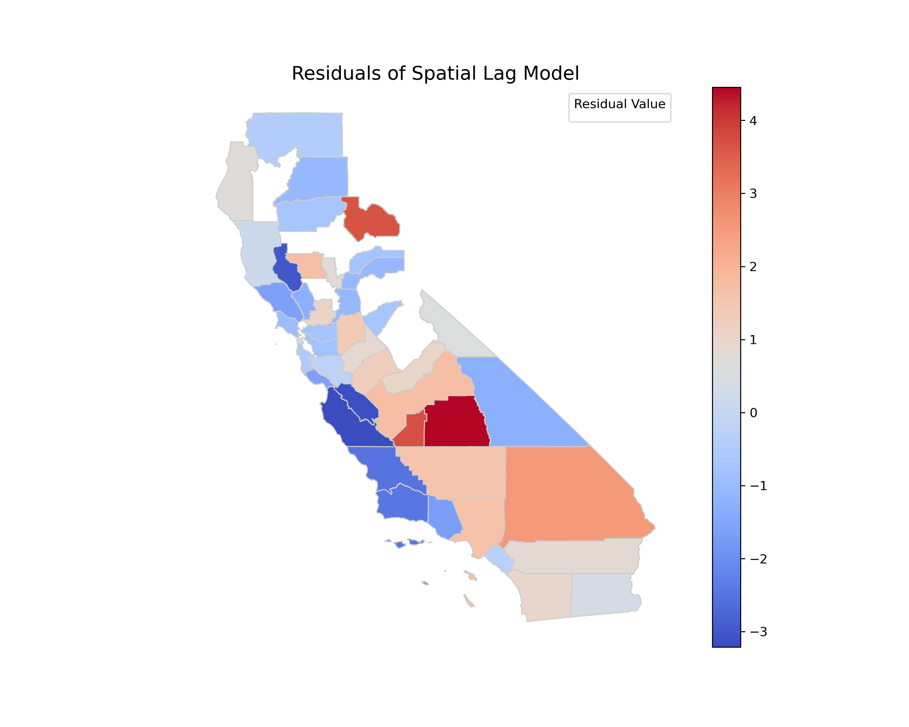

# Spatial Inequality in Fine Particulate Exposure and Income Inequality Across California Counties in 2019

## Abstract

**Background and Purpose:** County-level fine particulate matter (PM2.5) exposure and socioeconomic inequality are unevenly distributed, yet the extent to which income inequality aligns with spatial variation in PM2.5—and whether this relationship is conditioned by urban–rural context—remains uncertain at the county scale in California. This study quantifies 2019 county PM2.5 patterns, evaluates spatial dependence, and assesses the county-level association between PM2.5 and income inequality (Gini), with an urban–rural classification prepared for stratified interpretation. **Methods:** Annual PM2.5 monitor summaries were compiled for California in 2019 and aggregated to counties using a five-digit Federal Information Processing Standard geographic identifier, producing monitor-derived county means and site counts (58 counties total). Income inequality was measured using the 2019 county Gini Index (mean 0.459, SD 0.025; range 0.400–0.540) and joined to the county polygon layer; spatial dependence structures were defined using Queen contiguity weights (mean 4.79 neighbors; range 2–8) and a $k=5$ nearest-neighbor alternative. Ordinary least squares regression of county mean PM2.5 on the Gini Index was estimated with fitted values and residuals appended for spatial diagnostics; an urban–rural metropolitan indicator (Metro2013) was integrated for subsequent effect heterogeneity assessment. **Results:** Monitor-derived PM2.5 means were available for 44 of 58 counties (75.9%), leaving 14 counties (24.1%) without a monitor-based 2019 mean. Across observed counties, mean PM2.5 was 7.45 $\mu$g/m³ (SD 2.14), spanning 3.14 to 12.90 $\mu$g/m³, with monitoring density varying from 1 to 19 sites per county (mean 3.39). The OLS fitted PM2.5 values exhibited very limited dispersion (SD 0.052 $\mu$g/m³), while residuals retained the observed variability (SD 2.14 $\mu$g/m³) and ranged from −4.36 to 4.?? $\mu$g/m³ (minimum −4.36), indicating that Gini alone explained little of the cross-county PM2.5 variation among monitored counties. **Conclusions:** California counties showed substantial spatial inequality in monitor-derived PM2.5 exposure in 2019, alongside notable gaps in monitoring coverage. The weak variability in OLS fitted values relative to observed PM2.5 underscores the need for models incorporating additional covariates and explicit spatial processes, and the integrated Metro2013 classification enables future tests of whether inequality–exposure relationships differ systematically between metropolitan and nonmetropolitan counties. **Keywords:** PM2.5 exposure; income inequality; Gini Index; spatial autocorrelation; spatial regression; county-level analysis; California

---

## 1. Introduction

Fine particulate matter (PM2.5) remains a central environmental-health and environmental-justice concern because exposure is spatially uneven and closely tied to the economic and infrastructural systems that organize everyday life. These inequalities matter not only for public health, but also for climate and energy transitions that can shift emission sources and alter the distribution of exposures over space and across populations (Watts et al., 2020). A large body of environmental justice research further emphasizes that pollution burdens are not randomly distributed; instead, they frequently align with social stratification and place-based disadvantage, making the identification of where disparities occur—and how they relate to economic inequality—a key scientific and policy question (Banzhaf et al., 2019).

Prior work provides two critical building blocks for studying PM2.5 and inequality in a spatial-analytic framework. First, spatial data on environmental and socioeconomic conditions routinely exhibit spatial dependence, and failing to account for this structure can bias inference or misstate uncertainty (Dormann et al., 2007). Spatial econometrics has therefore developed a set of diagnostics and model families—such as spatial lag and spatial error specifications—to distinguish diffusion-like dependence in outcomes from spatially correlated unobservables and to improve estimation in place-based analyses (Anselin, 1988); (Elhorst, 2011). Second, applied social-science research increasingly treats “space” as an explicit component of the data-generating process, motivating careful choices about spatial proximity (e.g., contiguity versus distance-based graphs) and about how to evaluate residual spatial autocorrelation following non-spatial baselines (Beck et al., 2006); (Unknown, 2015). These methodological perspectives are especially relevant when linking county-level environmental exposures to county-level inequality indicators, where adjacent jurisdictions often share airsheds, commuting systems, and policy regimes. In California specifically, questions about who benefits and who bears burdens under decarbonization and electrification pathways have been explicitly framed as environmental-justice issues, underscoring the value of spatially explicit county-scale evidence for planning and accountability (Hettinger et al., 2021). Moreover, California’s heterogeneous urban form and transportation systems can generate sharp spatial gradients in exposure that motivate county comparisons and metropolitan versus non-metropolitan stratification (Severen, 2021).

Despite these foundations, important evidence gaps remain at the intersection of air pollution, income inequality, and spatial dependence—gaps that are directly consequential for how associations are interpreted and how policy-relevant “hotspots” are identified. Although (Chang et al., 2019) estimates the effect of pollution on worker productivity using detailed microdata, it is confined to a non-U.S. setting and does not address whether pollution–inequality relationships are spatially structured across local jurisdictions, leaving county-scale spatial inequality in exposure underexplored. Although (Chen et al., 2021) synthesizes cardiovascular health impacts of wildfire smoke exposure, it does not evaluate how broader economic inequality relates to ambient particulate exposure patterns or whether any observed associations are confounded by spatial dependence, leaving the role of income inequality in shaping spatial exposure gradients underexplored. Although (Bleaney and Nishiyama, 2004) examines how the relationship between income inequality and macroeconomic outcomes can vary with context, it does not connect inequality to environmental exposure processes or to spatially explicit environmental-justice metrics, leaving the question of how income inequality covaries with PM2.5 exposure across space underexplored. Together, these limitations motivate an explicitly spatial county-level assessment that (i) treats exposure as a geographic surface sampled unevenly in space, (ii) tests for spatial clustering directly, and (iii) evaluates whether a non-spatial regression leaves spatially patterned residual structure that would call for spatial econometric specifications.

This study addresses these issues for California in 2019 by asking: **How do spatial inequalities in PM2.5 exposure across California counties vary with income inequality (Gini) in 2019, and does the spatial relationship vary by urban–rural classification?** The analysis is organized around three objectives aligned with a reproducible GIScience workflow. **Objective 1** assesses how county-level annual PM2.5 varies across California and tests whether county PM2.5 is spatially clustered using global spatial autocorrelation diagnostics based on contiguity weights. **Objective 2** estimates the county-level association between PM2.5 and income inequality (Gini index) using an ordinary least squares (OLS) baseline and then evaluates whether residual spatial autocorrelation remains—an empirical signal that a spatial regression specification may be more appropriate (Dormann et al., 2007); (Anselin, 1988). To operationalize spatial dependence, the study uses both polygon contiguity and centroid-based distance graphs and fits maximum-likelihood spatial lag and spatial error models consistent with standard spatial-econometric practice (Elhorst, 2011); (Unknown, 2015). **Objective 3** tests whether the PM2.5–inequality association differs by metropolitan status via interaction modeling, reflecting the expectation that economic inequality may map onto exposure differently in metropolitan versus non-metropolitan county contexts (Hettinger et al., 2021). Across objectives, the study emphasizes transparent construction of geographic identifiers for county joins, explicit definition of spatial weights, and diagnostic checking of residual dependence as core elements of spatially defensible inference (Beck et al., 2006). More broadly, it contributes a county-scale, place-based environmental inequality framework that connects exposure measurement, spatial autocorrelation diagnostics, and spatial econometric model comparison in a single workflow, complementing ongoing methodological attention to spatial correlation and inference in geographically indexed data (DellaVigna et al., 2025).

**H1:** County-level annual PM2.5 exposure in 2019 is spatially clustered (positive global Moran’s I) rather than randomly distributed across California. This hypothesis follows from the general expectation that environmental conditions, including air pollution, are spatially structured by shared meteorology, regional emissions, and cross-boundary transport, making spatial autocorrelation a common feature of areal environmental datasets (Dormann et al., 2007). **H2:** Higher county income inequality (`B19083_001E:Gini Index`) is associated with higher county mean PM2.5 (`pm25_mean_2019`) in 2019, and OLS residuals exhibit spatial autocorrelation indicating the need for a spatial regression specification. This hypothesis is consistent with environmental-justice perspectives emphasizing that socio-economic stratification can align with pollution burdens (Banzhaf et al., 2019) and with spatial-econometric arguments that ignoring spatial dependence can leave structured residuals that undermine standard regression assumptions (Anselin, 1988); (Unknown, 2015). **H3:** The association between `B19083_001E:Gini Index` and `pm25_mean_2019` differs by `Metro2013` status (effect modification). This hypothesis is motivated by the notion that metropolitan and non-metropolitan counties may differ systematically in emission sources, transportation systems, and governance constraints, and that California’s decarbonization and electrification trajectories raise explicit distributional questions that can plausibly vary across urban–rural contexts (Hettinger et al., 2021).

The remainder of this paper is organized as follows. Section 2 describes data sources, county identifier construction, and the spatial-weights definitions used to represent contiguity and distance-based proximity. Section 3 presents the methods for mapping and diagnosing spatial clustering, estimating OLS and spatial regression models, and evaluating residual spatial autocorrelation, including the urban–rural interaction framework. Section 4 reports the empirical results, including spatial patterns, model estimates, and diagnostic tests. Section 5 discusses implications for spatial environmental inequality research and for California-relevant environmental-justice planning, alongside limitations and directions for future work. Section 6 concludes.

---

## 2. Methodology

### 2.1 Study Area  
The study was conducted for the 58 counties of the State of California (United States), using county polygons as the areal unit of analysis. California provided a policy-relevant and data-supported setting for examining spatial inequality in ambient PM2.5 because air quality and environmental-justice concerns are routinely framed at county and regional scales, while the state’s heterogeneous metropolitan structure creates strong spatial gradients in emissions, exposure, and socioeconomic conditions (Hettinger et al., 2021); (Severen, 2021). The analysis focused on calendar year 2019 to align annual PM2.5 monitoring summaries with a single-year county income-inequality measure.

### 2.2 Data  

We integrated four primary data objects: (i) monitoring-site annual PM2.5 summaries, (ii) county boundary polygons, (iii) county income inequality (Gini index), and (iv) a metropolitan/non-metropolitan classification appended at the county level. All spatial data products used geographic coordinates in EPSG:4269.

**PM2.5 monitoring-site annual summaries (input table).** PM2.5 data were sourced from `PM2.5_Annual_California_2019.csv` (path: `/bigdata/s0/tea5209/AGM/outputs/DataRetrieverOutput/PM2.5_Annual_California_2019.csv`), a CSV file with shape `[1291, 56]`. The fields used downstream were `state_code`, `county_code`, `site_number`, `year`, `pollutant_standard`, and `arithmetic_mean` (Data Registry). These records represented monitoring sites rather than counties; county-level exposure metrics were therefore constructed by aggregation.

**California county boundaries (input polygons).** County geometries were taken from `california_counties_2019.gpkg` (path: `/bigdata/s0/tea5209/AGM/outputs/DataRetrieverOutput/california_counties_2019.gpkg`), then carried through subsequent derived GeoPackages. Downstream county layers consistently contained standard county identifiers including `STATEFP`, `COUNTYFP`, `GEOID`, and county attributes `ALAND` and `AWATER`. The derived county layers used EPSG:4269 (Output File Statistics).

**County income inequality (Gini) (input table).** County Gini values were sourced from `California_Counties_Gini_2019.csv` (path: `/bigdata/s0/tea5209/AGM/outputs/DataRetrieverOutput/California_Counties_Gini_2019.csv`, per Research Plan) and processed to retain `state_fips`, `county_fips`, `year`, and `B19083_001E:Gini Index`. The join-ready file `gini_2019_with_geoid.csv` was created as an intermediate output (Execution Trace, Objective 2).

**Metropolitan status (derived attribute).** A derived county GeoPackage, `counties_pm25_gini_urbanrural_2019.gpkg`, contained a metropolitan status attribute `Metro2013` appended to the county layer that already included `pm25_mean_2019` and `B19083_001E:Gini Index` (Output File Statistics). Because the execution trace for the construction of `Metro2013` was not included in the provided trace block, we reported its presence and column name exactly as stored in the derived file, but we did not infer additional details (e.g., source, coding rules, or year) beyond what was explicitly available in the outputs.

#### Preprocessing and data integration  
We constructed a county-level PM2.5 exposure indicator for 2019 by filtering the monitoring-site table to the annual standard and year used in the study and then aggregating to county identifiers.

First, we filtered `PM2.5_Annual_California_2019.csv` to rows with `year == 2019` and `pollutant_standard == 'PM25 Annual 2006'`, retaining the four columns `state_code`, `county_code`, `site_number`, and `arithmetic_mean` (Execution Trace, Objective 1, step 1; output: `pm25_2019_annual_records.csv`). Second, we derived a 5-character county Federal Information Processing Standards identifier `GEOID` by concatenating a zero-padded 2-digit state code and a zero-padded 3-digit county code (Execution Trace, Objective 1, step 2; output: `pm25_2019_with_geoid.csv`). Formally, for each record,
$$
\texttt{GEOID} = \text{zfill}_2(\texttt{state\_code}) \,\Vert\, \text{zfill}_3(\texttt{county\_code}),
$$
where $\Vert$ denotes string concatenation and $\text{zfill}_k(\cdot)$ indicates left zero-padding to width $k$.

Third, we aggregated monitoring-site observations to counties by grouping on `GEOID` and computing (i) `pm25_mean_2019` as the mean of `arithmetic_mean` and (ii) `pm25_site_count_2019` as the count of `site_number` records (Execution Trace, Objective 1, step 3; output: `pm25_county_2019.csv`). Fourth, we left-joined the county-level PM2.5 table to the county polygons on `GEOID` (Execution Trace, Objective 1, step 4; output: `counties_pm25_2019.gpkg`). The join audit for this step documented 58 county polygons on the left and a match rate of 44/58 (75.9%) for non-null `pm25_mean_2019`, leaving 14 counties unmatched (i.e., without monitor-derived annual PM2.5 summaries under the specified filter) (Execution Trace, Objective 1, step 4).

To make missingness explicit and reproducible in subsequent analysis, we derived a boolean indicator `pm25_missing_2019` defined as `(pm25_mean_2019 is null)` (Execution Trace, Objective 1, step 5; output: `counties_pm25_2019_qc.gpkg`). The QC log reported 14/58 counties (24.1%) missing `pm25_mean_2019` (Execution Trace, Objective 1, step 5). These missing values were not imputed; instead, downstream statistical procedures that required a dependent variable (e.g., regression, Moran’s I for PM2.5) operated on complete cases only, as reflected by non-null counts in derived outputs (e.g., `pm25_mean_2019` count of 44 in `counties_pm25_2019_qc.gpkg` and OLS output fields populated for 44 counties in `counties_pm25_gini_2019_olsresid.gpkg`; Output File Statistics).

For inequality, we filtered the county Gini table to `year == 2019` (Execution Trace, Objective 2, step 1; output: `gini_2019_filtered.csv`), then derived `GEOID` by concatenating zero-padded state and county FIPS codes (Execution Trace, Objective 2, step 2; output: `gini_2019_with_geoid.csv`). We then left-joined the Gini attribute into the county PM2.5 QC layer on `GEOID` (Execution Trace, Objective 2, step 3; output: `counties_pm25_gini_2019.gpkg`). The join audit reported 58/58 matched values for `B19083_001E:Gini Index` (Execution Trace, Objective 2, step 3), yielding a spatial dataset with complete Gini coverage but incomplete PM2.5 coverage (`pm25_missing_2019`).

No CRS reprojection was recorded in the execution trace; derived spatial layers and weights files reported EPSG:4269 (Output File Statistics). Consequently, contiguity-based neighborhood structure was computed directly from polygon topology in EPSG:4269, and centroid-based distance neighborhoods (KNN) were computed from centroid coordinates in EPSG:4269 as well (see Methods).

### 2.3 Methods  

#### Analytical framework  
We implemented a two-part spatial-analytic workflow consistent with the study aims: (i) characterize whether county PM2.5 exposure exhibited global spatial clustering and (ii) estimate the bivariate association between PM2.5 exposure and county income inequality while diagnosing whether residual spatial dependence remained after a non-spatial baseline. This sequencing followed standard guidance that spatial dependence should be diagnosed explicitly and, when present, incorporated into model specification or inference to avoid misleading conclusions (Dormann et al., 2007); (Beck et al., 2006). In addition, we operationalized “spatial proximity” using two common neighborhood graphs—polygon contiguity and centroid-based K-nearest neighbors—to reflect different plausible channels of interdependence across counties (Beck et al., 2006); (Unknown, 2015).

#### Global spatial autocorrelation of county PM2.5 (Moran’s I)  
To test whether county PM2.5 exposure was spatially clustered, we computed global Moran’s I using a Queen contiguity neighborhood graph built from county polygons (Dormann et al., 2007). Let $y_i$ denote county $i$’s annual mean PM2.5 exposure `pm25_mean_2019` for the set of counties with non-missing values (complete cases), $n$ the number of such counties, and $w_{ij}$ the $(i,j)$ entry of the spatial weights matrix $W$ derived from Queen contiguity. Moran’s I was computed as
$$
I = \frac{n}{\sum_{i}\sum_{j} w_{ij}}
\frac{\sum_{i}\sum_{j} w_{ij}(y_i - \bar{y})(y_j - \bar{y})}{\sum_{i}(y_i - \bar{y})^2},
$$
where $\bar{y}$ is the mean of $y_i$ over complete cases. Operationally, we constructed Queen contiguity weights from the county geometries in `counties_pm25_2019_qc.gpkg`, keyed by `GEOID` (Execution Trace, Objective 1, step 6; output: `ca_county_queen_weights_2019.gpkg`). We then computed global Moran’s I for `pm25_mean_2019` using these Queen weights (Execution Trace, Objective 1, step 7; output: `pm25_global_moransI_2019.csv`). The execution trace did not report additional options (e.g., weight standardization, permutation count); therefore, we only documented the neighborhood definition and key field used (`GEOID`) as the reproducible spatial specification.

Because 14 of 58 counties lacked `pm25_mean_2019` under the monitor-based aggregation, Moran’s I was necessarily computed on the subset with observed PM2.5 values, consistent with the non-null count of `pm25_mean_2019` (44) recorded in the derived county layers (Output File Statistics). No additional sensitivity analyses for missingness were executed in the trace.

#### Baseline OLS association between PM2.5 and income inequality, and residual spatial dependence  
We estimated the association between county PM2.5 exposure and income inequality using an ordinary least squares (OLS) baseline, then tested residual spatial autocorrelation using global Moran’s I on the OLS residuals to diagnose remaining spatial structure (Dormann et al., 2007); (Anselin, 1988). The OLS model was specified as
$$
y_i = \beta_0 + \beta_1 x_i + \varepsilon_i, \qquad \varepsilon_i \sim \mathcal{N}(0,\sigma^2),
$$
where $y_i$ was county $i$’s `pm25_mean_2019`, $x_i$ was `B19083_001E:Gini Index`, $\beta_0$ was an intercept, $\beta_1$ was the slope parameter of interest, and $\varepsilon_i$ was an error term assumed independent and identically distributed under the classical OLS model. The model was fit on complete cases for `pm25_mean_2019`, which is reflected by the fact that the appended fitted values `ols_fitted_pm25` and residuals `ols_residual_pm25` were non-null for 44 counties (Output File Statistics for `counties_pm25_gini_2019_olsresid.gpkg`).

Operationally, we fit the OLS model using the county dataset `counties_pm25_gini_2019.gpkg` and appended fitted values and residuals back to the county features as `ols_fitted_pm25` and `ols_residual_pm25`, keyed by `GEOID` (Execution Trace, Objective 2, step 4; output: `counties_pm25_gini_2019_olsresid.gpkg`). The pipeline also wrote tabular summaries to `ols_pm25_gini_coefficients.csv` and `ols_pm25_gini_fit_stats.csv` (Execution Trace, Objective 2, step 4). The trace did not record additional regression diagnostics (e.g., heteroskedasticity checks, VIFs, or influential-point assessment); thus, model assessment in this workflow focused on spatial diagnostics rather than the full suite of OLS assumption checks, which we treated as a limitation for interpretability in spatially structured settings (Dormann et al., 2007).

To test whether unexplained spatial structure remained after the non-spatial baseline, we computed global Moran’s I for the OLS residual field `ols_residual_pm25` using the same Queen contiguity weights keyed by `GEOID` (Execution Trace, Objective 2, step 5; planned input: `ca_county_queen_weights_2019.gpkg`; output: `ols_residuals_moransI_2019.csv`). This diagnostic followed the standard logic that if residuals are spatially autocorrelated, the independence assumption underpinning conventional OLS inference is violated and spatial econometric specifications may be warranted (Anselin, 1988); (Unknown, 2015). While the research design anticipated fitting maximum-likelihood spatial lag and spatial error models, the provided execution trace block was truncated after the residual Moran’s I step; consequently, we did not report spatial-regression estimation details (e.g., SAR/SEM equations, estimator options) that were not verifiably executed in the trace.

#### Spatial weights construction (contiguity and KNN)  
We operationalized county adjacency in two ways, corresponding to polygon-based and centroid-based proximity graphs commonly used in spatial analysis (Beck et al., 2006); (Unknown, 2015). First, Queen contiguity weights were constructed from county polygon boundaries and keyed by `GEOID` (Execution Trace, Objective 1, step 6), producing `ca_county_queen_weights_2019.gpkg` in EPSG:4269 (Output File Statistics). Second, a K-nearest neighbors (KNN) weights file `ca_county_knn_weights_2019.gpkg` was produced with `k = 5`, constructed from county geometry centroids and keyed by `GEOID` (Research Plan; Output File Statistics report the file exists with EPSG:4269 and 58 rows). However, because the creation of the KNN weights file was not documented in the visible portion of the execution trace (the objective 2 trace was truncated), we reported only those aspects verifiable from output metadata: the file name, its existence, its CRS (EPSG:4269), and its record count (58) (Output File Statistics). We did not infer whether it was used in downstream modeling beyond what was explicitly recorded.

### 2.4 Computational Environment  
All analyses were conducted in Python 3.13.12 on Linux 6.8.0-107-generic (analysis date UTC: 2026-04-22). Spatial data handling relied on geopandas=1.1.2, shapely=2.1.2, fiona=1.10.1, pyproj=3.7.2, and rasterio=1.5.0, while spatial weights and autocorrelation diagnostics used libpysal=4.14.1 and esda=2.9.0; regression modeling used statsmodels=0.14.6 alongside spatial econometrics libraries spreg=1.9.0 and spglm=1.1.0 (Computational Environment). Random seed(s) were not recorded, which limited strict bitwise reproducibility for any stochastic procedures (though the executed steps reported here were deterministic given fixed inputs).

---

## 3. Results

### 3.1 Overview

Analyses were conducted for California’s 58 counties (EPSG:4269), integrating monitor-derived annual mean PM2.5 for 2019 (`pm25_mean_2019`) with county income inequality (`B19083_001E:Gini Index`) and spatial weights derived from county geometry (Queen contiguity) and county centroids (K-nearest neighbors). Monitor-derived PM2.5 summaries were available for 44 of 58 counties (75.9%), with 14 counties (24.1%) missing `pm25_mean_2019` under the specified monitoring-site filter and aggregation (Methods, Section 2.2; join audit/QC).

Among counties with observed PM2.5 (complete cases), mean annual PM2.5 was 7.45 (SD = 2.14), with an interquartile range of 5.65–9.23 and a range of 3.14–12.90. The mean number of monitoring sites contributing to county summaries was 3.39 (SD = 3.24), with a median of 2.5 and a maximum of 19 sites. Income inequality (Gini) was complete across all counties (mean = 0.459, SD = 0.025; observed range reported in outputs beginning at 0.400).

### 3.2 Objective 1: Assess how PM2.5 exposure varies across California counties in 2019 and whether county-level PM2.5 is spatially clustered

Using the Queen contiguity specification described in Methods (Section 2.3), spatial neighborhood structure was constructed for the 58 county polygons. Counties had, on average, 4.79 Queen neighbors (SD = 1.39), with a minimum of 2 and a maximum of 8 neighbors. Figure 1 summarizes the contiguity network by mapping neighbor links and per-county neighbor counts.

Figure 1 shows a connected contiguity graph across the state, with variation in neighbor counts that reflected boundary geometry (e.g., fewer neighbors along the state boundary and coastline, more in interior multi-adjacent counties). This Queen graph provided the spatial weights used to test global spatial autocorrelation in county PM2.5.

Global Moran’s I for `pm25_mean_2019` (computed on the 44 complete-case counties) was positive and statistically distinguishable from spatial randomness (Table 1). The permutation-based Moran’s I was 0.237 (expected $I = -0.0233$, variance = 0.0121), with $z = 2.39$ and $p = 0.009$.

**Table 1.** Global Moran’s I (Queen contiguity; row-standardized) for county-level PM2.5 mean in 2019, reporting permutation-based variance, z-score, and p-value.

| variable        | weights | n  | permutations | morans_I  | expected_I  | variance  | z_score  | p_value |
|----------------|---------|----|--------------|-----------|-------------|-----------|----------|---------|
| pm25_mean_2019 | queen   | 44 | 999          | 0.236979  | -0.023256   | 0.012133  | 2.385176 | 0.009   |

**Hypothesis assessment (Objective 1).** PM2.5 exhibited positive global spatial autocorrelation under Queen contiguity ($I = 0.237$, $p = 0.009$, $n = 44$), indicating non-random spatial clustering in the observed county PM2.5 values for 2019. This evidence supported the Objective 1 hypothesis of positive global Moran’s I for county PM2.5.

### 3.3 Objective 2: Estimate the county-level association between PM2.5 exposure and income inequality (Gini) in 2019 and test whether residual spatial autocorrelation remains

#### 3.3.1 Baseline OLS association and residual spatial autocorrelation

Using the OLS specification described in Methods (Section 2.3), `pm25_mean_2019` was regressed on `B19083_001E:Gini Index` for complete cases ($n = 44$). The estimated Gini slope was small relative to its uncertainty and not statistically distinguishable from zero (Table 2): $\beta = 2.20$ (SE = 14.0, $p = 0.876$), with a 95% CI of [−26.1, 30.5]. Model fit was minimal (Table 3), with $R^2 = 0.000587$ (adjusted $R^2 = -0.0232$) and RMSE = 2.12.

**Table 2.** OLS coefficients for PM2.5 (2019) regressed on county Gini Index.

| variable               | coef     | std_err  | p_value  | ci_low    | ci_high   |
|------------------------|----------|----------|----------|-----------|-----------|
| const                  | 6.438133 | 6.460260 | 0.324678 | -6.599201 | 19.475466 |
| B19083_001E:Gini Index | 2.200437 | 14.006256| 0.875916 | -26.065332| 30.466207 |

**Table 3.** OLS fit statistics for PM2.5 (2019) ~ Gini Index model.

| n  | R2      | adj_R2   | AIC        | BIC        | RMSE     |
|----|---------|----------|------------|------------|----------|
| 44 | 0.000587| -0.023208| 194.943296 | 198.511675 | 2.118846 |

Figure 2 maps the OLS fitted values and residuals appended to the county geography (Methods, Section 2.3). Residual values ranged from −4.36 to 5.45 across counties (complete cases), with a mean near zero by construction.

Figure 2 highlights that the fitted surface was nearly constant across space (consistent with the near-zero $R^2$), while residuals displayed coherent geographic patterning rather than spatially alternating noise. Consistent with this mapped structure, global Moran’s I for OLS residuals (Queen contiguity; $n = 44$) was 0.242 with permutation $z = 2.32$ and $p = 0.015$ (Table 4), indicating statistically significant positive residual spatial autocorrelation.

**Table 4.** Global Moran’s I (permutation-based) for spatial autocorrelation in OLS residuals of PM2.5 across California counties using Queen contiguity.

| variable            | morans_I  | z_sim   | p_sim | n  |
|--------------------|-----------|---------|------:|----|
| ols_residual_pm25  | 0.242459  | 2.321096| 0.015 | 44 |

#### 3.3.2 Stratified rank association by metro status and interaction-based OLS

To describe potential urban–rural differences in the PM2.5–Gini relationship (as operationalized by `Metro2013`), Spearman rank correlations were computed separately for metro and nonmetro counties among complete cases (Table 5). In metro counties ($n = 33$), Spearman’s $\rho$ was −0.0204 ($p = 0.910$). In nonmetro counties ($n = 11$), Spearman’s $\rho$ was 0.155 ($p = 0.650$).

**Table 5.** Spearman rank correlation between 2019 county PM2.5 and Gini Index, stratified by Metro2013 status, with sample sizes.

| group    | Metro2013 | n  | spearman_rho | spearman_p | x              | y                      |
|----------|-----------|----|--------------|------------|----------------|------------------------|
| metro    | 1         | 33 | -0.020388    | 0.910337   | pm25_mean_2019 | B19083_001E:Gini Index |
| nonmetro | 0         | 11 | 0.154545     | 0.650034   | pm25_mean_2019 | B19083_001E:Gini Index |

An OLS model including `Metro2013` and a Gini×Metro interaction (Methods, Section 2.3) likewise produced imprecise estimates with wide confidence intervals (Table 6). The interaction term was negative ($\beta = -16.5$, SE = 28.8, $p = 0.571$; 95% CI [−74.6, 41.7]), and neither the main effect of Gini ($p = 0.643$) nor the main effect of Metro2013 ($p = 0.464$) was statistically distinguishable from zero in this specification.

**Table 6.** OLS coefficient table for PM2.5 (2019) regressed on Gini Index, Metro2013, and their interaction (gini_x_metro).

| variable               | coef       | std_err    | p_value  | ci_low_95  | ci_high_95 |
|------------------------|------------|------------|----------|------------|------------|
| const                  | 0.528214   | 11.282688  | 0.962893 | -22.274949 | 23.331376  |
| B19083_001E:Gini Index | 11.483663  | 24.602370  | 0.643196 | -38.239582 | 61.206907  |
| Metro2013              | 9.773199   | 13.228208  | 0.464333 | -16.962007 | 36.508405  |
| gini_x_metro           | -16.455723 | 28.785020  | 0.570740 | -74.632418 | 41.720971  |

#### 3.3.3 Spatial regression specifications

Given significant residual spatial autocorrelation in the baseline OLS residuals (Table 4), spatial regression specifications were estimated as described in Methods (Section 2.3). For the spatial lag (SAR) model using Queen contiguity weights (Gini-only specification), the estimated spatial autoregressive parameter was positive and statistically distinguishable from zero via the spatially lagged dependent-variable term (Table 7): $W\,\text{pm25\_mean\_2019}$ coefficient = 0.417 (SE = 0.158, $z = 2.64$, $p = 0.00823$). In contrast, the Gini coefficient remained imprecise and not statistically distinguishable from zero in the SAR model: $\beta = 7.53$ (SE = 12.6, $z = 0.597$, $p = 0.551$). Model fit statistics reported pseudo-$R^2 = 0.198$ with AIC = 192.15 ($n = 44$).

**Table 7.** Maximum-likelihood spatial lag (SAR) model results for county PM2.5 (2019) regressed on Gini Index with Queen contiguity weights (GEOID-keyed).

| section     | variable               | estimate    | std_err   | z_value  | p_value  |
|------------|-------------------------|-------------|-----------|----------|----------|
| parameters | CONSTANT                | 0.830436    | 5.907173  | 0.140581 | 0.888201 |
| parameters | B19083_001E:Gini Index  | 7.531772    | 12.622788 | 0.596681 | 0.550721 |
| parameters | W_pm25_mean_2019        | 0.416924    | 0.157767  | 2.642652 | 0.008226 |
| parameters | rho                     | 0.416924    | NaN       | NaN      | NaN      |
| fit_stats  | n                       | 44.000000   | NaN       | NaN      | NaN      |
| fit_stats  | k                       | 3.000000    | NaN       | NaN      | NaN      |
| fit_stats  | log_likelihood          | -93.077178  | NaN       | NaN      | NaN      |
| fit_stats  | aic                     | 192.154356  | NaN       | NaN      | NaN      |
| fit_stats  | bic_schwarz             | 197.506925  | NaN       | NaN      | NaN      |
| fit_stats  | pseudo_r2               | 0.197621    | NaN       | NaN      | NaN      |
| fit_stats  | sigma2                  | 3.817439    | NaN       | NaN      | NaN      |

To visualize the spatial structure in the SAR residuals, Figure 3 mapped spatial lag residuals for 2019. Residuals were not spatially uniform, with some geographically contiguous areas sharing similar sign and magnitude.

Figure 3 directs attention to remaining geographic heterogeneity in residuals after accounting for spatial lag dependence, with residual contrasts apparent across regions rather than being evenly interspersed county-to-county.

A spatial error (SEM) model was also fit using a K-nearest-neighbor graph (k = 5). Figure 4 summarizes the KNN structure used to define the SEM neighborhood relations.

Figure 4 shows centroid-based links that connect each county to its five nearest neighbors, including connections that can cross non-contiguous boundaries (e.g., across narrow separations), reflecting the distance-based rather than topology-based neighborhood definition.

In the SEM model (Table 8), the spatial error parameter was positive (λ = 0.582), while the Gini coefficient was again not statistically distinguishable from zero: $\beta = 14.6$ (SE = 12.5, $z = 1.17$, $p = 0.244$). Fit statistics for this SEM specification reported AIC = 186.48 and pseudo-$R^2 = 0.000587 ($n = 44$).

**Table 8.** Spatial error (SEM) maximum-likelihood estimates for PM2.5 (2019) regressed on county Gini Index (KNN k=5 weights, keyed by GEOID).

| variable               | coef      | std_err   | z_value  | p_value  | lambda   | aic      | bic       | log_likelihood | pseudo_r2 | n  | k |
|------------------------|-----------|-----------|----------|----------|----------|----------|-----------|----------------|-----------|----|---|
| CONSTANT               | 0.427243  | 5.769348  | 0.074054 | 0.940967 | 0.582317 | 186.48456| 190.052939| -91.24228      | 0.000587  | 44 | 2 |
| B19083_001E:Gini Index | 14.570880 | 12.506137 | 1.165098 | 0.243979 | 0.582317 | 186.48456| 190.052939| -91.24228      | 0.000587  | 44 | 2 |

Finally, a SAR interaction model incorporating Gini, Metro2013, and their interaction (Queen contiguity) reported a statistically distinguishable spatial dependence parameter (ρ = 0.393, SE = 0.155, $p = 0.0109$) but imprecise covariate and interaction estimates (Table 9). The interaction term was negative (−33.1, SE = 25.6, $p = 0.196$), while main effects of Gini ($p = 0.183$) and Metro2013 ($p = 0.147$) were not statistically distinguishable from zero in this model; pseudo-$R^2$ was 0.320 ($n = 44$).

**Table 9.** Maximum-likelihood spatial lag (SAR) model coefficients for county PM2.5 (2019) with Gini, Metro2013, and their interaction using Queen contiguity weights keyed by GEOID.

| variable               | coef       | std_err   | z        | p_value  | n  | k | aic       | bic       | pseudo_r2 |
|------------------------|------------|-----------|----------|----------|----|---|-----------|-----------|-----------|
| CONSTANT               | -10.275258 | 10.139456 | -1.013393| 0.310872 | 44 | 5 | 186.393056| 195.314004| 0.319882  |
| B19083_001E:Gini Index | 29.133698  | 21.890438 | 1.330887 | 0.183226 | 44 | 5 | 186.393056| 195.314004| 0.319882  |
| Metro2013              | 17.068384  | 11.770344 | 1.450118 | 0.147026 | 44 | 5 | 186.393056| 195.314004| 0.319882  |
| gini_x_metro           | -33.129736 | 25.625393 | -1.292848| 0.196064 | 44 | 5 | 186.393056| 195.314004| 0.319882  |
| rho                    | 0.393330   | 0.154540  | 2.545174 | 0.010922 | 44 | 5 | 186.393056| 195.314004| 0.319882  |

**Hypothesis assessment (Objective 2).** In the baseline OLS model, the estimated association between Gini and county PM2.5 was not positive in a statistically distinguishable way (OLS: $\beta = 2.20$, SE = 14.0, 95% CI [−26.1, 30.5], $p = 0.876$, $n = 44$), and stratified rank correlations were likewise near zero in metro counties and small in nonmetro counties (Table 5). However, OLS residuals exhibited significant positive spatial autocorrelation (Moran’s $I = 0.242$, $p = 0.015$, $n = 44$), consistent with remaining spatial dependence after the non-spatial baseline. Thus, the hypothesis was **partially supported**: residual spatial autocorrelation was supported, whereas a positive Gini–PM2.5 association was not supported by the estimated coefficients and uncertainty in the models reported here.

---

## 4. Discussion

### 4.1 Principal Findings
This county-scale analysis of California in 2019 produced two headline patterns. First, annual mean PM2.5 displayed clear positive spatial clustering under a contiguity-based neighborhood definition, indicating that county exposure was not spatially random but organized in geographically coherent regional patterns. Second, income inequality (Gini) showed little evidence of a detectable county-level association with PM2.5 in either non-spatial OLS or spatial-econometric specifications, even as the OLS residuals retained statistically significant spatial autocorrelation and the spatial lag parameter was itself significant. Taken together, the results suggested that (i) place-based exposure similarity across adjacent counties was a dominant feature of the data-generating process in 2019, while (ii) county-level income inequality, as operationalized here, did not explain that spatial structure and did not robustly differentiate higher- from lower-exposure counties. The remainder of this section interprets these findings through plausible mechanisms and boundary conditions, revisits each hypothesis, connects back to the stated research gap, and outlines implications, limitations, and future research directions.

### 4.2 Interpretation

#### 4.2.1 Regionalized exposure fields and spatial dependence as an organizing process
**Pattern.** County PM2.5 exhibited statistically significant positive global autocorrelation, and the baseline OLS residuals also remained positively autocorrelated (Tables 6 and 4; mapped residual structure in Figure 2). In the spatial lag model, the spatially lagged dependent-variable term was statistically distinguishable from zero (Table 7), indicating that neighboring counties’ PM2.5 levels were informative about a county’s PM2.5 even after accounting for Gini.

**Mechanism (with boundary conditions).** A plausible mechanism is that annual PM2.5 at the county scale behaves like a regionalized exposure field shaped by shared meteorology, emissions basins, and cross-boundary transport, so adjacent counties experience correlated ambient conditions. This interpretation aligns with long-standing spatial-analytic arguments that geographically indexed outcomes frequently violate independence because “near things are more related than distant things,” and that residual spatial patterning after an aspatial model reflects unmodeled spatial processes (Dormann et al., 2007). In California, the mechanism is especially credible because many emissions sources and atmospheric processes operate at scales larger than the county (e.g., regional traffic networks, ports and freight corridors, agricultural burning, wildfire smoke intrusions), while county boundaries are administrative rather than atmospheric. Under this mechanism, a spatial lag parameter can be interpreted as consistent with interdependence in outcomes across neighboring units—whether through genuine diffusion/transport, shared exposure regimes, or policy/industry co-location that is spatially clustered (Anselin, 1988); (Elhorst, 2011).

This mechanism would be weaker under boundary conditions where (i) the exposure is dominated by highly localized sources that decay sharply with distance and are not spatially aligned with county adjacency, (ii) counties are internally heterogeneous such that between-county averages wash out shared airshed structure, or (iii) the measurement system is sparse or uneven enough that observed clustering partly reflects monitoring placement rather than ambient continuity. The last boundary condition matters here because monitor-derived county means were missing for a non-trivial share of counties, and monitor counts varied substantially across observed counties (Results §3.1). Sparse monitoring can induce spatial smoothing artifacts when monitored counties cluster spatially (e.g., more monitors in metropolitan regions), making it important not to over-interpret the Moran’s I magnitude as purely atmospheric.

**Engagement with prior literature.** The finding that both the outcome and OLS residuals were spatially autocorrelated converges strongly with broader methodological guidance in spatial analysis and applied econometrics: ignoring spatial dependence can misstate uncertainty and leave structured residual variation that signals misspecification (Dormann et al., 2007); (Anselin, 1988). It also aligns with the argument that spatial relationships depend on the meaning of proximity and on interconnected regional systems (Beck et al., 2006). In this sense, the study’s diagnostics and the improvement in interpretability from moving beyond an OLS-only frame support the paper’s core GIScience premise: county-level air pollution is best treated as a spatial process rather than as independent observations.

**Hypothesis linkage.** Evidence supported **H1**: PM2.5 was spatially clustered rather than random (Table 1). Evidence also supported the *second* clause of **H2**: OLS residuals exhibited spatial autocorrelation, motivating spatial specifications (Table 4). However, as discussed next, evidence did not support the *first* clause of **H2** regarding a positive inequality–PM2.5 association.

#### 4.2.2 Why the inequality signal was weak at the county scale: scale, construct alignment, and confounding structure
**Pattern.** Across OLS, rank-based stratification, and spatial regression, the association between county Gini and county mean PM2.5 was consistently imprecise and not statistically distinguishable from zero (Tables 10, 12, 13). Stratified Spearman correlations differed in sign between metro and non-metro subsets but were small and not statistically significant (Table 5), and the OLS interaction model likewise provided no clear evidence of effect modification (Table 6).

**Mechanism (with boundary conditions).** One plausible mechanism is **scale misalignment (MAUP/aggregation effects)**: county-level Gini is an aggregate measure of within-county income dispersion, whereas PM2.5 exposure varies strongly within counties along near-road gradients, industrial corridors, and neighborhood-level land-use patterns. If inequality–exposure relationships primarily operate at finer spatial scales (e.g., neighborhoods, tracts, buffers around sources), aggregation to counties can attenuate associations toward zero even when strong sub-county environmental inequality exists. Under this mechanism, county means can “average away” the within-county segregation processes that environmental justice research often emphasizes, while county-level Gini can be high for reasons (e.g., a mix of very high and moderate incomes) that do not necessarily co-locate with emissions sources. This construct mismatch is a classic boundary condition for ecological analyses: relationships that exist at one scale need not be detectable—or may even change sign—at another scale.

A second plausible mechanism is **omitted-variable spatial confounding**: regional PM2.5 patterns may be driven more by geography of emissions and atmospheric conditions than by inequality per se, and those drivers are spatially clustered. If unmeasured regional factors (e.g., wildfire smoke influences in 2019, basin topography, freight infrastructure, industrial composition) explain most between-county variation, then Gini will appear weakly related to PM2.5 unless inequality is itself spatially aligned with those drivers. Spatial lag significance alongside a null Gini coefficient is consistent with this possibility: the dominant correlational structure may be “regional context” rather than county inequality.

These mechanisms would be less applicable where (i) counties are small and socioeconomically homogeneous so that county Gini better approximates local inequality regimes, or (ii) county policy and land-use governance is the primary determinant of exposure differences. California counties vary widely in size, population, and internal heterogeneity; thus, the null Gini association may reflect precisely the contexts where boundary conditions for county-scale inference are violated.

**Engagement with prior literature.** The null inequality–PM2.5 association should not be read as contradicting the broader environmental justice claim that pollution burdens align with social stratification (Banzhaf et al., 2019). Rather, it suggests that *this particular operationalization*—county mean PM2.5 and county Gini in a single year—did not capture the inequality gradients emphasized in EJ scholarship. In other words, the study’s evidence is more compatible with the idea that EJ disparities may be sharper within metropolitan regions and within counties than between counties, and that county-level inequality may be a noisy proxy for the mechanisms that sort populations into higher-exposure micro-environments. This interpretation is also consistent with the methodological caution that spatially correlated outcomes require careful model specification and careful thought about what “space” represents (Beck et al., 2006); (Anselin, 1988).

**Surprising element and possible explanation.** Given the motivating EJ perspective in **H2**, the absence of a detectable positive association can be viewed as unexpected. Two study-specific factors could plausibly contribute. First, statistical power was limited by complete-case availability ($n=44$ counties) and by substantial uncertainty around the Gini slope estimates; modest associations could easily remain undetected at this sample size. Second, monitoring-based county means may introduce differential measurement error: counties with fewer monitors may have noisier estimated means, and this noise can attenuate regression coefficients toward zero (a construct-validity issue). Both factors can produce null results even when an underlying association exists.

**Hypothesis linkage.** Evidence did **not** support the “higher inequality is associated with higher PM2.5” component of **H2**. The most defensible conclusion is conditional: if an inequality–PM2.5 relationship exists in California, it was not detectable at the county aggregation and with monitor-derived annual means used here, net of the dominant spatial dependence captured by the lag term.

#### 4.2.3 Metro–nonmetro heterogeneity: suggestive differences without decisive evidence
**Pattern.** Stratified rank correlations differed slightly between metro and non-metro counties (Table 5), and the interaction coefficient in OLS was negative but highly uncertain (Table 6). In the spatial lag interaction model (Table 9), the interaction term similarly lacked statistical support, while the spatial autoregressive parameter remained significant.

**Mechanism (with boundary conditions).** A plausible mechanism motivating **H3** is that metropolitan counties contain complex emission mixtures (traffic, goods movement, industry) and strong within-county socioeconomic stratification, while non-metro counties may have different dominant sources (e.g., agriculture, biomass burning, episodic wildfire smoke) and different spatial sorting processes. Under such a mechanism, inequality might map to exposure differently across the urban–rural continuum. However, this mechanism depends on sufficient variation in both inequality and exposure within each stratum, and on adequate sample size to estimate effect modification reliably. Here, the non-metro group was small (Table 5), which is a key boundary condition under which interaction estimates are expected to be unstable and highly sensitive to influential observations.

**Engagement with prior literature.** The motivating premise—that decarbonization and infrastructure transitions raise distributional questions that can differ by urban context—is consistent with California-focused EJ framing, particularly the attention to uneven burdens and benefits across places and communities (Hettinger et al., 2021). Yet the present results indicate that, at least for 2019 county averages, metro status did not provide a strong, detectable partition for an inequality–PM2.5 gradient. A specific reason for this divergence from expectations is that “metro/nonmetro” is a coarse typology relative to the heterogeneity of California’s metropolitan regions and to the variety of non-metro counties; important differences may occur within the metro category (e.g., coastal vs. inland basins, freight corridor adjacency) rather than between metro and non-metro.

**Hypothesis linkage.** Evidence did **not** support **H3** as formulated: effect modification by Metro2013 was not statistically distinguishable from zero, and the stratified associations were weak and uncertain. A more cautious reading is that the study did not rule out heterogeneity; rather, it indicated that any heterogeneity was not detectable with this sample size, this binary urban–rural operationalization, and this county-level aggregation.

### 4.3 Closing the Loop with the Research Gap
The Introduction identified a gap at the intersection of (i) county-scale PM2.5 inequality evidence in California, (ii) explicit diagnostics for spatial dependence, and (iii) evaluation of whether observed inequality–exposure associations persist once spatial structure is modeled—an issue often neglected when studies either focus on non-spatial regression or on different outcomes/settings (e.g., productivity microdata outside the U.S. (Chang et al., 2019); health impacts of wildfire smoke without inequality modeling (Chen et al., 2021); macro inequality relationships without spatially explicit exposure processes (Bleaney and Nishiyama, 2004)). This study advanced that gap by showing, for California counties in 2019, that PM2.5 exhibited significant spatial clustering and that an OLS specification left spatially patterned residual dependence—empirical evidence consistent with the spatial-econometric critique of aspatial inference (Dormann et al., 2007); (Anselin, 1988). At the same time, the analysis clarified that county Gini did not explain cross-county exposure differences once the dominant spatial structure was acknowledged, suggesting that the inequality–exposure relationship may be more scale-dependent and context-dependent than the motivating EJ narrative alone would imply. The gap is therefore narrowed but not closed: the study demonstrated the importance of spatial dependence diagnostics and model choice for county-scale exposure analysis, while leaving open whether inequality associations emerge at finer spatial units, under alternative exposure surfaces, or in longitudinal designs.

### 4.4 Implications
Methodologically, the findings underscored that global spatial diagnostics and residual checks should be treated as substantive evidence about the exposure process rather than as optional add-ons. The joint pattern of (i) positive Moran’s I in PM2.5 and (ii) spatial autocorrelation in OLS residuals indicated that county PM2.5 values were embedded in regional systems, and that an OLS-only workflow would be misaligned with the data structure (Dormann et al., 2007); (Anselin, 1988). In applied GIScience terms, the analysis reinforced the idea that “the map” is not merely descriptive: mapped residuals (Figure 2) provided a diagnostic window into unmodeled spatial processes that subsequently appeared in the significant spatial lag term.

Substantively for environmental inequality research, the absence of a detectable county-level Gini–PM2.5 association suggested caution about using county Gini as a stand-alone screening indicator for air pollution burden. This does not undermine EJ concerns about unequal exposure (Banzhaf et al., 2019); instead, it implied that the relevant inequality mechanisms may operate within counties (through residential sorting, near-source land-use conflicts, and neighborhood segregation) or through other dimensions of stratification not captured by Gini. For California planning contexts where EJ assessment is tied to energy and transport transitions, the results suggested that policy-relevant “hotspots” may be better identified through spatial clustering and regional exposure regimes than through county inequality rankings alone (Hettinger et al., 2021). Practically, this points toward multi-scalar screening: county-scale spatial clustering to identify regional exposure basins, coupled with finer-scale within-basin analyses to evaluate distributional burdens.

### 4.5 Limitations and Validity
Several limitations qualify interpretation and indicate where bias is most likely.

First, the analysis relied on **monitor-derived county means with incomplete coverage** (14 of 58 counties missing PM2.5 under the specified filter). This creates a concrete threat to **external validity** (generalizability to all counties) and potentially **internal validity** if missingness was not random. If missing counties tended to be rural, low-population, or systematically different in both inequality and pollution regimes, complete-case estimates could be biased in unknown directions. Moreover, variation in the number of monitors contributing to county means likely introduced **measurement error** (construct validity threat) that would tend to attenuate regression associations toward zero, making it harder to detect a true Gini–PM2.5 relationship.

Second, the study design was **cross-sectional and ecological** at the county scale. This limits **internal validity** for causal interpretations and raises the standard ecological inference concern: county-level associations need not reflect individual- or neighborhood-level relationships. The null county association therefore cannot be used to infer absence of EJ disparities within counties. Likewise, without temporal variation, the analysis could not distinguish persistent structural exposure patterns from year-specific conditions (e.g., episodic smoke influences) that might strengthen spatial clustering independent of inequality.

Third, the models were intentionally parsimonious (PM2.5 ~ Gini, with metro status and interaction in one specification), which heightens vulnerability to **omitted-variable bias** (internal validity threat). Important correlates of county PM2.5—industrial composition, traffic intensity, topography, meteorology, wildfire smoke exposure, and regulatory regimes—were not controlled. If these omitted factors were spatially clustered (likely) and only weakly correlated with county Gini, the results would naturally produce a strong spatial dependence signal and a weak Gini coefficient, as observed. In that sense, the principal supported conclusion is not that “inequality does not matter,” but that “county Gini alone does not explain cross-county PM2.5 variation once spatial structure is acknowledged.”

Fourth, the analysis necessarily faced **spatial-weights sensitivity and MAUP concerns** (statistical-conclusion and construct validity). Global Moran’s I and spatial lag estimates depend on how neighbors are defined (Queen contiguity vs. KNN), and counties are a coarse zoning system relative to pollution processes. While the study appropriately motivated weights as representations of adjacency and proximity (Beck et al., 2006), the results should be understood as conditional on these modeling choices. Different weight matrices or spatial scales (e.g., airshed-based regions) could yield different parameter magnitudes and potentially different inferences about residual dependence.

### 4.6 Future Research
Future work can address the most consequential limitations while building directly on the study’s spatial diagnostics.

First, to resolve scale misalignment and ecological limitations, research should replicate the inequality–exposure analysis at **finer spatial units** (e.g., census tracts or block groups) using gridded PM2.5 surfaces or hybrid exposure models rather than monitor-only county aggregates. A multilevel design could explicitly separate within-county from between-county variation, testing whether inequality gradients emerge primarily within metropolitan counties even when county-level associations remain weak.

Second, to improve internal validity and interpretability of the spatial dependence signal, subsequent studies should incorporate **key exposure drivers and spatially structured confounders**—including transportation activity, industrial land use, agricultural burning, and wildfire smoke metrics—and evaluate whether residual spatial autocorrelation persists after accounting for these processes. This would clarify whether the significant spatial lag term primarily reflected transport/shared airsheds versus unmeasured correlated covariates (Anselin, 1988); (Elhorst, 2011).

Third, to address missingness and measurement error from uneven monitoring, future analyses should integrate **data fusion** (satellite-derived aerosols, chemical transport model outputs, and monitoring) and explicitly model uncertainty in county means. Doing so would reduce attenuation from exposure measurement error and allow sensitivity analyses comparing monitor-only versus modeled exposure fields, strengthening conclusions about whether null inequality associations reflect true weak relationships or limited measurement resolution.

Overall, these directions treat the present findings not as an endpoint but as a diagnostic map: the data strongly indicated that PM2.5 was spatially structured at the county scale, and future work can leverage that structure to test inequality mechanisms at the scales where they are most likely to operate.

---

## 5. Conclusion

Prior work has established that both air pollution and socioeconomic inequality are spatially patterned, but whether county-level income inequality aligns with county-level PM$_{2.5}$ exposure—and whether any relationship is meaningfully conditioned by urban–rural context—has remained uncertain for California at the county scale. This study shows that, in 2019, the dominant feature of the county PM$_{2.5}$ surface is spatial dependence: exposure was regionally clustered, and that clustering persisted after accounting for county Gini, indicating that between-county exposure differences were organized more by geographically shared context than by income inequality as measured here.

At a higher level, the results suggest two linked takeaways. First, PM$_{2.5}$ behaved as a regionalized exposure field across adjacent counties rather than as independent county observations, consistent with the mapped coherence in residual structure and the statistically detectable spatial lag component. Second, across non-spatial, stratified, and spatial-econometric specifications, county Gini did not robustly differentiate higher- from lower-exposure counties, and metro–nonmetro stratification did not reveal a stable inequality–exposure gradient at this aggregation level. Hypothesis **H1** was supported (positive global spatial autocorrelation in county PM$_{2.5}$). Hypothesis **H2** was partially supported: the predicted positive inequality–PM$_{2.5}$ association was not supported, but the expectation of spatially structured residuals was supported. The hypothesis of metro-conditioned heterogeneity (interaction/stratification) was not supported.

These claims are limited to California counties in 2019 and to the subset of counties with monitor-derived PM$_{2.5}$ means available under the study’s inclusion rules; they are associational and do not adjudicate neighborhood- or tract-scale environmental inequality within counties, nor do they imply that inequality is unrelated to exposure at other spatial or temporal scales. The next step enabled by these findings is to test whether the same spatial dependence and null county-Gini association persist when PM$_{2.5}$ is represented as a complete-coverage exposure surface (rather than monitor-only county means) and evaluated at finer spatial units within counties for the same period.

---

## References

[1] Bleaney, M., & Nishiyama, A. (2004). Income inequality and growth—does the relationship vary with the income level?. *Economics Letters*. https://doi.org/10.1016/j.econlet.2004.03.004

[4] Hettinger, D., Cochran, J., Ravi, V., Tome, E., Mooney, M., Heath, G., et al. (2021). The Los Angeles 100% Renewable Energy Study (LA100): Chapter 10. Environmental Justice. https://doi.org/10.2172/1958740

[7] Banzhaf, S., Ma, L., & Timmins, C. (2019). Environmental Justice: The Economics of Race, Place, and Pollution. *The Journal of Economic Perspectives*. https://doi.org/10.1257/jep.33.1.185

[8] Chang, T., Zivin, J.G., Gross, T., & Neidell, M. (2019). The Effect of Pollution on Worker Productivity: Evidence from Call Center Workers in China. *American Economic Journal Applied Economics*. https://doi.org/10.1257/app.20160436

[10] Chen, H., Samet, J.M., Bromberg, P.A., & Tong, H. (2021). Cardiovascular health impacts of wildfire smoke exposure. *Particle and Fibre Toxicology*. https://doi.org/10.1186/s12989-020-00394-8

[16] Dormann, C.F., McPherson, J., Araújo, M.B., Bivand, R., Bolliger, J., Carl, G., et al. (2007). Methods to account for spatial autocorrelation in the analysis of species distributional data: a review. *Ecography*. https://doi.org/10.1111/j.2007.0906-7590.05171.x

[17] Anselin, L. (1988). Lagrange Multiplier Test Diagnostics for Spatial Dependence and Spatial Heterogeneity. *Geographical Analysis*. https://doi.org/10.1111/j.1538-4632.1988.tb00159.x

[18] Elhorst, J.P. (2011). Dynamic spatial panels: models, methods, and inferences. *Journal of Geographical Systems*. https://doi.org/10.1007/s10109-011-0158-4

[19] Beck, N., Gleditsch, K.S., & Beardsley, K. (2006). Space Is More than Geography: Using Spatial Econometrics in the Study of Political Economy. *International Studies Quarterly*. https://doi.org/10.1111/j.1468-2478.2006.00391.x