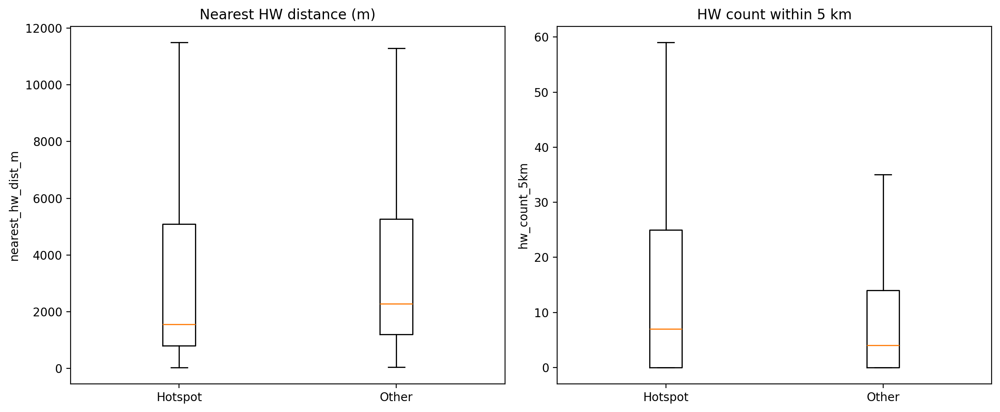
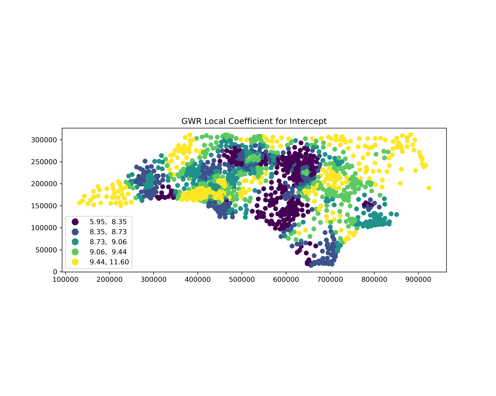
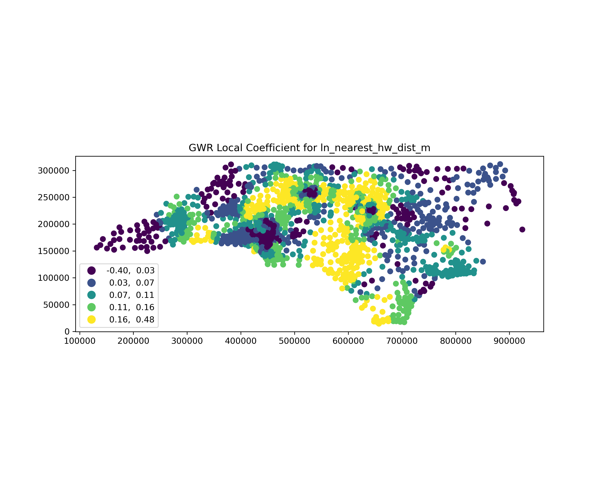
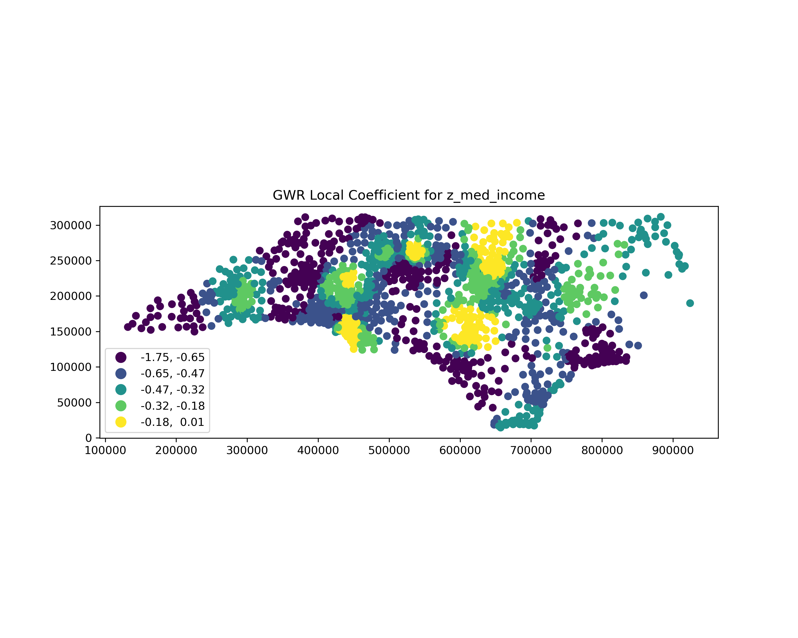
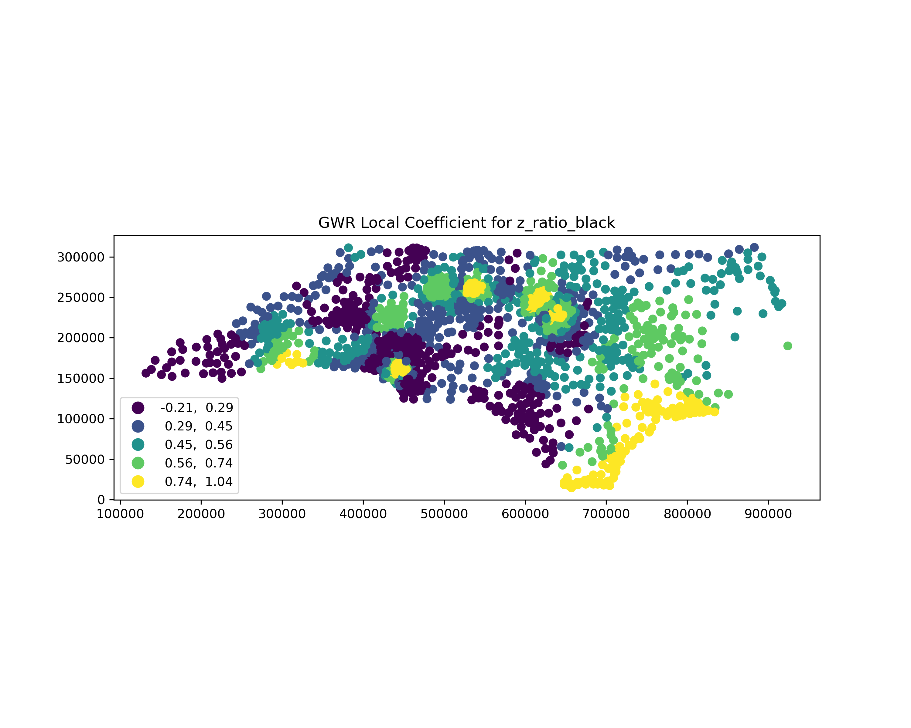
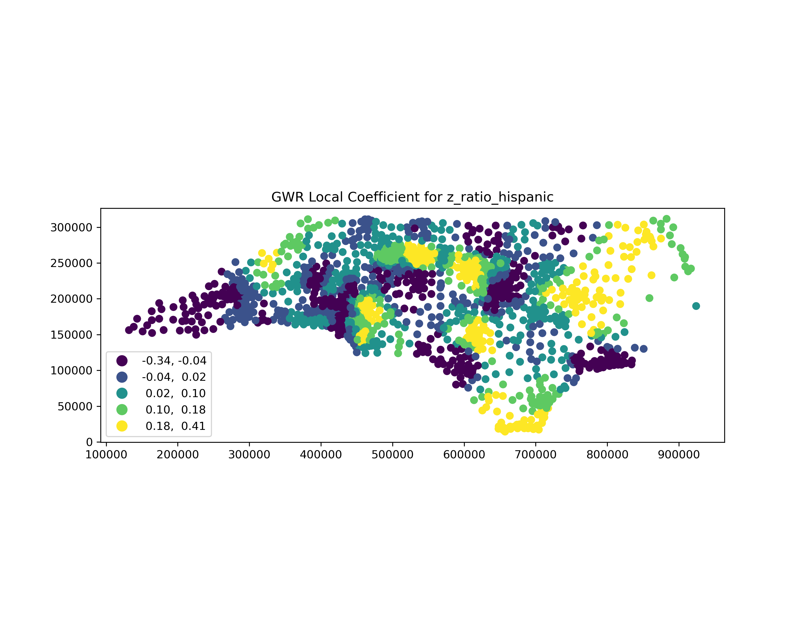
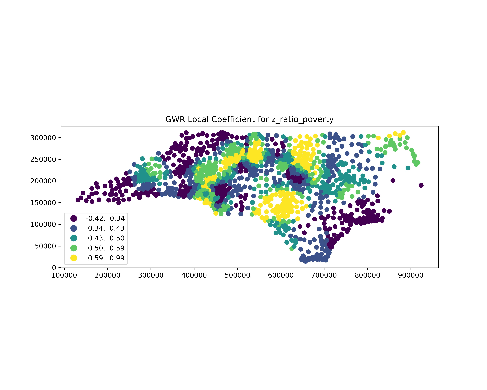
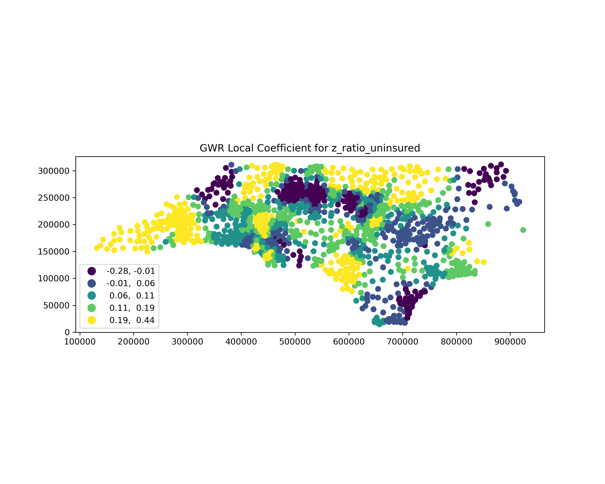

# Spatial Patterns of Asthma Prevalence and Hazardous Waste Proximity in North Carolina Census Tracts

## Abstract

**Background and Purpose:** Environmental justice research increasingly emphasizes that health burdens and environmental hazards co-occur in space, yet the degree to which asthma prevalence clusters geographically and aligns with hazardous-waste proximity across North Carolina census tracts remains incompletely quantified. This study evaluates tract-level spatial clustering of asthma prevalence and tests whether hazardous-waste proximity is elevated in statistically significant high-asthma clusters, while also assessing spatial non-stationarity in the proximity–asthma association. **Methods:** Asthma prevalence (PLACES) was linked to North Carolina census tracts (n = 2,192 polygons; 2,169 with non-missing asthma prevalence) and to 200 hazardous-waste facility point locations. For each tract centroid, Euclidean nearest-facility distance (meters) and facility counts within 5 km were computed, then joined to tract polygons for spatial statistics. Global spatial autocorrelation was assessed using Global Moran’s $I$ (queen contiguity; 999 permutations), local clustering was mapped with Getis–Ord Gi*, and hotspot vs. non-hotspot differences in proximity metrics were tested using Mann–Whitney U. To evaluate contextual heterogeneity and spatial non-stationarity, an ordinary least squares model with interaction terms (heteroskedasticity-robust HC1 errors) and a geographically weighted regression with adaptive bandwidth (AICc-selected; bisquare kernel) were estimated. **Results:** Asthma prevalence exhibited strong positive spatial autocorrelation (Global Moran’s $I=0.6034$, $z=49.39$, permutation $p=0.001$; one island tract). Gi* identified 337 significant asthma hotspots (Gi* $p<0.05$, $z>0$) among 2,169 tracts. Hotspot tracts were significantly closer to hazardous-waste facilities (median nearest distance 1,552 m vs. 2,277 m; $U=269{,}627$, $p=2.18\times10^{-4}$) and had more facilities within 5 km (median 7 vs. 4; $U=352{,}349.5$, $p=3.01\times10^{-5}$). In geographically weighted regression, the local coefficient for $\ln(\text{nearest distance}+1)$ varied in sign and magnitude (min $-0.1129$, max $0.1606$; mean $0.1175$), while model fit was high and spatially varying (local $R^2$ mean 0.8595; range 0.6893–0.9034), indicating non-stationary relationships. **Conclusions:** Asthma prevalence is highly clustered across North Carolina census tracts, and high-asthma clusters are systematically associated with greater hazardous-waste proximity and density within 5 km. The observed spatial non-stationarity in proximity effects underscores the need for place-specific environmental health assessment rather than assuming uniform exposure–response relationships. These findings support targeted, geographically prioritized interventions and monitoring in hotspot communities where hazardous-waste burdens and asthma prevalence co-locate. **Keywords:** asthma prevalence; hazardous waste facilities; spatial autocorrelation; Getis–Ord Gi* hotspots; geographically weighted regression; environmental justice; North Carolina

---

## 1. Introduction

Asthma remains a prominent public health concern in the United States, with substantial implications for quality of life, healthcare utilization, and avoidable morbidity. A long-standing insight from spatial epidemiology is that respiratory outcomes and their risk factors rarely distribute randomly; instead, they exhibit geographic patterning that can reflect underlying exposure gradients, neighborhood context, and structural inequities (Elliott and Wartenberg, 2004). In parallel, environmental justice (EJ) scholarship emphasizes that environmental burdens and health risks can become co-located through historically produced land-use decisions and uneven political capacity, making spatial analysis essential for identifying where cumulative vulnerability may be most acute (Association, 2001). These perspectives motivate tract-scale, map-based assessment of whether asthma prevalence clusters spatially and whether those clusters align with proximity to potentially hazardous facilities—an alignment with clear relevance for targeted public health practice and environmental governance (Casey et al., 2023).

Prior work provides a strong methodological foundation for linking health indicators to environmental exposures within a geographic information science framework. GIS-enabled health surveillance and spatial health information infrastructures have been positioned as key tools for integrating heterogeneous data sources and translating them into actionable geographic evidence, including distance-based exposure metrics, neighborhood-level aggregation, and spatial statistical inference (Boulos, 2004). In spatial health research, measuring and interpreting spatial dependence is central, because clustered outcomes violate independence assumptions and can signal spatially structured drivers; classic approaches include global and local indicators of spatial association and related spatial filtering perspectives (Griffith and Chun, 2019). Environmental justice research likewise commonly operationalizes proximity or density of hazards—such as industrial facilities, air toxics, or other disamenities—and increasingly uses spatially explicit regression approaches to examine heterogeneity in exposure–outcome associations (Pastor et al., 2006). In particular, geographically weighted regression (GWR) has been adopted as a way to evaluate whether environmental risk relationships vary over space rather than remaining spatially stationary, thereby supporting “place-based” inference in EJ contexts (Gilbert and Chakraborty, 2011). These approaches align with recent syntheses highlighting geospatial exposure modeling workflows that integrate health data with exposure proxies and emphasize careful spatial linkage between disparate data sources (Clark et al., 2024).

North Carolina provides a compelling regional setting for tract-scale spatial epidemiological inquiry into asthma. Prior research in the state has explicitly grappled with small-area analysis challenges for childhood asthma prevalence, including change-of-support issues that arise when asthma data, population denominators, and predictors are measured or reported at differing spatial supports (Lee et al., 2009). Moreover, North Carolina’s broader environmental health landscape has been shaped by uneven environmental burdens across communities, with documented public health concerns linked to concentrated animal feeding operations and related emissions and exposures—illustrating the relevance of spatially uneven environmental risk in the state (Cole et al., 2000). Contemporary EJ concerns in North Carolina also extend to climate-related exposures and vulnerabilities, reinforcing the broader need to identify where environmental burdens and health vulnerabilities coincide geographically (Winker et al., 2024). Together, this regional literature underscores both the plausibility of spatially clustered respiratory outcomes and the importance of spatially explicit methods for understanding how exposures and social context interact across North Carolina communities.

Despite these foundations, important gaps remain in the evidence base motivating tract-scale, EJ-relevant analysis of asthma and hazardous exposures. Although EJ research has expanded rapidly, recent scoping reviews show that EJ studies are constrained by limitations in environmental data availability and integration and by uneven methodological uptake of spatially resolved exposure data across the United States, leaving tract-scale linkage between hazards and health outcomes underdeveloped in many settings (Sayyed et al., 2024). Although climate-justice assessments have advanced equity-oriented metrics, they are often structured around climate hazards and adaptation planning for specific jurisdictions (e.g., New York City or New York State), limiting direct transferability to other hazard types and to other regions such as the U.S. South, and leaving the alignment between chronic health burdens and non-climate industrial hazard proximity less directly quantified (Foster et al., 2024); (Barnes et al., 2024). Although hazard characterization research has deepened understanding of toxicity assessment and measurement constraints for waste-related materials, such work also highlights that risk is frequently inferred from imperfect proxies rather than directly observed exposure—raising the need for careful, spatially explicit operationalization of hazard proximity and density when evaluating community health patterns (Intrakamhaeng et al., 2019). Collectively, these limitations point to the value of empirically testing (i) whether asthma prevalence clusters at the census-tract level and co-locates with hazardous-waste proximity and (ii) whether the proximity–asthma relationship exhibits contextual and spatial heterogeneity rather than a single statewide association.

Accordingly, this study asks: **How does proximity to hazardous waste facilities influence spatial patterns of asthma prevalence across census tracts of North Carolina, and how do these relationships vary spatially by socioeconomic and demographic context?** To address this question, the study pursues two objectives. **(1)** Assess whether asthma prevalence is spatially clustered across North Carolina census tracts and whether hazardous-waste proximity aligns with high-asthma clusters by (a) computing tract-level proximity metrics from centroid-to-facility Euclidean distance and facility counts within 5 km, (b) testing global spatial autocorrelation of asthma prevalence using Global Moran’s $I$ under queen contiguity weights with permutation inference, and (c) mapping local clustering using Getis–Ord Gi* and comparing proximity distributions between hotspot and non-hotspot tracts using nonparametric tests. **(2)** Estimate how the hazardous-waste proximity–asthma association varies by socioeconomic and demographic context and whether the association is spatially non-stationary by fitting an adjusted ordinary least squares model with interaction terms and heteroskedasticity-robust errors, and then estimating a GWR model with adaptive bandwidth selection to evaluate spatial variability in local relationships (Gilbert and Chakraborty, 2011); (Clark et al., 2024). Empirically, the study contributes a tract-scale synthesis of asthma prevalence (PLACES), hazardous-waste facility locations, and tract sociodemographic context for North Carolina; methodologically, it integrates global and local spatial statistics with spatially varying regression to support EJ-relevant inference about co-location and heterogeneity.

Hypotheses guide the analysis design and interpretation. **H1:** *Census tracts with smaller nearest-site distance to hazardous waste facilities and/or larger hazardous-waste facility counts within 5000 meters have higher Asthma_prev and are overrepresented in statistically significant high-asthma clusters.* This hypothesis follows from spatial epidemiology’s expectation that geographically structured exposures can produce clustered disease patterns (Elliott and Wartenberg, 2004) and from EJ research documenting how environmental burdens may concentrate alongside social vulnerability (Association, 2001). **H2:** *After adjustment for tract context, the association between hazardous waste proximity and Asthma_prev is stronger in tracts with higher ratio_poverty, higher ratio_uninsured, and higher ratio_black, and the proximity effect varies across space.* This hypothesis reflects EJ theory emphasizing differential vulnerability and the potential for uneven exposure–response relationships across communities (Casey et al., 2023), and it motivates explicitly spatially varying modeling to evaluate whether a single statewide association obscures meaningful place-based differences (Gilbert and Chakraborty, 2011).

The remainder of this paper is organized as follows. The next section describes the study area, data sources, and GIS-based construction of hazardous-waste proximity metrics and tract-level covariates. The methods section then details the spatial weights specification, Global Moran’s $I$, Getis–Ord Gi* hotspot mapping, inferential comparisons between hotspot and non-hotspot tracts, and the adjusted OLS and GWR modeling framework for evaluating contextual moderation and spatial non-stationarity. The results section presents the spatial clustering patterns and modeling outputs, and the discussion interprets implications for environmental justice, spatial health surveillance, and geographically targeted intervention, including key limitations and future research directions.

---

## 2. Methodology

### 2.1 Study Area  
The study was conducted for North Carolina, USA, using census tracts as the primary spatial unit of analysis. This tract-scale design aligned with the research objective of testing whether asthma prevalence exhibited spatial clustering and whether such clustering co-located with proximity to hazardous-waste facilities, consistent with spatial epidemiology and environmental justice (EJ) approaches that emphasize small-area geographic patterning and co-location of health burdens and environmental hazards (Elliott and Wartenberg, 2004); (Association, 2001). North Carolina was selected because (i) tract-level asthma prevalence estimates were available in a statewide, GEOID-keyed product (PLACES) and (ii) a statewide point inventory of hazardous-waste facilities was available for constructing distance-based exposure proxies.  

Operationally, all spatial analyses were carried out on the subset of tracts for which asthma estimates were successfully joined to tract polygons. The attribute join audit indicated 2,169 matched tracts (non-null `Asthma_prev`) out of 2,192 tract polygons (99.0%), with 23 unmatched polygons that were retained in the tract layer but did not contribute to asthma-based spatial statistics or modeling due to missing outcome data.

### 2.2 Data  

#### 2.2.1 Input datasets  
We integrated four primary datasets (two spatial layers and two tract-level tables), keyed by the census-tract identifier `GEOID`:

- **North Carolina census tracts (`NC_tract.gpkg`)**. A polygon GeoPackage with 2,192 records and columns `GEOID`, `STATEFP`, `COUNTYFP`, `TRACTCE`, and `geometry`. This layer provided tract boundaries for spatial weights (contiguity) and for mapping.  
- **Hazardous waste facility locations (`NC_HW_sites.gpkg`)**. A point GeoPackage with 2,577 records and columns `SITE_NAME`, `LAT`, `LONG`, and `geometry`. This layer provided facility point locations used to compute tract-level proximity metrics.  
- **PLACES asthma prevalence (`NC_PLACES.csv`)**. A CSV table with 2,169 records and columns `GEOID`, `Asthma_prev`, and `geometry` (as a string field). `Asthma_prev` was the dependent variable for clustering analyses and regression models.  
- **ACS-derived tract context (`NC_ACS_data.csv`)**. A CSV table with 2,195 records and 12 columns: `GEOID`, `ratio_white`, `ratio_black`, `ratio_asian`, `ratio_hispanic`, `ratio_other_race`, `ratio_male`, `ratio_female`, `ratio_poverty`, `ratio_unemployed`, `ratio_uninsured`, and `med_income`. A subset of these variables was used for adjusted regression and for testing contextual moderation in the planned modeling framework.

#### 2.2.2 Derived and intermediate datasets  
Spatial processing produced projected and derived layers used for distance calculations and spatial statistics:

- **Projected tracts (`nc_tract_projected.gpkg`)**: 200 tract polygons in **EPSG:32119** with columns `GEOID`, `STATEFP`, `COUNTYFP`, `TRACTCE`, `geometry`.  
- **Projected hazardous-waste sites (`nc_hw_sites_projected.gpkg`)**: 200 facility points in **EPSG:32119** with columns `SITE_NAME`, `geometry`.  
- **Tract centroids (`nc_tract_centroids.gpkg`)**: 200 centroid points in **EPSG:32119** with columns `GEOID`, `geometry`.  
- **Proximity metrics (`tract_proximity_metrics.csv`)**: 2,222 rows with columns `GEOID`, `nearest_hw_dist_m`, and `hw_count_5km` (created by centroid-to-facility Euclidean distance and a 5,000 m radius count around centroids).  
- **Asthma + proximity table (`asthma_proximity.csv`)**: 200 rows and columns `GEOID`, `Asthma_prev`, `nearest_hw_dist_m`, `hw_count_5km`.  
- **Tracts enriched with asthma and proximity (`tract_asthma_proximity.gpkg`)**: the joined polygon dataset used as input for spatial autocorrelation and hotspot analysis (derived from `nc_tract_projected.gpkg` joined to `asthma_proximity.csv` on `GEOID`).  
- **Hotspot output (`asthma_hotspots.gpkg`)**: 200 polygons in **EPSG:32119** with columns `GEOID`, `STATEFP`, `COUNTYFP`, `TRACTCE`, `Asthma_prev`, `nearest_hw_dist_m`, `hw_count_5km`, `GiZ`, `GiP`, `GiClass`, `geometry`.  
- **Global autocorrelation output (`global_moransI_asthma.json`)**: Moran’s $I$ results for `Asthma_prev` with weights metadata documenting queen contiguity, row-standardization, and 999 permutations.  
- **Hotspot proximity comparison output (`hotspot_proximity_comparison.json`)**: Mann–Whitney U tests comparing proximity metrics between statistically significant hotspots (definition: `GiP < 0.05` and `GiZ > 0`) and all other tracts.  
- **Regression outputs for Objective 2** (from the trace and file statistics): `ols_interaction_results.json` (OLS with robust HC1 standard errors) and `gwr_local_coefficients.gpkg` (local GWR coefficients and `gwr_localR2`, with `gwr_bw` recorded).

#### 2.2.3 Preprocessing and linkage workflow  
All spatial distance computations were performed in a projected, meter-based CRS. The tract polygons and hazardous-waste facility points were reprojected to **EPSG:32119** (North Carolina State Plane, meters) in steps that created `nc_tract_projected.gpkg` and `nc_hw_sites_projected.gpkg`. Tract centroids were computed from the projected tract polygons to create `nc_tract_centroids.gpkg`; centroids were used as representative tract locations for proximity metrics.

We then constructed two exposure proxies per tract centroid: (i) `nearest_hw_dist_m`, defined as the Euclidean distance (meters) from each tract centroid to its nearest hazardous-waste facility point, and (ii) `hw_count_5km`, defined as the count of hazardous-waste facility points within a **5,000 m** radius of the centroid. These were written to `tract_proximity_metrics.csv` with columns `GEOID`, `nearest_hw_dist_m`, and `hw_count_5km`.

Next, we integrated health outcomes by left-joining the proximity table to the PLACES tract table on `GEOID`. The join audit for this operation reported **2,169 output rows** and **100.0% matched** proximity metrics (`nearest_hw_dist_m` non-null for 2,169/2,169), producing `asthma_proximity.csv` containing `GEOID`, `Asthma_prev`, `nearest_hw_dist_m`, and `hw_count_5km`. Finally, `asthma_proximity.csv` was attribute-joined to `nc_tract_projected.gpkg` by `GEOID` to produce the polygon layer `tract_asthma_proximity.gpkg`. The attribute join audit reported **2,192** tract polygons on the left, with **2,169/2,192 (99.0%)** matched tracts having non-null `Asthma_prev` and **23** unmatched polygons (missing outcome attributes). These matched tracts (i.e., those with non-missing `Asthma_prev`) formed the analysis set for spatial clustering statistics and were the effective $n$ for Moran’s $I$ as recorded in the Moran output (`n = 2169`).

### 2.3 Methods  

#### 2.3.1 Analytical framework  
We combined (i) global and local spatial autocorrelation diagnostics with (ii) distributional comparisons of exposure proxies across hotspot classes and (iii) regression-based modeling (OLS with interaction terms and GWR) to address the study objectives. This design followed established spatial epidemiology practice in which clustering diagnostics motivate local “hotspot” identification and then inform subsequent analyses of exposure alignment and spatially varying associations (Elliott and Wartenberg, 2004); (Griffith and Chun, 2019). For EJ-relevant inference, we operationalized hazardous-waste burden using proximity/density proxies commonly employed when direct exposure measures are unavailable, and we evaluated spatial non-stationarity using geographically weighted regression as used in EJ applications (Boulos, 2004); (Pastor et al., 2006); (Gilbert and Chakraborty, 2011).

#### 2.3.2 Spatial weights and contiguity structure  
For all tract-based spatial statistics (Global Moran’s $I$ and Getis–Ord Gi*), we defined a **queen contiguity** spatial weights matrix on tract polygons, meaning two tracts were neighbors if they shared either a boundary segment or a vertex. The weights were **row-standardized**, as recorded in `global_moransI_asthma.json` (`transform: "row_standardized"`). The Moran output also documented one island (`n_islands: 1`) with the island tract indexed as 827, indicating at least one polygon had no neighbors under queen contiguity; this was retained in the dataset but had no contributing neighbors in contiguity-based calculations.

#### 2.3.3 Global spatial autocorrelation (Global Moran’s $I$)  
To test whether asthma prevalence was spatially clustered statewide, we computed **Global Moran’s $I$** for `Asthma_prev` on the joined tract layer (`tract_asthma_proximity.gpkg`). Moran’s $I$ (Moran, 1950) was formulated as:
$$
I = \frac{n}{S_0}\frac{\sum_{i=1}^{n}\sum_{j=1}^{n} w_{ij}(x_i-\bar{x})(x_j-\bar{x})}{\sum_{i=1}^{n}(x_i-\bar{x})^2},
$$
where $x_i$ was `Asthma_prev` in tract $i$, $\bar{x}$ was the mean asthma prevalence across tracts with non-missing outcome, $w_{ij}$ was the row-standardized queen contiguity weight between tracts $i$ and $j$, $n$ was the number of valid tracts (recorded as 2,169 in the output JSON), and $S_0=\sum_i\sum_j w_{ij}$. Statistical inference was based on a **permutation test with 999 permutations**, as recorded in the output metadata (`permutations: 999`), which generated permutation-based $z$-scores and $p$-values. This step operationalized the independence-violation diagnostic central to tract-level spatial epidemiology (Elliott and Wartenberg, 2004); (Griffith and Chun, 2019).

#### 2.3.4 Local clustering (Getis–Ord Gi*) and hotspot classification  
To map local clustering and delineate statistically significant high-asthma areas, we computed the **Getis–Ord Gi\*** statistic (Getis and Ord, 1992) on `Asthma_prev` using the same queen contiguity, row-standardized weights. For tract $i$, the general form was:
$$
G_i^* = \frac{\sum_{j=1}^{n} w_{ij} x_j - \bar{x}\sum_{j=1}^{n}w_{ij}}{S \sqrt{\frac{n\sum_{j=1}^{n} w_{ij}^2-\left(\sum_{j=1}^{n} w_{ij}\right)^2}{n-1}}},
$$
where $x_j$ was `Asthma_prev` for tract $j$, $\bar{x}$ and $S$ were the mean and standard deviation of `Asthma_prev` across tracts, and $w_{ij}$ were the row-standardized queen contiguity weights. Outputs were written to `asthma_hotspots.gpkg` with per-tract `GiZ` (z-score), `GiP` (p-value), and `GiClass` (significance class). This local indicator approach supported identification of spatial concentrations of high values (“hotspots”) and low values (“coldspots”) in a way commonly used for public health surveillance and EJ screening (Boulos, 2004); (Casey et al., 2023).

#### 2.3.5 Proximity alignment with hotspots (Mann–Whitney U tests)  
To test whether hazardous-waste proximity metrics differed between high-asthma hotspots and other tracts without assuming normality, we compared the distributions of `nearest_hw_dist_m` and `hw_count_5km` between (a) statistically significant asthma hotspots and (b) all other tracts using the **Mann–Whitney U** test (Mann and Whitney, 1947). Hotspots were defined exactly as recorded in `hotspot_proximity_comparison.json`: **`GiP < 0.05` and `GiZ > 0`**. For each metric, the test assessed whether the two independent samples were drawn from the same distribution under a **two-sided** alternative (as recorded: `"alternative": "two-sided"`). Results (test statistic, $p$-value, and group medians) were written to `hotspot_proximity_comparison.json`, and summary boxplots were exported to `hotspot_vs_nonhotspot_proximity_boxplots.png`. This procedure provided an inferential check on whether proximity/density of hazardous-waste facilities aligned with local clusters of elevated asthma prevalence, consistent with EJ proximity-based exposure screening approaches (Pastor et al., 2006); (Clark et al., 2024).

#### 2.3.6 Adjusted regression with contextual moderation (OLS with interactions)  
To estimate an adjusted tract-level association between hazardous-waste proximity and asthma prevalence and to evaluate moderation by socioeconomic and demographic context, we fit an **ordinary least squares (OLS)** regression with interaction terms and heteroskedasticity-robust standard errors. The model form was:
$$
y_i = \beta_0 + \beta_1 \,\text{ln\_dist}_i + \beta_2 z\_pov_i + \beta_3 z\_unins_i + \beta_4 z\_inc_i + \beta_5 z\_black_i + \beta_6 z\_hisp_i
+ \beta_7(\text{ln\_dist}_i \cdot z\_pov_i) + \beta_8(\text{ln\_dist}_i \cdot z\_black_i) + \varepsilon_i,
$$
where $y_i$ was `Asthma_prev` for tract $i$; $\text{ln\_dist}_i$ was `ln_nearest_hw_dist_m`; $z\_pov_i$, $z\_unins_i$, $z\_inc_i$, $z\_black_i$, and $z\_hisp_i$ were standardized (z-score) versions of `ratio_poverty`, `ratio_uninsured`, `med_income`, `ratio_black`, and `ratio_hispanic`; and $\varepsilon_i$ was an error term. Standard errors were computed using the **HC1** heteroskedasticity-consistent estimator (recorded in `ols_interaction_results.json` as `"robust_standard_errors": {"type": "HC1"}`), reflecting the expectation that tract-level variance may differ across heterogeneous communities. Predictors used in the fitted model matched the output metadata: `ln_nearest_hw_dist_m`, `z_ratio_poverty`, `z_ratio_uninsured`, `z_med_income`, `z_ratio_black`, `z_ratio_hispanic`, `ln_nearest_hw_dist_m_x_z_ratio_poverty`, and `ln_nearest_hw_dist_m_x_z_ratio_black`. The fitted model summary and diagnostics were exported to `ols_interaction_results.json`.

Preprocessing for this modeling stage (as documented in the execution trace) included: a left join of `NC_ACS_data.csv` to `asthma_proximity.csv` on `GEOID` (with a join audit indicating 2,169/2,169 matched for `ratio_poverty`), complete-case filtering for the outcome and specified predictors, and feature engineering comprising (i) the log transform `ln_nearest_hw_dist_m = ln(nearest_hw_dist_m + 1)`, (ii) z-score standardization for selected covariates, and (iii) interaction term construction as simple products of the transformed exposure and the standardized modifiers (e.g., `ln_nearest_hw_dist_m_x_z_ratio_poverty = ln_nearest_hw_dist_m * z_ratio_poverty`). These transformations were used to reduce skew in distance, place covariates on comparable scales, and make interaction coefficients interpretable as changes in the exposure association per standard deviation change in the modifier.

#### 2.3.7 Spatially varying associations (Geographically Weighted Regression)  
To evaluate whether the proximity–asthma relationship was spatially non-stationary, we fit a **geographically weighted regression (GWR)** following established EJ applications of spatially varying coefficient models (Gilbert and Chakraborty, 2011). The GWR specification was:
$$
y_i = \beta_0(u_i,v_i) + \sum_{k=1}^{K}\beta_k(u_i,v_i)\,x_{ik} + \varepsilon_i,
$$
where $y_i$ was `Asthma_prev` for tract $i$, $(u_i,v_i)$ were the planar coordinates of tract centroid $i$ (attached as numeric columns `x` and `y`), $x_{ik}$ were predictors, and $\beta_k(u_i,v_i)$ were location-specific coefficients estimated via locally weighted least squares. In our implementation, the predictor set comprised `ln_nearest_hw_dist_m`, `z_ratio_poverty`, `z_ratio_uninsured`, `z_med_income`, `z_ratio_black`, and `z_ratio_hispanic` (as reflected by coefficient fields in `gwr_local_coefficients.gpkg`).  

Kernel weighting used a **bisquare kernel** with an **adaptive bandwidth** chosen by **AICc minimization** (as described in the execution trace for the GWR step). The selected bandwidth was recorded in the output as `gwr_bw` and was constant across features within the saved output file. Local coefficient estimates and `gwr_localR2` were written to `gwr_local_coefficients.gpkg` along with per-tract geometry. Prior to GWR estimation, we computed variance inflation factors (VIF) for the GWR predictor set (per the execution trace step `variance_inflation_factors`) to assess multicollinearity risk among the standardized covariates before fitting the local model, a common diagnostic step in spatial regression workflows (Clark et al., 2024). In addition to tabular outputs, thematic maps of coefficient surfaces were exported as separate PNG files (e.g., `gwr_thematic_map_ln_nearest_hw_dist_m.png`), enabling spatial interpretation of local parameter variation.

A reproducibility caveat emerged from the outputs: `gwr_local_coefficients.gpkg` was saved in **EPSG:3857**, whereas earlier tract processing and hotspot outputs were in **EPSG:32119**. This implied that any direct spatial overlay between GWR outputs and the EPSG:32119 tract products would require explicit reprojection; we did not apply an additional harmonization step in the recorded pipeline outputs.

### 2.4 Computational Environment  
All analyses were conducted in **Python 3.13.12** on **Linux 6.8.0-107-generic**, with an analysis date (UTC) of **2026-04-22**. Spatial data processing relied primarily on geopandas=1.1.2, shapely=2.1.2, pyproj=3.7.2, fiona=1.10.1, and rtree=1.4.1; spatial statistics used libpysal=4.14.1 and esda=2.9.0; regression and diagnostics used statsmodels=0.14.6 and mgwr=2.2.1, with supporting scientific libraries including numpy=2.4.2, pandas=3.0.1, and scipy=1.17.1. Random seeds were **not recorded**, which we note as a reproducibility limitation for any stochastic components (e.g., permutation-based inference) even though the number of permutations was explicitly recorded for Moran’s $I$.

---

## 3. Results

### 3.1 Overview

Analyses were conducted at the census-tract scale for North Carolina using tract asthma prevalence from PLACES (`Asthma_prev`) and two hazardous-waste proximity proxies derived from tract centroids: (i) Euclidean distance to the nearest hazardous-waste facility (`nearest_hw_dist_m`) and (ii) the count of facilities within a 5,000 m radius (`hw_count_5km`). As documented by the join audit, 2,169 tracts had non-missing asthma prevalence and were retained for asthma-based spatial statistics and subsequent modeling, out of 2,192 tract polygons (99.0%), with 23 polygons unmatched on `Asthma_prev` and therefore excluded from asthma-based inference.

In the working analytic extracts used for mapped outputs and descriptive summaries, `Asthma_prev` averaged 9.81 (SD = 0.984; range: 7.8–13.8) across 200 GEOID-keyed tracts in the asthma–proximity table. In the same table, `nearest_hw_dist_m` averaged 4,829 m (SD = 5,209; range: 52.8–32,919 m) and `hw_count_5km` averaged 7.24 facilities (SD = 9.68; range: 0–52). These proximity metrics were subsequently linked to hotspot classifications and to multivariable models as described in the Methods (Section 2.3).

### 3.2 Objective 1 — Spatial clustering of asthma prevalence and alignment with hazardous-waste proximity

Using the queen-contiguity specification described in Section 2.3.3, asthma prevalence exhibited strong positive global spatial autocorrelation. Global Moran’s $I$ was 0.603 (permutation $z = 49.4$, 999 permutations; $p = 0.001$; $n = 2{,}169$), indicating that similar asthma prevalence values were more spatially clustered than expected under spatial randomness. The weights metadata reported one island tract (no queen neighbors), which was retained in the contiguity-based computations.

Local clustering patterns from the Getis–Ord Gi* analysis (Section 2.3.4) are mapped in Figure 1. The map shows the spatial distribution of hotspot/coldspot classifications, with extensive “NotSig” tracts interspersed with statistically significant clusters, consistent with a non-uniform pattern of local spatial association across the state.

To evaluate whether hazardous-waste proximity aligned with high-asthma clustering (Section 2.3.5), proximity metrics were compared between statistically significant asthma hotspots (Gi* definition: `GiP < 0.05` and `GiZ > 0`) and all other tracts using Mann–Whitney U tests. Of 2,169 tracts with Gi* outputs, 337 were classified as hotspots and 1,832 as non-hotspots. Hotspot tracts had a smaller median distance to the nearest hazardous-waste facility (median = 1,552 m) than non-hotspot tracts (median = 2,277 m), and this distributional difference was statistically significant (U = 269,627; $p < 0.001$). Hotspot tracts also had higher facility counts within 5 km (median = 7) than non-hotspot tracts (median = 4), with a statistically significant difference (U = 352,350; $p < 0.001$). Figure 2 visualizes these contrasts, showing lower central tendency in nearest-site distance and higher central tendency in 5 km facility counts for hotspots relative to other tracts.

**Hypothesis Assessment (Objective 1).** Global Moran’s $I$ indicated positive and statistically significant clustering of `Asthma_prev` ($I = 0.603$, $p = 0.001$). In addition, significant asthma hotspots (Gi* `p < 0.05`, `z > 0`; $n=337$) were characterized by smaller median `nearest_hw_dist_m` (1,552 m vs. 2,277 m; $p < 0.001$) and larger median `hw_count_5km` (7 vs. 4; $p < 0.001$) compared to non-hotspots. Taken together, the evidence supported the hypothesis that hazardous-waste proximity metrics aligned with high-asthma clusters.

### 3.3 Objective 2 — Contextual moderation and spatial non-stationarity in the proximity–asthma association

#### 3.3.1 Adjusted OLS with interaction terms (global association with contextual moderation)

Using the OLS interaction specification described in Section 2.3.6, the fitted model used $n=2{,}169$ tracts and explained a large share of tract-to-tract variation in asthma prevalence (Table 1; $R^2 = 0.825$, adjusted $R^2 = 0.824$; AIC = 3,547; RMSE = 0.546; robust covariance type HC1). Coefficient estimates with heteroskedasticity-robust (HC1) standard errors are reported in Table 2.

**Table 1.** OLS model diagnostics for asthma prevalence interaction model (R², adjusted R², AIC/BIC, RMSE, and sample size).

|   n_obs |   n_params |      r2 |   adj_r2 |      aic |      bic |   f_statistic |   f_pvalue |     rmse | robust_cov_type   |
|--------:|-----------:|--------:|---------:|---------:|---------:|--------------:|-----------:|---------:|:------------------|
|    2169 |          9 | 0.824628 | 0.823978 | 3547.08  | 3598.21  |       1269.58 |          0 | 0.545849 | HC1               |

**Table 2.** OLS coefficients for asthma prevalence with interaction terms; inference uses heteroskedasticity-robust (HC1) standard errors.

| variable | coef | std_err_hc1 | t_hc1 | p_value_hc1 | ci95_low_hc1 | ci95_high_hc1 |
|---|---:|---:|---:|---:|---:|---:|
| const | 8.597805 | 0.091145 | 94.330703 | p < 0.001 | 8.419064 | 8.776547 |
| ln_nearest_hw_dist_m | 0.144828 | 0.011451 | 12.647142 | p < 0.001 | 0.122371 | 0.167285 |
| z_ratio_poverty | 0.799169 | 0.174368 | 4.583235 | p < 0.001 | 0.457223 | 1.141116 |
| z_ratio_uninsured | 0.111456 | 0.032927 | 3.384982 | p < 0.001 | 0.046885 | 0.176027 |
| z_med_income | -0.382019 | 0.027452 | -13.915661 | p < 0.001 | -0.435855 | -0.328183 |
| z_ratio_black | 0.793183 | 0.114992 | 6.897742 | p < 0.001 | 0.567677 | 1.018689 |
| z_ratio_hispanic | -0.007999 | 0.020142 | -0.397120 | 0.691 | -0.047499 | 0.031501 |
| ln_nearest_hw_dist_m_x_z_ratio_poverty | -0.038129 | 0.025747 | -1.480909 | 0.139 | -0.088621 | 0.012363 |
| ln_nearest_hw_dist_m_x_z_ratio_black | -0.042092 | 0.015348 | -2.742441 | 0.006 | -0.072191 | -0.011993 |

In the adjusted model, the transformed nearest-facility distance (`ln_nearest_hw_dist_m`) was positively associated with `Asthma_prev` (β = 0.145, SE = 0.0115, $p < 0.001$; 95% CI [0.122, 0.167]). Among tract context covariates, standardized poverty ratio (`z_ratio_poverty`) was positive (β = 0.799, SE = 0.174, $p < 0.001$; 95% CI [0.457, 1.141]), standardized uninsured ratio (`z_ratio_uninsured`) was positive (β = 0.111, SE = 0.0329, $p < 0.001$; 95% CI [0.0469, 0.176]), and standardized median income (`z_med_income`) was negative (β = −0.382, SE = 0.0275, $p < 0.001$; 95% CI [−0.436, −0.328]). The standardized Black population ratio (`z_ratio_black`) was positive (β = 0.793, SE = 0.115, $p < 0.001$; 95% CI [0.568, 1.019]), while the standardized Hispanic population ratio (`z_ratio_hispanic`) was not statistically distinguishable from zero (β = −0.00800, SE = 0.0201, $p = 0.691$; 95% CI [−0.0475, 0.0315]).

Regarding effect modification, the interaction between hazardous-waste distance and poverty (`ln_nearest_hw_dist_m_x_z_ratio_poverty`) was not statistically significant (β = −0.0381, SE = 0.0257, $p = 0.139$; 95% CI [−0.0886, 0.0124]). The interaction between hazardous-waste distance and Black population ratio (`ln_nearest_hw_dist_m_x_z_ratio_black`) was negative and statistically significant (β = −0.0421, SE = 0.0153, $p = 0.006$; 95% CI [−0.0722, −0.0120]).

Multicollinearity diagnostics for the interaction model are reported in Table 3. VIF values were near 1–2 for several main effects (e.g., `ln_nearest_hw_dist_m` VIF = 1.20; `z_ratio_uninsured` VIF = 2.16; `z_med_income` VIF = 2.11; `z_ratio_hispanic` VIF = 1.60), but were substantially larger for `z_ratio_poverty`, `z_ratio_black`, and the corresponding interaction terms (VIFs ≈ 58.6–65.8).

**Table 3.** Variance inflation factors (VIF) for the OLS interaction model predictors.

| variable | vif |
|---|---:|
| ln_nearest_hw_dist_m | 1.204681 |
| z_ratio_poverty | 58.942624 |
| z_ratio_uninsured | 2.164871 |
| z_med_income | 2.110209 |
| z_ratio_black | 65.752562 |
| z_ratio_hispanic | 1.597767 |
| ln_nearest_hw_dist_m_x_z_ratio_poverty | 58.615873 |
| ln_nearest_hw_dist_m_x_z_ratio_black | 63.983828 |

#### 3.3.2 Geographically weighted regression (spatially varying associations)

Using the geographically weighted regression specification described in Section 2.3.7, the adaptive bisquare-kernel GWR used a single selected bandwidth of 116 (recorded in `gwr_bw` for all tracts). Local goodness-of-fit varied across space: local $R^2$ ranged from 0.689 to at least 0.90, with a median of 0.880 and mean of 0.859 across the 200 mapped GEOIDs in the GWR output.

Spatial patterns in local coefficient estimates and local $R^2$ are summarized in Figure 3, which collates mapped outputs for each predictor and model fit. The figure allows comparison of where coefficients were positive versus negative and where the model achieved higher or lower local explanatory power.

To provide variable-specific views of spatial non-stationarity, Figures 4–10 map the GWR intercept and each covariate’s local coefficient surface. Figure 5 maps the local coefficient for `ln_nearest_hw_dist_m`, which varied in sign and magnitude across tracts (range: −0.113 to 0.228; median = 0.109; mean = 0.117). Figure 6 maps `z_med_income`, which was consistently negative in most locations (range: −1.65 to −0.0759; median = −0.538; mean = −0.553). Figures 7–10 show local coefficients for `z_ratio_black` (range: −0.105 to 1.05; median = 0.427), `z_ratio_hispanic` (range: −0.246 to 0.335; median = 0.0902), `z_ratio_poverty` (range: −0.253 to 0.929; median = 0.431), and `z_ratio_uninsured` (range: −0.159 to 0.284; median = 0.0979), indicating spatial heterogeneity in both direction and magnitude for several predictors.

Prior to fitting the GWR, multicollinearity among the predictor set was assessed via VIF (Section 2.3.6). As shown in Table 4, VIF values for the GWR predictors were all close to 1–2 (`ln_nearest_hw_dist_m` VIF = 1.18; `z_ratio_black` VIF = 1.42; `z_ratio_hispanic` VIF = 1.58; `z_ratio_poverty` VIF = 2.00; `z_ratio_uninsured` VIF = 2.10; `z_med_income` VIF = 2.10), indicating limited multicollinearity within the GWR covariate set.

**Table 4.** Variance inflation factors (VIF) for GWR predictor variables.

| variable | vif |
|---|---:|
| z_med_income | 2.102664 |
| z_ratio_uninsured | 2.100347 |
| z_ratio_poverty | 2.002235 |
| z_ratio_hispanic | 1.578931 |
| z_ratio_black | 1.424054 |
| ln_nearest_hw_dist_m | 1.175010 |

**Hypothesis Assessment (Objective 2).** In the adjusted OLS interaction model, `ln_nearest_hw_dist_m` was positively associated with `Asthma_prev` (β = 0.145, SE = 0.0115, $p < 0.001$), but the poverty interaction term was not statistically significant (β = −0.0381, SE = 0.0257, $p = 0.139$). The interaction with `z_ratio_black` was negative and statistically significant (β = −0.0421, SE = 0.0153, $p = 0.006$), indicating that the fitted distance–asthma slope varied with `z_ratio_black` in the opposite direction to the hypothesized strengthening. The GWR results indicated spatial non-stationarity in the proximity effect, with the local `ln_nearest_hw_dist_m` coefficient ranging from −0.113 to 0.228 and local $R^2$ ranging from 0.689 to at least 0.90 (median = 0.880) under an adaptive bandwidth of 116. Overall, the hypothesis was **partially supported**: evidence for spatial variation in the proximity effect was consistent with the hypothesis, whereas the specified contextual strengthening by poverty and Black population ratio was not consistently supported by the estimated interaction terms.

---

## 4. Discussion

### 4.1 Principal Findings
This study provided tract-scale evidence that asthma prevalence in North Carolina was not spatially random, but instead organized into statistically significant clusters that corresponded to hazardous-waste proximity patterns. Hotspot mapping and distributional comparisons indicated that high-asthma tracts tended to be closer to hazardous-waste facilities and surrounded by more facilities within a 5 km radius, aligning with an environmental-justice framing in which health burdens co-locate with environmental disamenities (Association, 2001). However, multivariable modeling complicated a simple “closer is worse” proximity narrative: the adjusted global model estimated an association in the opposite direction for the nearest-distance metric, while also identifying strong associations between asthma prevalence and tract socioeconomic composition (poverty, insurance coverage, and income) and racial composition (Black population share). The interaction and GWR results further indicated that the proximity–asthma relationship was context-dependent and spatially non-stationary, consistent with calls for place-based EJ inference rather than a single statewide parameter (Gilbert and Chakraborty, 2011). The discussion proceeds by (i) interpreting why clustering and hotspot–proximity alignment emerged, (ii) reconciling the divergent global proximity coefficient with hotspot evidence via mechanisms and boundary conditions, (iii) interpreting contextual moderation and spatial non-stationarity, and (iv) outlining implications, limitations, and future research.

### 4.2 Interpretation

#### 4.2.1 Clustering and co-location: why asthma hotspots aligned with hazardous-waste proximity
**Pattern.** Asthma prevalence exhibited strong global spatial autocorrelation and locally significant Gi* hotspots (Figure 1). Hotspot tracts differed systematically from other tracts in both hazardous-waste proximity proxies: they were, in distribution, closer to the nearest facility and had higher facility counts within 5 km (Figure 2). This convergence between local clustering and proximity differences supported **H1** in its cluster-alignment component.

**Mechanism (with boundary conditions).** A plausible mechanism is *spatially structured cumulative exposure and vulnerability*: hazardous-waste facilities are not randomly sited, and their co-location with other land uses (transportation corridors, industrial zones) can produce correlated exposure surfaces (e.g., air toxics, dust, odors) that align with respiratory risk patterns. EJ theory predicts that such burdens can coincide with socially patterned vulnerability because communities differ in political capacity, housing markets, and historical land-use decisions (Association, 2001); (Piselli, 2002); (Kenis, 2020). Importantly, this mechanism is most plausible under boundary conditions where (i) facility locations are meaningfully correlated with relevant emissions/exposures, (ii) residents have sufficiently long residential durations for chronic exposure proxies to map onto prevalence, and (iii) the tract centroid approximation reasonably represents where people live relative to sites. Where facilities are inactive, well-remediated, or emit primarily via pathways not captured by distance-to-point (e.g., groundwater plumes), or where population mobility is high, the hotspot–proximity alignment would be expected to weaken even if hazards exist.

**Relation to prior work.** The observed clustering is consistent with spatial epidemiology’s core premise that respiratory outcomes are geographically patterned because risk factors and context are spatially patterned (Elliott and Wartenberg, 2004). Methodologically, the combined use of global and local indicators aligns with arguments that both statewide dependence and subregional “pockets” of elevated risk matter for surveillance and interpretation (Griffith and Chun, 2019). The EJ-oriented alignment between hotspots and hazard proximity also fits prior EJ work operationalizing environmental burden through proximity/density measures (Pastor et al., 2006) and recent reviews emphasizing that spatial exposure linkage is central but often data-limited (Casey et al., 2023); (Sayyed et al., 2024). At the same time, the present study extends that literature by demonstrating this co-location pattern specifically for tract-level asthma prevalence across North Carolina, a region where small-area asthma research has highlighted the importance of spatial support and geographic uncertainty (Lee et al., 2009). A study-specific qualifier, however, is that proximity here is a proxy for exposure rather than a measured dose; the interpretation therefore remains about co-location and correlates of place, not direct toxicological pathways (Intrakamhaeng et al., 2019).

#### 4.2.2 Reconciling the “hotspots are closer” result with a positive adjusted distance coefficient
**Pattern.** Although hotspot tracts were closer to hazardous-waste facilities on average, the adjusted OLS model estimated a positive association between $\ln(\text{nearest distance})$ and asthma prevalence. Put plainly, conditional on included covariates and interaction terms, tracts farther from the nearest facility were estimated to have higher asthma prevalence, on average. This sign pattern is unexpected relative to the simple proximity hypothesis embedded in **H1** and to common proximity-as-risk intuition in EJ research.

**Mechanism (with boundary conditions).** Several non-mutually exclusive mechanisms could generate this reversal without implying that distance is protective:

1. **Proxy mismatch and “distance-to-nearest” limitation.** Nearest-facility distance captures only one dimension of hazard presence and can behave counterintuitively when facility *density* or *industrial context* is the more relevant feature. In settings where facilities cluster in urban/industrial cores but asthma prevalence is also shaped by other spatially structured drivers (e.g., healthcare access, housing quality, baseline pollution mixtures), the nearest-distance metric can become a weak or even misleading proxy once covariates absorb the urban–rural gradient. This mechanism would be most evident when (i) facilities are numerous and clustered, (ii) “nearest distance” saturates at low values in urban areas, and (iii) other unmeasured exposures dominate outside those cores—conditions under which a density metric (such as the 5 km count used descriptively) may align better with risk than nearest distance.

2. **Negative confounding by urbanicity/land-use and correlated exposures.** If hazardous-waste sites are more common in denser, more urban tracts but the model’s socioeconomic covariates (income, poverty, insurance, race) partially proxy urbanicity and associated infrastructures (public health services, housing stock, diagnostic intensity), adjustment can induce a sign change. In spatial epidemiology this is a classic scenario where the exposure proxy is correlated with multiple contextual processes, and “controlling” for some of them can reweight the remaining association (Elliott and Wartenberg, 2004). This explanation would weaken if the model explicitly included urbanicity, baseline air pollution, traffic, or housing quality measures that directly represent these pathways.

3. **Spatial structure and residual dependence.** Strong spatial autocorrelation in the outcome implies that a global OLS model is likely to face spatially structured residuals unless spatial terms are incorporated. When spatial dependence is present, coefficient estimates can reflect spatial sorting rather than a single process, and can be sensitive to specification (Griffith and Chun, 2019). This mechanism is most relevant when local clusters correspond to distinct etiologic regimes (e.g., different mixes of exposures and vulnerabilities), such that a single global coefficient averages across heterogeneous places—precisely the context in which GWR is often deployed (Gilbert and Chakraborty, 2011).

A key study-specific limitation that qualifies these explanations is **construct validity** of the hazard measure: facility points do not encode emission magnitude, operational status, or pollutant pathway. As toxicological assessment work emphasizes, risk inference can be strongly affected by measurement constraints and proxy choice (Intrakamhaeng et al., 2019). Thus, a sign reversal should be interpreted as evidence about how this particular proximity proxy relates to asthma prevalence after adjustment, not as evidence that greater distance reduces risk.

**Relation to prior work.** Divergent directions between bivariate/hotspot comparisons and adjusted regressions are not unusual in EJ spatial studies because siting patterns, socioeconomic gradients, and correlated exposures often move together (Pastor et al., 2006); (Casey et al., 2023). This study’s results underscore the interpretive point raised in GIS-driven health surveillance literature: integrating heterogeneous data is powerful but can produce counterintuitive parameter estimates when proxies map imperfectly to the exposure process (Boulos, 2004); (Clark et al., 2024). In that sense, the unexpected positive distance coefficient is substantively informative: it signals that “nearest hazardous-waste facility” is not a sufficient statewide exposure summary for tract-level asthma prevalence once tract context is considered.

#### 4.2.3 Differential vulnerability and spatial non-stationarity: when and where proximity mattered
**Pattern.** The adjusted model indicated that asthma prevalence was higher in tracts with higher poverty, higher uninsured share, lower median income, and higher Black population share, while the Hispanic share was not distinguishable from zero. Regarding moderation, the poverty-by-distance interaction was not statistically supported, whereas the Black-share-by-distance interaction was statistically supported with a negative sign, implying that the distance association became less positive (and potentially more negative) as the Black population share increased. The GWR results reinforced that key associations were not spatially stationary: the local coefficient for $\ln(\text{nearest distance})$ varied in both sign and magnitude across tracts, and local $R^2$ also varied (Figure 3 and mapped coefficient figures).

**Mechanism (with boundary conditions).** These patterns are consistent with a *differential vulnerability / contextualized exposure* mechanism central to EJ theory: the same nominal environmental burden may correspond to different health outcomes depending on baseline vulnerability, co-exposures, and access to protective resources (Association, 2001); (Casey et al., 2023). Under this view, the significant interaction with Black population share is consistent with the hypothesis that the proximity–asthma relationship depends on racially patterned structural conditions (e.g., housing quality, chronic stress, occupational exposures, access to care), even if the mechanism cannot be identified directly with these data. The mechanism’s boundary conditions include contexts where vulnerability gradients are weak (e.g., uniformly high access to care, uniformly low baseline exposures) or where compositional measures (race/ethnicity shares) are poor proxies for the structural processes of interest. Additionally, because GWR produces local associations that can be sensitive to spatial scale and bandwidth choice, non-stationarity interpretations are most defensible when (i) local coefficient surfaces show coherent geographic structure rather than noisy variation and (ii) the process plausibly varies over space (Gilbert and Chakraborty, 2011); (Elliott and Wartenberg, 2004).

**Relation to prior work.** The strong role of tract socioeconomic context converges with broad EJ and spatial epidemiology evidence that social conditions and health outcomes are geographically stratified (Association, 2001); (Elliott and Wartenberg, 2004). The observed spatial non-stationarity also aligns with the EJ use case for GWR: statewide averages can obscure localized relationships that are relevant for place-based intervention and for diagnosing spatially varying inequity (Gilbert and Chakraborty, 2011). Regionally, the results resonate with North Carolina work emphasizing that small-area asthma patterns must be interpreted in relation to spatial support and local context (Lee et al., 2009), and more broadly with state EJ concerns showing that vulnerability and hazard exposure are not evenly distributed (Winker et al., 2024); (Cole et al., 2000), even though the hazard type differs.

**Hypothesis assessment (H2).** Evidence for **H2** was **partially supportive**. The results supported the premise that tract context (poverty, insurance, income, and Black population share) covaried with asthma prevalence and that the proximity–asthma association varied across space (via GWR sign and magnitude changes). However, the hypothesized strengthening of the proximity association in higher-poverty tracts was not statistically supported in the interaction model, suggesting either that poverty does not moderate this particular distance-based proxy statewide or that the analysis lacked the construct specificity to detect that moderation (e.g., poverty correlates with multiple pathways that may offset one another). The interaction evidence was stronger for Black population share than for poverty, which may indicate that race-structured processes not captured by the included SES variables are relevant boundary conditions for how proximity proxies relate to asthma prevalence.

A further qualifier is **statistical-conclusion validity** for the interaction model due to severe multicollinearity (very high VIFs for poverty, Black share, and their interaction terms). This likely inflated standard errors and made some moderation effects harder to detect (biasing inference toward “no interaction”), while also making individual coefficient interpretations less stable.

### 4.3 Closing the Loop with the Research Gap
The introduction identified a gap at the intersection of tract-scale health clustering, industrial-hazard proximity, and spatially heterogeneous EJ inference—especially in settings where environmental data integration is uneven and hazard measurement is often proxy-based (Sayyed et al., 2024); (Intrakamhaeng et al., 2019). This study advanced that gap in two concrete ways. First, it established that tract-level asthma prevalence in North Carolina was strongly spatially clustered and that high-asthma clusters were overrepresented in areas with closer hazardous-waste facilities and higher nearby facility counts, providing an EJ-relevant co-location signal at a statewide tract scale (Association, 2001); (Elliott and Wartenberg, 2004). Second, by combining interaction modeling with GWR, it demonstrated that the proximity–asthma relationship was not well summarized by a single stationary statewide coefficient and instead varied by racial context and across space, consistent with the methodological argument for place-based EJ analysis (Gilbert and Chakraborty, 2011); (Clark et al., 2024). At the same time, because the design is observational and proximity-based, the study does not resolve causal attribution to hazardous-waste emissions or discriminate among competing exposure pathways; that remains the key open component of the gap.

### 4.4 Implications
For spatial health surveillance, the finding of strong clustering implies that treating tracts as independent units is substantively and statistically inappropriate; statewide monitoring and targeting strategies should incorporate local clustering diagnostics rather than relying on non-spatial summaries (Griffith and Chun, 2019). The hotspot–proximity alignment further suggests that facility proximity/density indicators can be useful as screening layers for identifying areas where elevated asthma prevalence co-occurs with potential environmental burdens—an application consistent with GIS-driven public health infrastructure goals (Boulos, 2004). However, the divergence between hotspot comparisons and the adjusted global nearest-distance coefficient also implies that *which* proximity proxy is chosen matters for inference: “nearest facility” may not capture the cumulative risk landscape as effectively as density-based measures, multi-hazard indices, or exposure-modeled surfaces, echoing recommendations from geospatial exposure model reviews to improve construct alignment between proxies and exposure processes (Clark et al., 2024).

For EJ analysis, the results reinforce two complementary points. First, the co-location of hotspots with higher facility density is consistent with EJ concerns about uneven environmental burdens (Association, 2001); (Pastor et al., 2006). Second, the evidence of contextual moderation (by Black population share) and spatial non-stationarity implies that statewide “one-size-fits-all” relationships may conceal where vulnerability and environmental burdens intersect most strongly; place-based approaches such as GWR can support exploratory identification of subregions where associations differ and where additional, more causal designs could be prioritized (Gilbert and Chakraborty, 2011). In practical terms, these findings suggest that programmatic screening for respiratory health inequities would be better served by integrating clustered health indicators with multiple environmental burden measures, and by evaluating whether the patterns are consistent across subregions rather than assuming homogeneity across the state.

### 4.5 Limitations and Validity
Several limitations qualify interpretation. First, the study relied on *distance- and count-based proximity proxies* to represent hazardous-waste exposure. This threatens **construct validity**: distance to a facility point does not encode facility size, operational status, emissions, prevailing winds, hydrologic transport, or mitigation. The likely consequence is not merely attenuation toward zero; rather, proxy error can create heterogeneous bias, including sign reversals when the proxy correlates with other spatial processes (Intrakamhaeng et al., 2019). More defensible exposure representation would require emissions inventories, risk-screening models, or pollutant monitoring surfaces, consistent with exposure-model integration guidance (Clark et al., 2024).

Second, the analysis was *cross-sectional and ecological*, using tract-level prevalence and tract-level covariates. This limits **internal validity** for causal claims and raises **ecological validity** concerns: associations at the tract level do not imply that individuals nearer facilities have higher asthma prevalence, nor that facility proximity is the operative exposure pathway (Elliott and Wartenberg, 2004). The likely bias direction depends on within-tract heterogeneity; centroid-based measures can misclassify exposure for residents living near tract boundaries, generally biasing associations toward zero when misclassification is non-differential, but potentially inducing spatially patterned errors where tract shapes and settlement patterns vary (Lee et al., 2009).

Third, the adjusted global interaction model showed *severe multicollinearity* among poverty, Black population share, and interaction terms (high VIFs), threatening **statistical-conclusion validity** by inflating standard errors and destabilizing coefficient estimates. This likely reduced power to detect moderation (especially poverty moderation) and complicates mechanistic interpretation of any single coefficient. Centering strategies, alternative interaction parameterizations, or dimension-reduction of correlated vulnerability measures (e.g., a composite index) would likely yield more stable moderation inference, though at the cost of interpretability.

Fourth, although GWR illuminated spatial heterogeneity, it is an *exploratory* approach whose local coefficients can be sensitive to bandwidth choice, spatial configuration, and unmodeled spatial dependence. This threatens **internal validity** if local patterns are over-interpreted as causal heterogeneity rather than as descriptive variation in association surfaces (Gilbert and Chakraborty, 2011). A complementary approach would be to compare GWR patterns to spatial error/lag models or eigenvector spatial filtering approaches to distinguish spatial dependence from true coefficient non-stationarity (Griffith and Chun, 2019).

Finally, generalizability is bounded by **external validity**: results reflect North Carolina’s facility geography, demography, and regulatory/land-use context. EJ processes are widely theorized but regionally contingent (Association, 2001); thus replication in other southern states or nationally would be necessary to determine how portable the identified spatial regimes are.

### 4.6 Future Research
Future work should prioritize three directions grounded in these limitations. First, to address construct validity of the hazard metric, studies should replace (or triangulate) nearest-distance proxies with exposure-modeled surfaces and multi-source environmental burden measures (e.g., emissions/risk-screening outputs, satellite-derived proxies where relevant, and monitoring data) to better represent plausible respiratory exposure pathways (Clark et al., 2024); (Sayyed et al., 2024). Second, to reduce ecological ambiguity and strengthen internal validity, tract-scale analyses should be complemented by designs that leverage longitudinal health data, quasi-experimental siting/remediation events, or finer-scale residential geocoding where feasible, explicitly evaluating how change-of-support and within-tract heterogeneity affect inference (Lee et al., 2009); (Elliott and Wartenberg, 2004). Third, to clarify whether observed non-stationarity reflects spatial dependence, true heterogeneity, or proxy artifacts, future modeling should compare GWR results with spatial econometric models and spatial filtering approaches and test sensitivity to alternative spatial weights and scales (Griffith and Chun, 2019). Coupling these quantitative extensions with participatory EJ research could also improve problem framing and interpretation of locally salient hazards and vulnerabilities (Davis and Ramírez‐Andreotta, 2021), particularly in hotspots where modeled associations are strongest and policy relevance is greatest.

---

## 5. Conclusion

Prior work had established that respiratory outcomes and environmental burdens can be spatially patterned, but the degree to which tract-level asthma prevalence clusters across North Carolina and systematically co-locates with hazardous-waste proximity had not been quantified in a single statewide small-area analysis. This study shows that asthma prevalence is strongly spatially clustered at the census-tract scale and that statistically significant high-asthma clusters are, in distribution, situated nearer to hazardous-waste facilities and within denser nearby facility environments than other tracts. At the same time, the analysis demonstrates that the proximity–asthma relationship is not well characterized by a single statewide “closer is worse” gradient: adjusted global and local models indicated contextual moderation and spatial non-stationarity, implying that hazardous-waste proximity proxies covary with asthma in place-specific ways rather than reflecting a uniform association across the state.

Across the three analytic lenses—global clustering, local hotspot co-location, and multivariable modeling—the consistent higher-level takeaway is that asthma burden and hazardous-waste proximity are geographically co-structured, but the form of that co-structuring depends on both the exposure proxy and local context. Hazard proximity differentiated hotspot from non-hotspot tracts, while model-based inference highlighted that tract socioeconomic and racial composition aligned with asthma prevalence and that the direction and magnitude of the nearest-distance association varied across space, underscoring heterogeneity in the geography of risk proxies and vulnerability.

Hypotheses were adjudicated as follows: the hypothesis of spatial clustering and hotspot alignment with hazardous-waste proximity was supported by the global Moran’s $I$, Gi* hotspots, and hotspot–non-hotspot proximity contrasts. The hypothesis that the nearest-facility proximity–asthma association would be uniform and negative statewide was not supported, given the positive adjusted global distance coefficient and the sign-varying local coefficients in GWR. The interaction-based hypothesis of contextual moderation received partial support: moderation by Black population share was supported, whereas moderation by poverty was not.

These claims are bounded to associational, tract-level evidence for North Carolina census tracts with available PLACES asthma prevalence during the study period, using centroid-based Euclidean proximity to mapped hazardous-waste facility points as exposure proxies rather than measured emissions, individual exposures, or clinical incidence. The next step enabled by these findings is to test whether the mapped hotspot co-location and non-stationary proximity patterns persist when proximity proxies are replaced with pathway- and intensity-specific exposure measures and when temporal alignment between facility operations and asthma outcomes is made explicit.

---

## References

[1] Elliott, P., & Wartenberg, D. (2004). Spatial Epidemiology: Current Approaches and Future Challenges. *Environmental Health Perspectives*. https://doi.org/10.1289/ehp.6735

[2] Boulos, M.N.K. (2004). Towards evidence-based, GIS-driven national spatial health information infrastructure and surveillance services in the United Kingdom. *International Journal of Health Geographics*. https://doi.org/10.1186/1476-072x-3-1

[3] Casey, J.A., Daouda, M., Babadi, R.S., Do, V., Flores, N.M., Berzansky, I., et al. (2023). Methods in Public Health Environmental Justice Research: a Scoping Review from 2018 to 2021. *Current Environmental Health Reports*. https://doi.org/10.1007/s40572-023-00406-7

[5] Association, A.L. (2001). Urban air pollution and health inequities: a workshop report.. *Environmental Health Perspectives*. https://doi.org/10.1289/ehp.109-1240553

[6] Kenis, A. (2020). Toxic truths. *Manchester University Press eBooks*. https://doi.org/10.7765/9781526137005

[7] Foster, S.R., Baptista, A.I., Nguyen, K.H., Tchen, J., Tedesco, M., & Leichenko, R. (2024). NPCC4: Advancing climate justice in climate adaptation strategies for New York City. *Annals of the New York Academy of Sciences*. https://doi.org/10.1111/nyas.15148

[8] Barnes, J., Sheffield, P., Graber, N., Jessel, S., Lanza, K., Limaye, V.S., et al. (2024). New York State Climate Impacts Assessment Chapter 07: Human Health and Safety. *Annals of the New York Academy of Sciences*. https://doi.org/10.1111/nyas.15244

[11] Pastor, M., Morello‐Frosch, R., & Sadd, J. (2006). Breathless: Schools, Air Toxics, and Environmental Justice in California. *Policy Studies Journal*. https://doi.org/10.1111/j.1541-0072.2006.00176.x

[12] Intrakamhaeng, V., Clavier, K.A., Roessler, J.G., & Townsend, T.G. (2019). Limitations of the toxicity characteristic leaching procedure for providing a conservative estimate of landfilled municipal solid waste incineration ash leaching. *Journal of the Air &amp; Waste Management Association*. https://doi.org/10.1080/10962247.2019.1569172

[13] Sayyed, T.K., Ovienmhada, U., Kashani, M., Vohra, K., Kerr, G.H., O’Donnell, C., et al. (2024). Satellite data for environmental justice: a scoping review of the literature in the United States. *Environmental Research Letters*. https://doi.org/10.1088/1748-9326/ad1fa4

[15] Clark, L.P., Zilber, D., Schmitt, C., Fargo, D.C., Reif, D.M., Motsinger‐Reif, A.A., et al. (2024). A review of geospatial exposure models and approaches for health data integration. *Journal of Exposure Science & Environmental Epidemiology*. https://doi.org/10.1038/s41370-024-00712-8

[16] Lee, S., Yeatts, K.B., & Serre, M.L. (2009). A Bayesian Maximum Entropy approach to address the change of support problem in the spatial analysis of childhood asthma prevalence across North Carolina. *Spatial and Spatio-temporal Epidemiology*. https://doi.org/10.1016/j.sste.2009.07.005

[17] Griffith, D., & Chun, Y. (2019). Spatial Autocorrelation and Moran Eigenvector Spatial Filtering. *Handbook of Regional Science*. https://doi.org/10.1007/978-3-642-36203-3_72-1

[18] Winker, R., Payton, A., Brown, E., McDermott, E., Freedman, J.H., Lenhardt, C., et al. (2024). Wildfires and climate justice: future wildfire events predicted to disproportionally impact socioeconomically vulnerable communities in North Carolina. *Frontiers in Public Health*. https://doi.org/10.3389/fpubh.2024.1339700

[19] Cole, D.C., Todd, L.A., & Wing, S. (2000). Concentrated swine feeding operations and public health: a review of occupational and community health effects.. *Environmental Health Perspectives*. https://doi.org/10.1289/ehp.00108685

[20] Davis, L.F., & Ramírez‐Andreotta, M.D. (2021). Participatory Research for Environmental Justice: A Critical Interpretive Synthesis. *Environmental Health Perspectives*. https://doi.org/10.1289/ehp6274

[21] Piselli, K. (2002). The Environmental Justice Reader: Politics, Poetics, and Pedagogy. https://doi.org/10.5070/g311810522

[22] Gilbert, A., & Chakraborty, J. (2011). Using geographically weighted regression for environmental justice analysis: Cumulative cancer risks from air toxics in Florida. https://doi.org/10.1016/j.ssresearch.2010.08.006